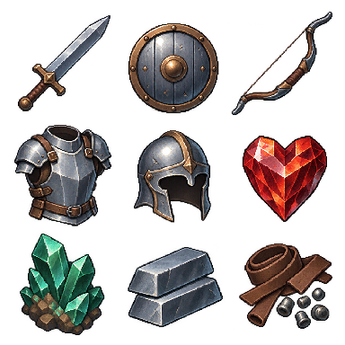
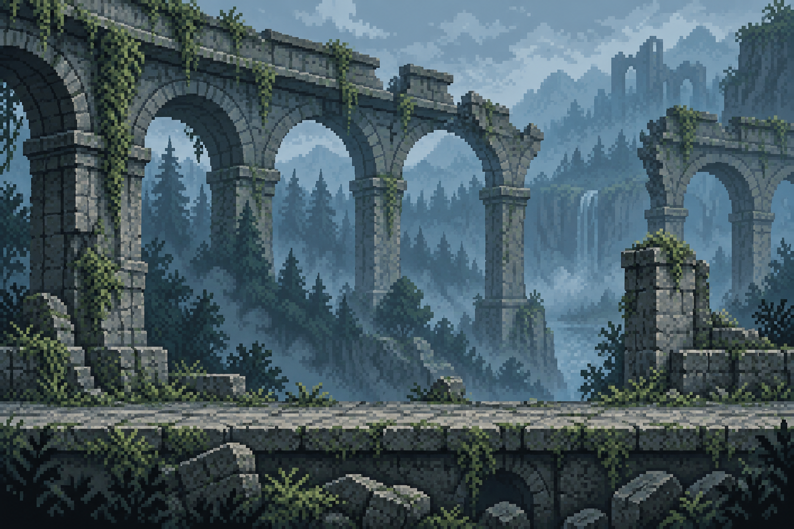
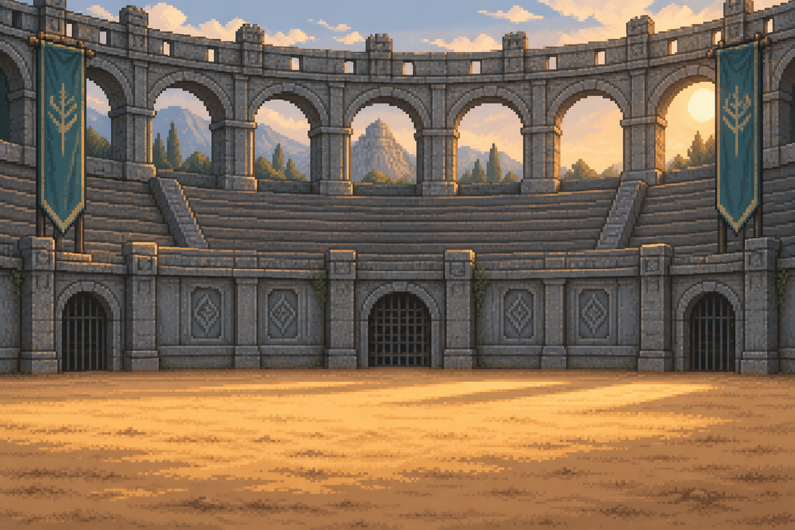
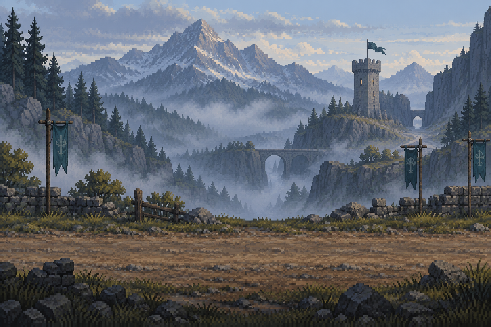
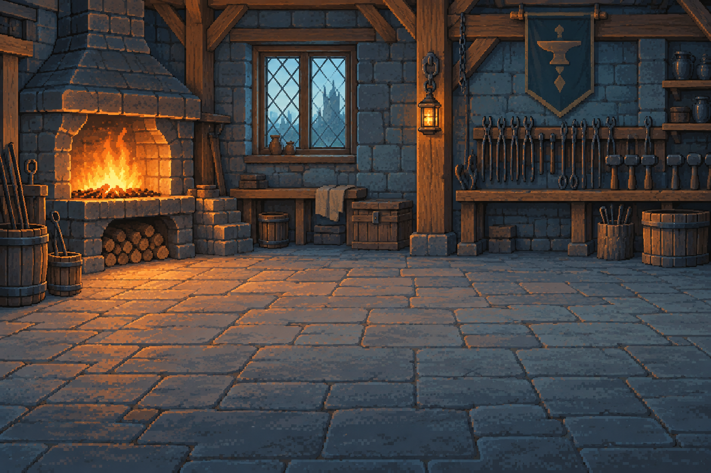
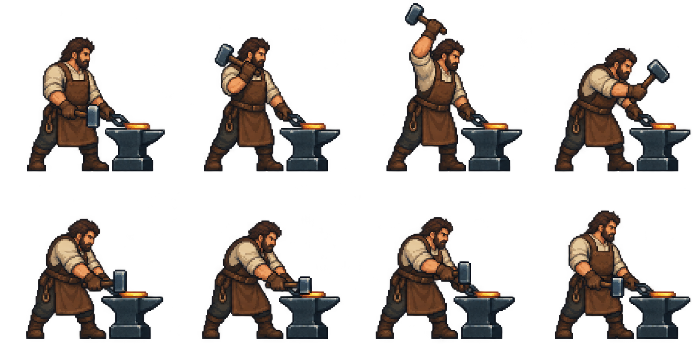
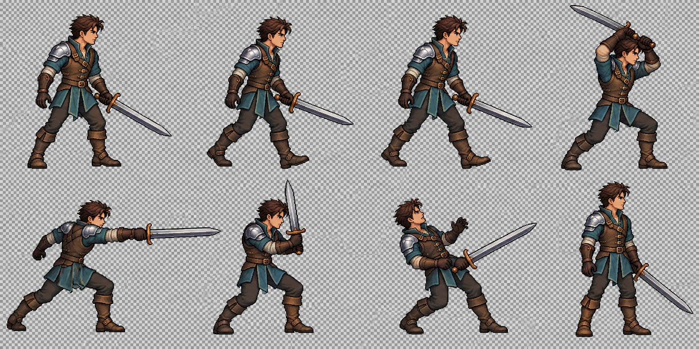
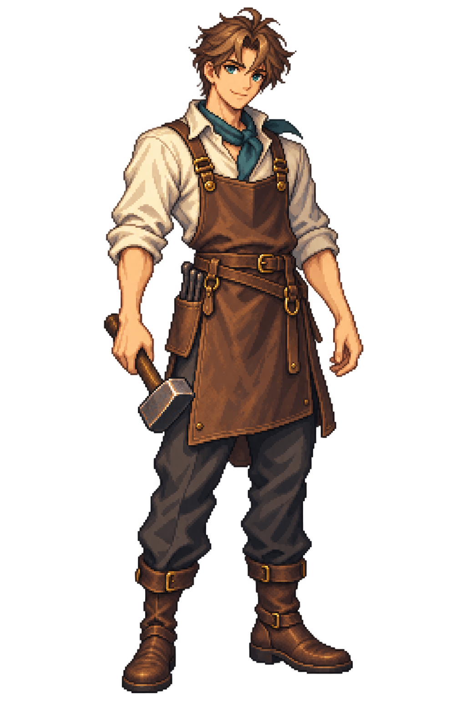

# 모루의 서약
사람용 통합 블루프린트 / 2026.09.13 갱신 / 설계와 실행 증거 분리

## 01. 화면 아틀라스 - 내 작품의 한 바퀴

같은 철방패 S-001을 따라가며 바뀌는 값·선택·소유권을 읽는다. 아래는 흐름 지도이며46~50절에서 큰 화면의 전후·분기·펼침을 비교한다. 반복 배경 카드를 제거했다. 모든 그림은 편집 가능한 설계 도식과 기존 후보 자산의 배치이며 인게임 촬영이 아니다.

```atlas
작품 선택|UID S-001 / +9 · 태그 없음 / 소유: 공방 · 편집 가능
정밀 성공/실패|성공 +10 · 기민I / 실패 +9 · 태그 없음 / 두 결과는 같은 시작의 분기
다음 정밀 선택|+19 → +20 / 기민II 또는 기민I+균형I / 46~47절에서 차이 비교
고객에게 인계|소유: 공방 → 고객 / 같은 방패 편집 잠금 / 명시한 보고일 표시
세계창 펼침|접힘 → 분할 → 확대 / 공간과 조작 범위 변화 / 관람으로 결과 변경 없음
사건 결과|임무 성공과 손상 별도 / 현재5 → 4 · 한계5 유지 / 사건 확정 후 반환
수리|3/5/5 → 4/4/5 예 / 현재100% · 구조80% / 수리했어도 흉터는 남음
연대기|태그·인계·손상·수리 연결 / 같은 UID로 추억 추적 / 일반 강화 반복 로그 제외
다음 영업일|수동 마감 → 보고·주문 보충 / 빈 날 자체 보상 없음 / 51절 시험·미해결 위험
```

---

## 02. 읽는 순서와 승인 경계

이 책은 이전21쪽 보충편의 정보·선택 규칙을 통합하고 빠진 제작·예외·경제·자산 명세를 보완한다. 이전 PDF는 비교용으로 보존한다. 최신 상세 권장안의 책임 페이지는 이 책이며, 역사 runtime 수치·기존 승인 규칙과 새 제안의 차이를 명시한다.

| 부 | 읽을 내용 | 결정할 질문 |
|---|---|---|
| 1부 경험·전략 | 03~08 / 코어·SWOT·독창성·조사 | 어떤 재미에 집중하는가? |
| 2부 공방과 성장 | 09~17 / 흐름·화면·강화·정밀·수리·경제 | 무엇을 보고 언제 선택하는가? |
| 3부 장비와 세계 | 18~25 / 5종·촉매·고객·사건·연대기 | 내 작품이 어디에 쓰이는가? |
| 4부 시각·모션 | 26~32 / 아틀라스·배경·동작·UI·오디오 | 어떤 그림을 어떻게 연결하는가? |
| 5부 구현과 검증 | 33~41 / 데이터·저장·작업·검수·출처·시험표 | 승인 후 어디부터 구현하는가? |
| 6부 인물·변화 비교 | 42~51 / 승인 인물·전후 아틀라스·대표 하루 | 행동 후 화면에서 무엇이 달라지는가? |

표시: 유지=현재 승인 의미 보존 / 권장 설계=이번 위임으로 상세화, 최종 승인 대기 / 후보 자산=실제 사용처를 위한 제작물, 채택·엔진 검수 별도 / 기존 구현=읽은 코드의 사실 / 미검증=아직 실행하지 않은 확인.

2026.09.13 현재 사용자는 전체 게임 구현·개선의 연속 진행을 승인했다. 앞선 준비 전용 경계는 역사 상태다. 실제 구현과 검증은52~54절을 먼저 읽는다. 후보 이미지의 최종 채택, 상용 출시·유료 상품·기존 세이브 파괴는 구현 승인에 묶어 추정하지 않는다.

---

## 03. 플레이어 약속 - 더 올릴까, 이대로 맡길까

강화의 긴장감이 중심이다. 세계창은 별도 자동전투 게임이 아니라 대장장이의 선택을 되돌아보는 창이다. 승리만이 아니라 맡긴 장비의 사용·손상·수리가 기억에 남아야 한다.

| 시간 범위 | 플레이어의 행동 | 기대 감정 | 반증 질문 |
|---|---|---|---|
| 한 번의 시도 | 비용·확률 확인 후 강화 | 내가 결정했다 / +1의 만족 | 비용을 모르고 눌렀는가? |
| 10단위 정밀 | 새 태그 또는 기존 태그 성장 | 용도에 맞게 만들었다 | 정답 색을 누르기만 하는가? |
| 한 작품의 인계 | 현재 성능과 다음 이득 비교 | 충분하다 / 한 번 더 | 일반 +1이 실제 쓸모 있는가? |
| 세계 결과 | 성과·손상을 따로 확인 | 내 작품이 쓰였다 | 그냥 남의 전투처럼 느끼는가? |
| 다음 작품 | 다른 요구·이전 기록 참고 | 다른 방식도 해보고 싶다 | 같은 사건·태그만 반복하는가? |

첫 세션6~8분은 측정 가설이며 강제 제한 시간이 아니다. +100 도달은 장기 목표다. +10 이후 인계가 가능하고 더 올려도 된다. 빠른 연타를 요구하는 피버·타이밍 미니게임·실패 직전처럼 속이는 연출은 이번 설계에 없다.

---

## 04. SWOT - 강점을 더 강하게

| 강점·근거 | 강화 전략 | 구체 실행 | 확인 기준 |
|---|---|---|---|
| S1 작품 UID와 저장된 사용 결과가 있음 | 같은 작품의 인과를 화면 전체에 유지 | 강화·인계·세계창·연대기의 동일 UID 및 당시 스냅샷 | 과거 재현20회 후 현재/과거 값 불변 |
| S2 10단위 정밀 선택이 반복 리듬을 제공 | 숫자 성장 사이에 용도 판단 배치 | +10~100 매10마다 추가/성장, 비용 전 미리보기 | 10회 선택 공간 고갈0, 빈 선택 비용0 |
| S3 5종 장비가 공통 소비처를 가짐 | 유형별 역할 표현, 공통 판정 재사용 | 검·방패·활·갑옷·투구의 이름/실루엣/요구 문구 분리 | 5종 모두 제작→+10→인계→기록 경로 검사 |
| S4 접이식 관전 방향이 명확 | 공방 집중과 세계의 존재감 공존 | 기본 접힘, 소식 배지, 결과 재현 한 개만 | 접힘 상태 재생/반복음0, 조작 가림0 |

강점도 검증된 재미와 동일하지 않다. S1은 코드 기반이며 ‘애착’은 가설이다. S2는 구조적 장점이지만 초반 수급과 단조로운 최적해가 방해할 수 있다. S3의 방어구 정밀은 새 연결이 필요하다.

우선 투자: 작품을 더 많이 추가하기 전에 한 철방패가 고객 요구→태그→실제 사용→흉터로 이어지는 전체 경로를 완성한다. 같은 제작 규격으로 철검까지 재현해 반복 생산성도 확인한다.

---

## 05. SWOT - 약점을 고치는 순서

| 약점 / 현재 증거 | 개선·보완 조치 | 우선순위·책임 | 실패 기준·대안 |
|---|---|---|---|
| W1 새 태그와 기존 누적 스탯이 다른 의미 | 새 규칙 버전·새 저장 슬롯, 구형은 보존 | P0 데이터/저장 | ID만 교체·기존 효과 이중 합산 시 중단 |
| W2 일반 강화가 신규 사건에 주는 이득 미정 | 목표 레벨 대비 준비도 보정 명세와 cap 표시 | P0 판정/UX | cap 구간에서도 이득 증가로 표시하면 교정 |
| W3 세계 사건 공급이 미구현 | 3종×4요구의 유한 정의, 한 번 판정·저장 | P0 콘텐츠/서비스 | 장면 재생이 재추첨·재보상하면 차단 |
| W4 원화는 있으나 작은 픽셀·모션 품질 미완 | 128셀·발/손 접점·필수 상태를 실제 출력과 대조 | P1 자산 | 알파·셀 넘침·손잡이 단절은 후보 반려 |
| W5 정식 자원 순환이 없음 | 테스트 예산과 제품 경제를 분리, 재기 경로 설계 | P1 경제 | 초기6~8분 도중 자원 고갈로 경로 종료 시 수정 |
| W6 역사 문서와 현재 규칙 혼재 | 이 책의 책임 표와 구현 연결 지도 우선 | P0 문서/검사 | 구형 하락·단발 +10을 새 규칙에 재사용 금지 |

W2의 신규 식은 시험용 권장안이며 기존 estimate를 실제 결과로 둔갑시키지 않는다. W5의 재기 경로는 고단계 도전의 가격을 없애는 무료 강화가 아니라, 다음 기본 작품을 만들 수 있는 낮은 수입을 보장하는 방향이다. 실제 경제 반증은 수치표와 별도 실험한다.

---

## 06. SWOT - 기회·위협과 교차 전략

| 기회 또는 위협 | 활용·대응 | 비용·부작용 | 검증·중단 조건 |
|---|---|---|---|
| O1 제작자 관점의 간접 활약 | ‘내 장비’의 당시 외형·이름 강조 | 장면마다 식별 정보 필요 | 관전 후 사용 장비/도움 이유 설명4/5 목표 |
| O2 짧은 모바일 플레이 | 한 시도 저장, 중단 뒤 같은 작품 복귀 | 저장 오류 경로 복잡 | 종료/복귀/연타/뒤로가기 중 중복 소비0 |
| O3 목적별 전문화 | 요구 예고+4적합도 비교 | 계산 부담 증가 | 처음에는 현재 요구만, 상세는 펼침 |
| T1 자동전투 유사작과 구분 약함 | 지휘·영웅 파밍보다 제작 결과에 집중 | 관전 자체의 다양성 제한 | 전투 운영 확장 대신 장비 기록 이해 개선 |
| T2 실패·영구 흉터의 불쾌감 | 시도 전 손상 확률, 수리 후 한계 분리 | 위험 설명이 무거워짐 | 숨겨진 손실 경험1건이라도 우선 교정 |
| T3 조합×장비×상태 제작량 폭증 | 기본 실루엣+각인+상태 레이어, 1사건 렌더 | 레이어 충돌 가능 | 5종×4태그×4단계 대표 충돌표 검사 |
| T4 발열·작은 글자·원화 스타일 불일치 | 단일 viewport, 정수 배율, 글자 별도 렌더 | 기기별 여백 조정 필요 | 20분 성능·밝고 어두운 화면·큰글자 실측 |

SO: UID 기반 장비의 활약을 짧은 모바일 관전에 연결. WO: 신규 장비 수를 늘리기 전에 실제 사용 스냅샷과 초반 경제를 완성. ST: 강화 위험을 사전 설명하고 결과는 저장된 사실만 재현. WT: 전체 전투 시뮬레이터·온라인 순위·직원 생활관리·유료 확률 상품은 현재 범위에서 제외한다.

---

## 07. 독창성 - 힘이 아니라 쓰임을 만든다

독창성은 시장 유일성 주장이 아니라 이 작품에서 함께 작동해야 할 조합이다. 핵심 연결은 ‘목적을 안다 → 장비 성질을 선택한다 → 실제 사용을 본다 → 작품의 기억이 남는다’다.

| 설계 장치 | 사용자에게 보이는 예 | 복제하지 않을 것 |
|---|---|---|
| 목적이 있는 정밀강화 | 같은 방패라도 급한 방향 전환과 오래 버티기가 다름 | 원소 상성 색깔만 다른 선택 |
| 모루의 서약 | 내가 감당할 위험과 고객에게 맡길 수준을 결정 | 새 서약 화폐·계약 벌점 자동 추가 |
| 흔적이 남는 작품 | 4/4/5는 다 채워졌어도 구조 흉터가 남음 | 무조건 복구되는 장비 소모 루프 |
| 선택형 세계창 | 공방을 떠나지 않고 짧게 결과를 봄 | 시청 시간 보상·강제 자동전투 |
| 작품별 연대기 | 첫 태그·인계·수리·사건 결과 | 모든 +1을 날짜 로그로 쌓기 |

추가 기능 대신 연결 품질을 높인다. 장비 이름과 외형은 등급만으로 달라지지 않는다. 고급스러움은 강화 마감·각인·태그 표현의 변화로 전달한다. 등급은 문자와 테두리 상태로 읽되 새로운 실루엣을 지급하지 않는다.

---

## 08. 벤치마킹과 실무 조사 - 채택·변형·제외

2026-09-11 공식 소개·문서 중심 조사. 직접 플레이·사용자 인터뷰·강연 전체 시청으로 표시하지 않는다. 아래 적용 판단은 우리 설계이며 외부 수치를 복제하지 않는다.

| 출처 | ADOPT / ADAPT | REJECT / 주의 |
|---|---|---|
| Weapon Shop Fantasy | 제작물·모험·재료의 연결 변형 | 직원 성장·200종 장비 규모 복제 제외 |
| Anvil Saga | 고객 주문과 공방 맥락 변형 | 역사 배경·방 확장·직원 생활관리 제외 |
| Gladiator Guild Manager | 준비 뒤 관찰하는 흐름 변형 | 전술 지휘·길드 운영 제외 |
| Into the Breach | 판단에 필요한 사전 정보 | 강화 확률까지 완전 결정제로 바꾸지 않음 |
| Wildermyth | 개체별 사건·이력의 연속성 | 인물 관계·환생 시스템 제외 |
| Battle Brothers | 역할 적합성과 손상 설명 | 피로·사기·영구 사망 패키지 제외 |
| Aseprite 공식 문서 | 셀·레이어·프레임·PNG/JSON 내보내기 | 정지 포즈 배열=완성 모션이라는 오인 제외 |
| Godot 해상도 문서 | 아트 정수 배율·UI 별도 가독성 | 모든 기기에서 논리px=dp로 가정 금지 |
| Android 접근성 지침 | 충분한 터치 영역·비색상 구분 | 픽셀 아이콘 크기=버튼 터치 크기 아님 |

실무 적용: 인터페이스와 상태표를 먼저 고정하고, 첫 자산 다음 두 번째 같은 유형까지 같은 절차로 내보낸다. 화면·동작·자산 준비와 사람의 최종 승인은 분리한다. 예시 책의92쪽은 목표 분량이 아니다. 빠진 질문이 없는지가 기준이다.

---

## 09. 핵심 시스템 관계와 전체 플로우맵

```flow
새 공방 / 이어하기 → 저장 버전 검사 → 고객의 목적 확인
→ 작품 제작·선택 → 일반 강화(+1)
→ 다음 목표가10의 배수? → 정밀 선택(촉매+가공+추가/성장)
→ 미리보기·자원 확인 → 한 시도 저장 → 성공 / 유지 / 손상
→ 계속 강화 / 수리 / 멈추고 인계
→ 실제 사용 사건 확정·저장 → 성과·손상·보상 따로 확인
→ 선택형 세계창 / 연대기 → 다음 고객·새 작품
```

시스템 책임: 장비는 UID·등급·레벨·태그·내구도를 소유한다. 자원은 골드·보강재·촉매 재고를 소유한다. 시도 서비스는 입력을 검사하고 저장 성공 뒤 변경을 공개한다. 사건 서비스는 사용 결과를 소유한다. 세계창은 결과를 읽을 뿐 바꾸지 않는다.

실패 경로: 빈 선택/부족한 자원은 시도 전 차단. 저장 실패는 기존 상태 유지와 재시도 안내. 과거 저장의 모르는 태그·버전은 임의 변환하지 않는다. 파괴된 장비는 강화·수리·신규 인계 불가, 기록 열람만 가능하다.

---

## 10. 공방 화면 - 집중과 함께 보기

```wireframe
집중 모드 | 기본
상단 자원·작품             40
픽셀 공방·대장장이         248
레벨·내구도·다음 비용      176
강화 / 멈추고 인계         64
세계 소식 열기             56
탐색·안전 영역             56
```

```wireframe
함께 보기 | 펼침
상단 자원·작품             40
공방·작품                  136
비용·위험·태그 요약        96
강화 / 멈추고 인계         56
결투 / 모험 / 군대         48
선택 사건 재현             136
요약·확대·접기             72
탐색·안전 영역             56
```

360×640은 배치 기준, 실제 게임은720×1280 기준 설정이다. 단순히 절반 크기를 dp로 간주하지 않는다. 정밀·수리 확인에서는 세계창을 일시정지하고 의사결정 영역을 확보한다. 접힘·펼침 상태는 UI 선호이며 게임 결과와 무관하다.

강화 버튼은 누르는 순간 입력 잠금, 저장 확인 후 해제한다. 길게 누르기 자동 강화는 초기 범위 제외. 중요한 비용 확인 문구는 눌림 뒤가 아니라 미리 보인다. 뒤로가기 우선순위는 상세 닫기→확대 닫기→세계창 접기→메인 확인이다.

---

## 11. 일반 강화 - 성공·유지·손상

유지: 성공은 언제나 +1, 실패 단계 하락 없음. +10까지 강화 손상0. +11부터 실패했을 때만 손상 가능. 새 태그의 적합도는 강화 성공률을 올리지 않는다.

| 목표 단계 | 현재 기본 성공률 | 같은 목표 실패 누적 후 보장 | 비용 / 보강재 |
|---|---|---|---|
| +1 / +2 | 100 / 97% | 2회 실패 뒤 다음 시도 | 아래 공통식 |
| +3~+10 | 95→86% 선형 | 4회 실패 뒤 다음 시도 | 아래 공통식 |
| +11 | 82% | 4회 실패 뒤 다음 시도 | 아래 공통식 |
| +12~+30 | 81→72% 선형 | 5회 실패 뒤 다음 시도 | 아래 공통식 |
| +31~+60 | 73→69% 선형 | 6회 실패 뒤 다음 시도 | 아래 공통식 |
| +61~+100 | 69→64% 선형 | 7회 실패 뒤 다음 시도 | 아래 공통식 |

현재 실행 기준 비용=10×round(1.2×목표레벨^1.84), 보강재=ceil(목표레벨/20). 같은 목표 실패마다 성공률+6%p, 일반 상한은max(95,기본성공률), 보장 시100%. 내구도 보정 NORMAL0 / MINOR-3 / MAJOR-7%p. 성공하면 해당 목표의 실패 누적 삭제. 현재 수치는 테스트 밸런스이며 제품 경제 검증은 별도다.

중요 교정 명세: 손상 조건부 확률d와 최종 시도 확률(1-p)×d를 구분한다. 예: +11 정상·누적0은 성공82%, 실패손상0.9%, 실패유지17.1%. 현재 resolver의 display_outcomes는 조건부d를 그대로 표시하는 경로가 있어 실제 3결과 표시 교정이 구현 작업에 필요하다. 이 책이 코드 수정 완료를 뜻하지 않는다.

---

## 12. 정밀강화 - 10번의 성격 선택

유지: +9→10, +19→20 … +99→100에서 정밀강화. 촉매는 계보 버튼이 아닌 소모 아이템이다. 불의 심장 또는 대지의 결정1개를 정상 해결된 시도마다 소비한다. 성공/실패 모두 소비, 입력 차단·저장 실패는 소비0.

| 순서 | 플레이어가 고르는 것 | 확인·차단 |
|---|---|---|
| 1 | 촉매 | 이름·현재 보유량·이번 소모1 |
| 2 | 성능 가공 / 취급 가공 | 장비 종류에 맞는 문구 |
| 3 | 새 태그 추가 / 기존 태그 성장 | +10은 추가만, 이후 유효 행동만 |
| 4 | 대상 태그 | 추가는 중복 불가·최대3, 성장은IV 미만 |
| 5 | 현재→성공 시 비교 | 레벨+1·태그·4요구 적합도·비용 |
| 6 | 정밀강화 실행 | 저장 성공 후 결과, 다음 선택은 비움 |

태그는4종 중최대3개, I~IV. 각 성공에서 한 단계만 증가한다. 새 슬롯·태그 교체·삭제·무작위 재굴림은 없다. 등급/사건 수식어는 이 선택으로 바뀌지 않는다. 10회 성장 동안 기계적으로 선택이 고갈되지 않는 공간은 확인했지만, 부족한 촉매가 선택을 막을 수 있으므로 재고 안내·획득 경로를 함께 제공한다.

---

## 13. 네 태그의 효과와 데이터 표

이번 권장안: 과거 경량 -3·역할 수치+3 누적을 새 태그 ID에 자동 이식하지 않는다. 태그는 실제 사용 사건의 적합도에만 기여한다. 외형 각인은 이 태그를 표시할 뿐 추가 스탯이 아니다.

| 촉매·가공 | 이름 / ID | 같은 요구 | 다른 성격·같은 축 |
|---|---|---|---|
| 불의 심장·성능 | 격발 / BURST_OUTPUT | 성능·순간:3×단계 | 성능·지속:1×단계 |
| 불의 심장·취급 | 기민 / BURST_HANDLING | 취급·순간:3×단계 | 취급·지속:1×단계 |
| 대지의 결정·성능 | 견실 / SUSTAIN_OUTPUT | 성능·지속:3×단계 | 성능·순간:1×단계 |
| 대지의 결정·취급 | 균형 / SUSTAIN_HANDLING | 취급·지속:3×단계 | 취급·순간:1×단계 |

축이 다르면0. 같은 축 두 태그는 합산. 단계는I=1~IV=4. 적합도1점은 해당 새 사건 성공률1%p로 변환하며, 사건 성공률 상한 때문에 실제 적용분은 줄어들 수 있다. 강화 성공률·손상 확률·무게·수리비에는 중복 적용하지 않는다.

예: 격발II+견실I인 철검은 성능·순간7점, 성능·지속5점, 취급 요구0점이다. 기민I 추가는 취급·순간3점/지속1점을 열고, 격발III 성장은 성능·순간을10점으로 높인다. 화면에는 현재 고객과 예정 고객에 대한 실제 변화가 함께 보인다.

---

## 14. 내구도와 수리 - 회복과 흉터는 다르다

유지: 0≤현재≤구조한계≤출생한계, 출생한계 불변, 구조한계 최저1. 상태=min(현재/구조한계, 구조한계/출생한계). 1은 정상, 0.5초과~1미만 경미, 0초과~0.5이하 중대, 현재0은 파괴다.

| 숫자 | 사람이 읽는 뜻 | 행동 |
|---|---|---|
| 5/5/5 | 정상 | 강화·인계 가능, 수리 불필요 |
| 3/5/5 | 경미한 현재 손상 | 실제 손상 후 수리 기회가 있으면 수리 |
| 4/4/5 | 현재는 가득, 구조 흉터 남음 | 경미 보정 유지, 가득 찬 수리 불가 |
| 2/2/5 | 구조가 크게 약해짐 | 중대 보정, 강화 가능하지만 경고 |
| 0/2/5 | 파괴 | 강화·수리·신규 사용 금지, 기록 보존 |

수리 조건: 실제 손상 후 UID당 수리 기회1회, 0<현재<구조한계. 시작 시 기회 소비. 품질 우수20%/표준60%/미흡20%, 흉터 반영 후 구조한계의100/75/50%까지 회복하되 가능한 경우 현재+1 이상 보장. 회복을 막는 흉터는 재추첨 없이 건너뛴다.

최종 상용 수리비 확정은 아니다. 현재 비용식 ceil(R×(0.05+0.65×손실/출생한계))+보강재1을 시험 기준으로 유지한다. 구조한계 복원·파괴 복원·무료 재수리 버튼은 없다. 결과는 전후3수치와 기회 소모를 함께 보여 준다.

---

## 15. 손상·수리 상세 데이터

| 강화 목표 | 실패 조건부 손상 기본확률 | 정상 실제 시도 예 |
|---|---|---|
| ≤10 | 0% | 손상0 |
| 11 | 5% | 성공82%일 때0.9% |
| 30 | 6% | 성공72%일 때1.68% |
| 60 | 7% | 성공69%일 때2.17% |
| 90 | 8% | 해당 성공률의 실패분에8% 적용 |
| 100 | 10% | 성공64%일 때3.6% |

앵커 사이 선형보간, 경미×1.25 / 중대×1.75. 보장 성공은 손상0. 표시는 소수 첫째 자리, 실제 판정은 정확값. 세계 사용은 별도 NONE0/LOW10/MEDIUM20/HIGH40/DIRECT100 프로필, 확률형만95% cap. 실제 사용 없는 인계는 손상0, 동일 사건·UID당 최대1회, MAX 직접 손상 없음.

| 수리 전 상태 | +0~10 | +11~30 | +31~60 | +61~90 | +91~100 |
|---|---|---|---|---|---|
| 경미 흉터 확률 | 10% | 15% | 20% | 25% | 30% |
| 중대 흉터 확률 | 25% | 30% | 35% | 40% | 45% |
| 철 R 값(확보 구간) | 125 | 160 | 220 | 300 | 400 |

Decision31은 수리비 R을 현재 단계가 아닌 확보 구간 기준으로 명시한다. 현재 quote의 highest_checkpoint 사용 자체를 오류로 판정하지 않는다. 코드 경계는 checkpoint<11→125, ≥11→160, ≥30→220, ≥60→300, ≥90→400이다. 흉터 확률의 구간과 수리비 확보 구간을 같은 의미로 설명하지 않으며, 승인 후 경계값 회귀를 분리한다. 수리·손상 수치의 최종 재미 승인은 플레이 시험 뒤다.

---

## 16. 경제와 진행 - 시험 예산과 제품 순환

새 규칙 시험은 별도 테스트 저장으로 시작한다. 첫 루프는+10~15, 다음 검증은+20/+30, 이후+60/+100을 고정 진행도 fixture로 확인한다. 임시 무제한 골드를 실제 게임 수입으로 제시하지 않는다.

권장 제품 순환: 기본 주문의 선금은 해당 작품의 제작을 가능하게 하고, 인계 정산으로 다음 제작을 준비한다. 위험한 추가 강화의 비용까지 자동 환급하지 않는다. 실제 사용의 성공 보너스는 별도이며 관전으로 발생하지 않는다. 이 신규 주문 경제는 기존 보상과 합산하지 않고 새 규칙 버전에서만 시험한다.

| 경제 항목 | 권장 설계 | 악용 방지 |
|---|---|---|
| 기본 제작 재료 | 주문 수락 시 주문 귀속 지급 | 다른 주문으로 양도/판매 불가 |
| 선금 | 기본 제작에 필요한 액수만 | 수락·취소 반복 수익0, 취소 시 미사용 선금 회수 |
| 인계 대금 | 요구 최저 수준의 사전 표시 고정액 | 실제 사용 성공과 별개, 주문·UID 거래당1회 |
| 정밀 촉매 | 불/대지 중선택 가능한 주문 보상 | 무작위 촉매만으로 원하는 성장 차단 금지 |
| 재기 | 기본 주문은 고단계 장비 없이 수행 가능 | 고단계 비용까지 무료 보전하지 않음 |
| 자원 부족 | 부족량·획득 주문 표시 | 광고·유료 구매 강제 경로 없음 |

시험에 사용할 정확한 시작 예산·가격은39절에 둔다. 최종 상용 균형은 미확정이다. 승인 후 첫 구현 묶음은 테스트 예산에서 핵심 루프를 먼저 검증하고, 선금·취소·정산 회귀와 비용 분포 검증을 통과하기 전 상용 진행 경제로 활성화하지 않는다. 이 경계가 없는 ‘전체 구현 준비 완료’ 선언은 하지 않는다.

---

## 17. 초반 선택과 균형 검토

4태그 단계0..IV, 활성≤3, 누적 성장10인 최종 상태는24개다. 4요구 균등 노출 평균은 모두10점, 엄격 우월 조합쌍0. 특정 요구 최대16점이며 이것은 재미의 증명이 아니다. 재료 비용과 요구 편중은 결과를 바꾼다.

| 상황 | 선택 의미 | 화면·검사 |
|---|---|---|
| +10 / 첫 태그 | 현재 용도에 집중 |4후보 실제 기여 비교, 자동 선택 없음 |
| +20 / 태그1개 보유 | 기존 강화 vs 새 용도 | 현재/예정 요구의 전후 값 |
| +30 / 태그2개 보유 | 전문화 vs 마지막 슬롯 |3슬롯 한계를 비용 전에 표시 |
| 한 촉매만 보유 | 가능한 행동은 줄어듦 | 없는 재료 필요량, 선택 보상 경로 |
| 준비도80%+적합도16 | 최종95%, 지원1점은 cap | raw점수16과 실제 적용15%p 분리 |
| 최종95%에 이미 도달 | 추가 성공 이득0 | ‘이미 상한’ 표시, 강화를 유도하지 않음 |

금지: 태그를 보고 불리한 사건을 몰래 배정, 관전 패배로 추가 비용 생성, 성공률과 손상을 한 위험 막대로 합치기. 요구는 주문 수락 전 확정하고 저장한다. 테스트는 균등4요구와70/10/10/10 편중을 비교하며 최선 평균13.6이라는 기존 추상 계산을 실제 경제 밸런스와 구분한다.

---

## 18. 장비 아틀라스 - 다섯 종류와 재료



같은 종류는 등급이 달라도 같은 기본 외형이다. 강화 단계는 마감·금속 가장자리·각인의 정교함, 태그는 정해진 부착점의 문양, 손상은 균열·흉터로 표시한다. 배경·카드 테두리를 그림에 굽지 않는다. 후보 투명도와 작은 크기 가독성은 실제 파일 검사 결과를 따른다.

이 아틀라스는 실제 인벤토리/강화/인계의 이미지 영역을 위해 제작한 자산 후보다. PDF에서 각 칸을 확대 설명해도 별도 장식 삽화로 집계하지 않는다.

---

## 19. 장비 데이터 - 역할과 가공 언어

| ID / 표시 | 역할 | 성능 가공 | 취급 가공 | 기본 재료·외형 |
|---|---|---|---|---|
| iron_sword / 철검 | 근접 도구·검격 | 날 성능 | 조작 균형 | 철, 청동 손잡이 장식 |
| iron_shield / 철방패 | 엄호·막기 | 차단 성능 | 방향 전환 | 철, 둥근 테두리 |
| iron_bow / 철활 | 원거리 수행 | 사격 성능 | 조준·반복 취급 | 철 보강 활체·시위 |
| iron_armor / 철갑옷 | 몸통 보호 | 보호 성능 | 활동·착용 안정 | 철판·가죽 끈 |
| iron_helmet / 철투구 | 머리 보호 | 보호 성능 | 시야·착용 안정 | 개방형 철투구 |

5종 모두 같은 정밀 성장 규칙을 사용한다. 갑옷·투구를 무기라고 부르지 않는다. 사용자 이름은 장비별 표현이고 machine axis는 OUTPUT/HANDLING이다. 초기 weight_point15는 현재 카탈로그의 값이며 새 태그가 무게를 자동 감소시키지 않는다.

등급 보통/우수/명품/걸작/전설, 예술성1~10 유지. 예술성은 기본 전투력 증가가 아니다. 제작 등급·예술성의 기존 판정/보상은 독립 owner를 재사용하고 새 사건 성공식에 임의 보너스를 더하지 않는다. 필요한 배경 없는 인게임 그림은5종 기본 및 강화/태그/손상 상태군으로 나누어 생산한다.

---

## 20. 고객의 요구와 장비 인계

고객은 복잡한 경영 캐릭터가 아니라 장비의 목적을 전달한다. 요구 정의에는 장비종류·최저단계·권장단계·요구축·순간/지속·손상위험·보상·반환정책을 저장한다. 현재 선택 태그를 보고 요구를 재생성하지 않는다.

| 화면 상태 | 표시·행동 | 예외 |
|---|---|---|
| 주문 목록 | 목적·종류·보상·위험 | 미정 결과를 성공 보장으로 쓰지 않음 |
| 작품 비교 | 현재 준비도·태그 기여·내구도 | 보유하지 않은 UID는 선택 불가 |
| 인계 확인 | 소유권 이전/대여 여부·대금·복귀 | 강화/수리 중인 작품 차단 |
| 인계 저장 | UID·주문·거래번호 고정 | 저장 실패 시 작품·대금 모두 원상 |
| 실제 사용 대기 | 사실만 대기 표시 | 인계 자체 손상 없음 |
| 결과 | 성과/손상/반환/보상 | 같은 거래 재열기로 추가 지급 없음 |

권장 초기 정책: 모험·결투·군대 시험 주문은 대여 후 사건 확정 시 반환한다. 소유권이 고객에 있는 동안 공방 편집 불가. 판매 주문은 반환 없음으로 별도 표기하며 다시 수정할 수 있다고 약속하지 않는다. 이 반환 정책은 신규 콘텐츠 권장안이며 기존 인계 코드에 이미 구현됐다는 뜻이 아니다.

---

## 21. 세계 사건 - 세 종류, 하나의 판정 계약

세 종류는 서로 다른 실시간 전투 게임이 아니다. 저장된 사건의 짧은 ‘요약 재현’이다. 화면에 LIVE·실제 전투 리플레이라고 표시하지 않는다. 처음에는 모험1건의4요구 변형으로 공통 계약을 검증하고 결투·군대를 같은 순서로 연결한다.

신규 준비도 권장식: B=clamp(60+0.5×(장비레벨-권장레벨),40,80). 최종 임무 성공률=clamp(B+태그적합도,5,95). 장비종류·최저단계 조건은 먼저 검사한다. 현재/구조 손상은 별도 공개된 손상 위험에 반영하고, 이 시험 성공식에는 임의의 두 번째 내구도 페널티를 넣지 않는다.

예: 권장10, 장비10, 기민I, 취급·순간이면 B60+3=63%. +11은63.5%. 요구와 다른 축의 태그는0. +10의 첫 정밀로II를 가질 수 없으며II는 다음 정밀 성공 이후 가능하다. 이 식은 일반 +1의 신규 사용 가치를 명시하기 위한 권장 시험식이며 기존 customer estimate나 구형 전투 피해량을 대체한 구현 사실이 아니다.

임무 성공과 손상은 독립 난수 입력이다. 결과 확정 전에 event_id·ruleset·snapshot을 고정하고 저장한다. 플레이어가 시청하지 않아도 같은 결과가 남는다. 취소/종료/재시작은 이미 확정한 결과를 바꾸지 않는다. 보상은 reward_spec의 transaction_id로1회만 지급한다.

---

## 22. 모험 - 무너진 수로의 측량대



| ID | 요구·작업 | 성공 / 실패 | 재현 비트 |
|---|---|---|---|
| AQ01 | 성능·순간 / 파편을 막아 표식 회수 | 회수 / 접근 중단 | 출발→차단→결과 |
| AQ02 | 취급·순간 / 바뀌는 방향을 엄호 | 회수 / 철수 | 출발→방향 전환→결과 |
| AQ03 | 성능·지속 / 측량 동안 엄호 | 완료 / 엄호 중단 | 준비→유지→결과 |
| AQ04 | 취급·지속 / 여러 지점 이동 엄호 | 기록 / 일부 철수 | 이동→반복 엄호→결과 |

첫 비교: 철방패·권장10·LOW·보상NONE로 통제한다. 신규 제품 주문의 보상은 경제 계약을 별도 검증한 뒤 연결한다. 작업자 부상·사상자·처치 수는 기록 없이 생성하지 않는다. 성공했다고 무손상은 아니며 실패했다고 파괴가 아니다.

---

## 23. 콜로세움 - 짧은 결투의 기록



| ID | 요구 | 보여 줄 사용 | 결과 언어 |
|---|---|---|---|
| DU01 | 성능·순간 | 결정적 검격·막기 | 결투 승리 / 패배 |
| DU02 | 취급·순간 | 빠른 대응·방향 조절 | 결투 승리 / 패배 |
| DU03 | 성능·지속 | 반복 공방의 성능 | 결투 승리 / 패배 |
| DU04 | 취급·지속 | 안정적인 반복 취급 | 결투 승리 / 패배 |

검·방패를 우선 사용, 활은 별도 사격 경기 정의로 분리해 근접 모션에 끼워 넣지 않는다. 초기MEDIUM 위험은 시험값. 두 인물의 승패 반응은 저장 결과에서 선택하며, 실제 피해량/HP를 계산하지 않은 경우 숫자를 띄우지 않는다. 죽음 대신 패배 인정·후퇴로 표현한다.

---

## 24. 군대 전투 - 작품이 전선을 지탱한다



| ID | 요구 | 장비 사용 맥락 | 결과 |
|---|---|---|---|
| AR01 | 성능·순간 | 짧은 돌파/급박한 엄호 | 목표 확보 / 철수 |
| AR02 | 취급·순간 | 진형 변화에 빠른 대응 | 목표 확보 / 철수 |
| AR03 | 성능·지속 | 통로·보급대 지속 엄호 | 유지 / 철수 |
| AR04 | 취급·지속 | 긴 행군과 반복 진형 유지 | 도착 / 중단 |

장비 하나의 기여를 대표 병사와 이름표로 연결한다. 대표6~8명은 렌더 예산이지 실제 부대 인원이나 사상자 수가 아니다. HIGH 위험은 해당 주문에 공개된 시험 프로필로만 사용. 사건 이름만 보고 자동HIGH를 부여하지 않는다. 군대 소유·전략 지도·실시간 지휘 기능은 없다.

---

## 25. 결과와 작품 연대기

결과는 위에서부터 고객 목표, 성과, 사용 장비·당시 레벨/태그, 기여 수치, 손상 전후, 보상·반환으로 읽는다. 기여가+6%p였다는 사실과 ‘이 태그 때문에 이겼다’는 단정은 다르다. 후자는 하지 않는다.

| 기록할 사건 | 저장 내용 | 기록하지 않을 것 |
|---|---|---|
| 제작 | UID·종류·등급·예술성·출생한계 | 매프레임 제작 입력 |
| 정밀 성공 | 태그 추가/성장·전후단계 | 실패마다 중복 수식어 |
| 손상·수리 | 현재/한계/흉터·원인·거래 | 보지 않은 피해·가짜 흉터 |
| 인계·반환 | 고객·주문·소유권·대금 | 화면 열기 자체 |
| 세계 결과 | event_id·snapshot·성과·손상 | 재현 재생마다 새 사건 |
| 파괴·완성 | 파괴 원인 / +100 도달 | 복구 가능하다는 미승인 약속 |

세계창의 다시 보기는 읽기 전용. 오래된 사건에 snapshot이 없으면 텍스트 요약만 보여 준다. 현재 장비를 과거 사건의 장비로 대체하지 않는다. 연대기는 원본 사건을 참조하며 동일 사건의 보상을 다시 실행하지 않는다.

---

## 26. 픽셀 Visual Bible와 배경 아틀라스



표현 기준: 선명한 덩어리, 읽히는 강철·가죽·목재, 따뜻한 공방과 차가운 세계의 대비. 빛과 표면을 과도하게 사실적으로 그리지 않는다. 인물·장비·환경의 픽셀 밀도를 같은 실제 화면에서 맞춘다. 높은 원본 해상도만으로 픽셀 품질을 승인하지 않는다.

배경 아틀라스: 공방=작업 정체성, 수로=위험 지형과 엄호, 경기장=두 인물 교환, 전선=대표 병력 이동. 각 파일은 실제 환경 슬롯용이며 책의 도판만을 위한 신규 설명 그림이 아니다. 압축·축소 후 크롭에서 접점·바닥·여백을 확인한다.

---

## 27. 자산 규격과 상태군

| 가족 | 생산 목표 | 상태·부착점 | 엔진 소비 |
|---|---|---|---|
| 장비 아이콘 | 128×128 셀, 실제64/128 비교 | 기본5종, 투명 배경 | AtlasTexture/TextureRect |
| 촉매·재료 | 같은128셀 | 불/대지/주괴/보강재 | 재고·소모 미리보기 |
| 장비 장착 표현 | 인물 손·몸·머리 부착점 | 검/방패/활/갑옷/투구 별도 | actor attachment |
| 대장장이 | 128셀8프레임 후보 | 발·망치·모루 고정 | AnimatedSprite2D |
| 세계 인물 | 128셀 상태 키포즈 | 발 기준·무기 손잡이 | 상태별 모션 리소스 |
| 환경 | 360폭 정수배 기준 | 바닥선·중요 crop 영역 | 정적TextureRect 또는Sprite2D |
| 각인·손상 | 장비별정해진 앵커 | 태그4종·단계·균열/흉터 | 별도레이어, 텍스트 병행 |

아이콘을 그대로 손에 붙이면 크기·시점이 틀어질 수 있다. 장착용 실루엣은 별도 소비처로 검수한다. 이번 원화·키포즈가 모든 장착 모션과 상태 레이어를 대체하지 않는다. 최종 자산 승인 전에는 기존 runtime을 유지한다.

---

## 28. 공방 모션 - 준비·접촉·복귀



| 프레임 | 의미 | 시험 시간 | 접점·이벤트 |
|---|---|---|---|
| 1~3 | 대기→들기→준비 | 160/120/160ms | 비용 확정은 서비스, 모션이 소비하지 않음 |
| 4~5 | 내려치기→접촉 | 80/80ms | 망치와 작품 접점, 소리1회 |
| 6~8 | 후속→회수→대기 | 100/120/160ms | 결과 공개 후 입력 복구 |

낮은 시점·발 위치·팔 길이·그립·모루 높이를 비교한다. 셀마다 다른 모루/무기 형상, 접촉 전 순간이동, 발 미끄러짐은 수정 대상이다. 성공/유지/손상 결과는 별도 문구와 제한된 효과로 구분하고 실패를 성공 직전처럼 속이지 않는다. 반복 연출 축약은 결과 저장 뒤에만 가능하다.

---

## 29. 세계 인물 상태 아틀라스



필수 상태: ready, walk, use/attack, guard, hit, recover, success, failure. 후보 시트의 상태 존재와 자연스러운 연결 동작은 별도로 검수한다. 왼쪽용은 단순 반전 시 손잡이·갑옷 비대칭이 바뀌므로 좌우 역할 검수 후 허용한다.

실제 검사: 이 결과는 투명 PNG가 아니다. 배경 제거 편집도 RGB 바둑판으로 반환되어 두 결과 모두 runtime용 반려다. 위 그림은 상태 배치 검수 증거이며 인게임 준비 자산 수에 넣지 않는다. 승인된 이미지 모델 수정 또는 투명 원본 기반 재제작이 필요하다.

모험은 이동·엄호·귀환, 결투는 준비·교환·승패, 군대는 전진·유지·후퇴로 같은 기본 상태를 조합하되 없는 판정을 꾸미지 않는다. 활의 시위 당김·발사, 방패 차단, 갑옷/투구의 착용 표현은 검 공격 포즈의 색만 바꿔 처리하지 않는다.

핵심 검수: 준비→행동→회복→대기가 연결되는가, 무기 끝이 셀을 넘는가, 팔이 몸에서 끊기지 않는가, 접점과 저장된 의미가 일치하는가. 단일 자세 또는 키포즈 시트는 ASSET_READY가 아니라 후보 상태다.

---

## 30. 화면 아틀라스의 상태 설명

| 화면 | 정상 | 빈/차단 | 오류·복귀 |
|---|---|---|---|
| 메인 | 새 공방·이어하기 | 저장 없으면 이어하기 비활성 | 손상 저장은 보존·복구 안내 |
| 공방 | 작품·비용·확률 | 파괴/자원 부족 사유 | 저장 실패는 원상, 입력 복구 |
| 정밀 | 촉매·방식·성장 비교 | 빈 선택/IV/3슬롯 차단 | 뒤로가면 비용0, 선택은 임시 |
| 수리 | 견적·품질·흉터 위험 | 수리기회없음/가득참/파괴 | 저장 실패 재고·기회 유지 |
| 세계창 | 한 사건 요약 재현 | 소식없음/결과대기 | snapshot없음은 텍스트 |
| 인계 | 요구와 선택 UID | 소유권/종류/최저단계 검사 | 거래 실패 시 대금·소유권 원상 |
| 연대기 | 의미 사건 목록 | 아직 사건 없음 | 누락 revision은 텍스트 |
| 설정 | 소리·진동·모션·글자 | 지원하지 않는 진동 비활성 | 저장 실패 안내, 현재 조작 유지 |

UI는 정상/눌림/선택/비활성/키보드초점을 형태와 문자로 구분한다. 픽셀 테두리·장식과 한글 본문 렌더를 분리한다. 탭의 색만으로 사건 종류·태그를 구별하지 않는다. 확인창은 취소를 기본 안전 경로로 제공한다.

---

## 31. 음향·VFX·접근성

| 트리거 | 표현 | 동기·제한 |
|---|---|---|
| 망치 접촉 | 금속 타격1회·짧은 접점 불꽃 | 셀 접점, 중복 재생 금지 |
| 일반 성공 | 짧은 금속 정돈음·+1 | 저장된 성공 이후 |
| 정밀 성공 | 각인 강조·선택 태그명 | 단계·태그 중복 보상처럼 연출 금지 |
| 실패 유지 | 둔한 잔향·유지 문구 | 위협적 파괴음 금지 |
| 실제 손상 | 짧은 균열음·전후 내구도 | 일반 실패와 구분 |
| 세계 결과 | 결과 문구·절제된 반응 | 시청 여부와 보상 무관 |

배경음·효과음 개별 조절, 진동 끄기, 흔들림/섬광 줄이기, 큰글자 옵션을 계획한다. 소리를 꺼도 결과를 이해할 수 있어야 한다. 반복 음압·기기 청감은 실제 장치에서 확인하며 현재 음향 제작 완료로 표시하지 않는다.

Android 터치 목표48dp 이상을 참고하되 실제 뷰의 물리 크기를 측정한다. 작은128셀 아이콘 안을 정확히 누르게 하지 않는다. 글자200% 시험에서 주요 행동·비용·위험이 잘리지 않아야 한다. 모션 감소 상태에서는 결과 카드로 바로 이동해도 저장 의미가 같다.

---

## 32. Aseprite와 Godot 연결 계약

창작은 이미지 모델, 레이어·프레임·PNG/JSON 패키징은 현재 제한된 Aseprite 도구, 실제 장면은 승인된 Godot 저작 경로를 사용한다. 다른 프로젝트 서버·임의Lua·기존 정본 덮어쓰기는 사용하지 않는다.

| 납품 항목 | 필수 데이터 | 검사 |
|---|---|---|
| source PNG | 원본 해시·프롬프트·입력권리 | 원본 보존 |
| .aseprite | 캔버스·레이어·프레임시간 | 파일 열기·실제 정보 읽기 |
| atlas PNG | 폭·높이·알파·셀 영역 | 투명도·셀 넘침·크롭 |
| metadata JSON | frame rect·duration·pivot·asset revision | 참조 이미지 존재·범위 검사 |
| 엔진 import | nearest·mipmap정책·정수배율 | 실제 화면·작은 크기·기기 확인 |

제안 렌더: 인게임 아트는 고정 논리 그리드와 정수 배율, 한글·터치 UI는 별도 가독성 계층. 세계창의 SubViewport는 한 개만 활성화하고 접힘 상태 처리·소리를 멈춘다. frame time·메모리·발열 예산은 실제 기기를 기준으로 측정하며, 미실행이면 NOT_RUN이다.

---

## 33. 구현 데이터와 책임 원본

| 데이터 | 필수 필드·의미 | 검증 |
|---|---|---|
| Item | uid, equipment_id, level, grade, artistry, durability3수치, tags | UID불변·0≤현재≤MAX≤BASE |
| TagEntry | id, stage, ruleset_version | 중복0·stage1..4·최대3 |
| PrecisionChoice | catalyst_id, method, action, target_tag | 임시입력, 가능한 선택만 |
| Order | order_id, equipment_group, min/recommended_level, axis, pressure, reward, return_policy | 수락 전 확정·역추론 금지 |
| Event | event_id, ruleset, order_id, item_snapshot, rolls, outcome, damage, reward_transaction | 한 번 확정·중복 거래 차단 |
| Presentation | event_id, asset_revision, beats, labels | 읽기 전용, 없는 사실 생성 금지 |
| Save | schema_version, ruleset_version, items, resources, orders, resolved_events | 이전 버전 보존·전체 원자성 |

기존 consumer: vs_workshop_screen.gd, vs_customer_result_screen.gd, vs_item_chronicle_screen.gd. 기존 저장 책임: vs_customer_actual_use_action_service.gd, vs_customer_world_event_resolver.gd. 새 WorldEventPanel·신규 주문 producer·스냅샷은 신규 구현 대상이다. 실제 파일 위치는 검토 기록과 함께 연결한다.

---

## 34. 저장·재시작·이행·실패 계약

기존 V5 저장은 원본 유지, 신규 태그/경제는 새 ruleset과 신규 테스트 슬롯에서 시작한다. 기존 누적 역할 수치·무게를 역산하지 못하면 자동 변환하지 않는다. 신규 슬롯 생성은 기존 저장 삭제 버튼이 아니다.

```flow
사용자 입력 → 구조/소유권/자원 검사 → 거래 ID 확보
→ 저장 후보 복제 → 난수/결과 확정 → 비용·장비·보상 같은 후보에 반영
→ 파일 저장 성공 → 메모리 상태 교체 → 화면/음향/관람 노출
저장 실패 → 기존 상태 유지 → 같은 요청의 중복성 검사 후 재시도
```

난수와 저장 실패: 같은 미확정 시도를 반복해 원하는 결과를 고를 수 없도록 attempt_id와 결정 입력을 일관되게 관리한다. 재시도 시 새 소비·새 결과를 무조건 만들지 않는다. 앱 강제종료 전후의 일관성은 별도 저널/원자파일 교체 방식으로 설계·시험하고, 프레임 모션을 저장 트랜잭션으로 쓰지 않는다.

중복event_id는 기존 결과를 읽거나 명확히 차단한다. 부분 보상·부분 손상 상태는 공개하지 않는다. unknown tag/event/ruleset은 fail-closed 또는 기록전용 폴백이며 값을 삭제하지 않는다. 소유권 반환은 사건 완료 거래 안에서 수행하고 공방을 재진입할 때 재검사한다.

---

## 35. 승인 후 구현 순서와 완료 증거

| 묶음 | 변경 단위 | 선행 조건 | 완료 증거 |
|---|---|---|---|
| I1 규칙 기반 | 새 ruleset·5종정밀·4태그·3슬롯·10회 | 최종 기획 승인 | 잘못된 선택/재고/저장 실패 회귀 |
| I2 판정·표시 | 일반강화3결과 확률·준비도식·cap | I1 | 수학 fixture와 화면 전후 일치 |
| I3 사건·소유권 | 모험4변형·snapshot·반환·중복성 | I1/I2 | 동일UID 전체 루프·재시작20회 |
| I4 공방·세계창 | 접힘/펼침/확대·결정창 우선 | I3·자산채택 | 실제720×1280 캡처·입력 검수 |
| I5 장비·동작 | 5종·장착·상태·VFX·소리 | 후보 QA·I4 | 준비→행동→복귀·좌우·모션감소 |
| I6 콘텐츠 확장 | 결투·군대 각4요구 | 모험 계약 통과 | 12정의·각 결과·폴백 회귀 |
| I7 경제 | 선금·취소·정산·촉매選択·재기 | 테스트수치 검증 | 고갈/무한이익/중복지급 검사 |
| I8 최종 검수 | Android·성능·한글·사람 | 대표 빌드 | 인게임 이미지/영상·사람피드백 |

기존 .tscn/Resource 설정은 프로젝트의 승인된 Godot 저작 경로를 따른다. 문서/후보가 있다는 이유로 해당 게임 작업을 완료 체크하지 않는다. 일정은 실제 첫 묶음 작업량을 확인한 뒤 산정한다.

---

## 36. 전체 준비·구현 체크리스트

이 표는 준비 시점의 전체 범위다. 2026.09.13에 연결된 새 태그·수로 시험·수리 저장·연대기의 현재 완료 범위는52절, 실제 촬영은53절, 다음 구현은54절로 추적한다. 아래 '미구현'은 해당 준비 시점의 상태이며 최신 실행 권한이 아니다.

| 항목 | 기획·상세 | 자산 | 구현·검증 |
|---|---|---|---|
| 강화 코어·내구도 | 유지 규칙과 교정 위험 명시 | 새표현 후보 | 기존코드 있음·표시 교정 필요 |
| 5종 정밀·4태그 | 권장안 있음 | 기본아이콘 후보 | 새규칙 미구현 |
| 고객·12사건 | 정의·저장/반환 계약 | 배경4종 후보 | producer·snapshot 미구현 |
| 접이식 세계창 | 흐름·정상/빈/오류 명세 | UI는구조도 | 미구현 |
| 모션·장착 | 상태·시간·접점 명세 | 일부키포즈/루프 후보 | 전상태 준비 미완료 |
| 자원 순환 | 계약·악용방지·39절 시험수치 | 재료아이콘 후보 | 최종 분포·제품경제 미검증 |
| 저장 이행 | 구형보존·새규칙 분리 | 해당없음 | 실제이행·중단회귀 미실행 |
| 최종 체감 | 과제·측정 기준 | 대표자료 준비 | 사람/Android/출시 미실행 |

준비 게이트: 핵심 규칙의 의미 충돌0, 실제 사용처 없는 자산0, 필요한 상태 목록 누락0, 구현 작업·수용 기준 연결, 미완료가 보이는 상태. ASSET_READY는 투명도·셀·상태·작은 크기·동작 연속성 검수 뒤만 가능하다. 이번 책의 최종 제출 상태는 실제 검수 record를 따른다.

---

## 37. 검수 계획·반대 검토·학습

기계: 태그 성장 공간·기여 계산·95% cap·입력차단·저장 원자성·중복이벤트·구형보존. 화면:9화면 아틀라스의 진입/주행동/종료/빈/오류. 자산: 실제알파·셀넘침·그립·발·시점·원본해시. 기기: 작은화면/긴화면/안전영역/큰글자/20분발열. 사람: 첫5명 탐색, 성공통계나 시장유지율 주장 아님.

| 반대 질문 | 대응·검사 | 남는 한계 |
|---|---|---|
| 일반 +1이 의미 없는가? | 목표레벨 대비 준비도와 cap 전후 비교 | 비용 대비 체감 플레이 필요 |
| 태그가 정답 맞추기인가? | 현재/예정 요구·전문화 비교 | 요구 편중·촉매 경제 미검증 |
| 세계창이 사실을 꾸미는가? | snapshot·요약 재현 라벨·가짜HP금지 | 장면과 글의 사람 이해 필요 |
| 생성시트가 완성 모션인가? | 프레임/셀/접점/되돌림 실제검수 | 누락장착·연결포즈 보완 필요 |
| 책은 많지만 구현할 수 없는가? | I1~I8 실제 consumer·실패계약 매핑 | 일부 경제 수치·자산 준비 게이트 남음 |

프로젝트 학습: 역사 owner 이름과 실제 최신 의미를 구분하고, 조건부 손상률을 최종시도 확률로 잘못 표시하지 않는다. 설명용 문서와 게임 자산을 같은 완료 상태로 섞지 않는다. 재사용 가능한 체크는 프로젝트 검증에 우선 남기며 Base에 무조건 새 스킬을 만들지 않는다.

---

## 38. 출처·원본·검증 범위

기준: 프로젝트AGENTS·현재main·PR371후속·현재Context·기존정밀/내구도/수리/실제사용코드. main ff1c935d9ada60607bace782f1f21f1adac59ba9, 작업시작74fd8da16467ca841f16641153171b8449e5c31d. Base current2f93e872d9ed4fa18018ac759b01acd7d34e9b58 관찰, adopted v9.4.4 유지. 타PR359/196 읽기전용.

예시 TEN_PACES_HUMAN_BLUEPRINT_20260910_ORGANIZED.pdf는92쪽의 구조·아틀라스·도감/데이터/검수 분리만 참고. 해당 작품의 무공·인물·그림·숫자는 가져오지 않았다. 기존21쪽과 과거PDF는 보존한다.

조사 링크:
- https://store.steampowered.com/app/599460/Weapon_Shop_Fantasy/
- https://store.steampowered.com/app/1587540/Anvil_Saga/
- https://store.steampowered.com/app/1043260/Gladiator_Guild_Manager/
- https://subsetgames.com/itb.html
- https://wildermyth.com/
- https://store.steampowered.com/app/365360/Battle_Brothers/
- https://www.worch.com/2014/03/23/decisions-that-matter/
- https://www.aseprite.org/docs/sprite-sheet/
- https://www.aseprite.org/docs/animation/
- https://docs.godotengine.org/en/stable/tutorials/rendering/multiple_resolutions.html
- https://docs.godotengine.org/en/stable/tutorials/io/saving_games.html
- https://developer.android.com/guide/topics/ui/accessibility/views/apps-views

이번 신규 시각물은 image_gen 제작 후보이며 실제 게임용 사용처를 지정했다. 후보 생성·패키징·사용자채택·엔진연결·인게임촬영은 별개다. 모델 세부버전은 도구 미노출, 외부 벤치마크 이미지 bytes는 입력하지 않았다. 프로젝트 자체 actor 참조만 사용했다. 상업권리·최종등급·배포는 별도 RELEASE_BLOCKED_UNVERIFIED.

---

## 39. 초반 경제 시험표 - 바로 실행할 숫자

이 표는 새 테스트 슬롯 전용 권장값이다. 시장 조사로 증명된 최적 가격이나 기존 저장에 지급할 보상이 아니다. 처음에는 고정된 철방패1개(+0, 내구5/5/5), 골드20,000, 보강재60, 불의 심장5, 대지의 결정5로 시작한다. 작품을 선택하고+10까지 도달하는 핵심 판단을 자원 부족과 분리해서 검사한다.

| 시험 항목 | 정확한 값·판정 | 의미·보호 |
|---|---|---|
| 성공만 있는+0→10 | 골드3,330 / 보강재10 / 선택 촉매1 | 현재 비용식 산출, 운이 좋은 하한 |
| 보장까지 실패하는 보수 상한 | 골드16,550 / 시도≤50 / 촉매≤5 | +1의 불가능한 실패까지 포함한 느슨한 상한 |
| 초기 예산 | 골드20,000 / 보강재60 / 촉매각5 | 정상5/5/5·+10까지 손상0에서 도달 가능 |
| 가상 재기 주문 | 전용재료 지급 / 제작골드0 / 완료400골드·보강재2 | 주문ID당1회, 시청과 관계없이 완료 |
| 가상 촉매 교환 | 골드1,000→선택 촉매1 | 구매·취소·재접속 중 중복 지급0 |
| 비교 실험 | 초기 예산×0.75/1/1.25, 교환비500/1,000/1,500 | 첫 선택 도달·재기 반복·쏠림 비교 |

재기 주문은 최저+0 장비를 납품해 그 작품을 소비하는 별도 판매형 시험이다. 대여 사건의 반환 장비를 수락·취소만으로 재판매할 수 없다. 일반 인계 대금·세계 성공 보너스는 이 통제 실험에서0으로 두고, 제품 진행 경제의 수입·지출 실험과 섞지 않는다.

확인 지표: 첫 정밀 도달률, 소모 시도 수, 다음 행동을 이해하지 못한 시간, 촉매 부족 때문에 원하지 않는 태그를 고른 횟수. 예산 상한 검사는 진행 가능성만 보여 준다. 재미·장기 자원 순환·상용 가격 검증은 아니다.

---

## 40. 사건 입력·출력 예 - 한 철방패의 기록

| 필드 | 예시 값 | 읽는 규칙 |
|---|---|---|
| ruleset / definition | PIXEL_REPLAN_TEST_1 / AQ02 | 구형 규칙과 혼합 금지 |
| event_id / item_uid | run01-event001 / run01-shield001 | 난수·비용·기록의 동일 거래 식별 |
| 요구 / 장비 | HANDLING·BURST / iron_shield | 종류·최저10·권장20의 주문 변형 |
| 당시 상태 | +20 / 기민II / 5·5·5 | 두 정밀 성공 후 가능, snapshot 불변 |
| 준비도 / 태그 / 최종 | 60 / +6%p / 66% | 기여가 승리의 단독 원인이라는 뜻 아님 |
| 독립 난수 입력 | mission_roll=0.60 / damage_roll=0.05 | [0,1), 확률보다 작으면 해당 결과 |
| 손상 profile | LOW=10%, 정상×1 | 성공 여부와 독립 |
| 저장 결과 | 임무 성공 / 현재4·한계5·출생5 / 반환 | 승리와 손상 동시 가능 |
| 반복 호출 | 동일event_id→동일 저장 결과 | 재보상·재손상·다른 난수0 |

두 번째 시험은 mission_roll=0.90 / damage_roll=0.80으로 임무 실패·무손상을 만든다. third-party 영상이나 생성된 공격 장면은 이 입력의 증거가 아니다. 화면은 ‘목표 달성, 방패 손상’ 또는 ‘철수, 장비 무손상’을 별도로 읽는다.

저장 실패 검사에서는 원본 골드·자원·소유권·내구도·연대기 길이가 모두 유지돼야 한다. 같은 요청의 재시도는 동일한 확정 입력을 사용한다. 이 표는 승인 후 resolver와 서비스 계약 테스트의 fixture가 된다.

---

## 41. 자산 인수 기준과 제작 잔여량

| 결과물 | 현재 확보 | 반려·보정 기준 | 다음 소비처 |
|---|---|---|---|
| 기본 장비5+재료4 | 투명384×384 아틀라스·128셀·Aseprite 원본 | 내부 알파·작은 크기·윤곽 검수 | 인벤토리·강화·인계 |
| 배경4종 | 공방·수로·경기장·전선 PNG | 실제 픽셀 격자 통일·인물과 바닥선 | 환경 레이어 |
| 이전 대장장이8포즈 | 탐색 이력 시트 | 현재 청년 외형으로 대체 제작 필요, 정수셀·모루/발 정렬 미완료 | 공방 타격 루프 |
| 세계 인물8포즈 | RGB 바둑판으로 입력 반려 | 배경 교정도 실패; 투명 원본 재제작 필요 | 세계창 인물 |
| 장착·태그·손상 | 소비처·필수 상태 명세 | 검/방패/활 동작, 갑옷/투구 부착, 각인4·균열/흉터 미완 | 대표 장비 사용 장면 |

일괄 ASSET_READY 선언을 하지 않는다. 화면에 들어갈 배경과 아이콘 후보는 확보했지만, 모든 장비의 완성 동작과 상태 레이어는 아직 제작·검수 잔여다. 이 책의 기획 검토와 방향 승인으로 I1~I3의 데이터·판정 준비를 시작할 수 있고, I4~I5의 최종 시각 적용은 이 인수 기준을 별도로 통과해야 한다.

사용자가 승인할 대상은 코어·새 태그·세계창 의미·이번 권장 세부 규칙과 시각 방향이다. 후보를 승인하더라도 알파·발 접점·셀 정렬 같은 기술 결함까지 수용했다고 추정하지 않는다. 기술적 보정은 같은 방향 안에서 후속 제작하고 실제 인게임 캡처로 확인한다.

---

## 42. 현재 승인 캐릭터 - 청년 대장장이



앞선 수염 대장장이 동작 시트는 제작 탐색 이력이다. 실제 새 주인공 외형은 이 선택본을 기준으로 준비한다. 외형 선택은 알파·발 접점·망치 궤적·연속 동작의 기술 검수를 대신하지 않는다.

| 유지 | 다음 제작 | 완료 상태 |
|---|---|---|
| 젊은 인상·얼굴·앞치마·망치 | 윤곽/반투명 정리, 준비→접촉→복귀 모션 | 외형 선택 완료 / 게임 적용 전 |
| 공방 중심의 작업 주인공 | 실제 세로 화면에서 얼굴·손·도구 가독성 검수 | 화면·Android·사람 검수 전 |

캐릭터 승인·출처·해시는 candidates/young-smith-spirit-20260911/record.json에서 추적한다. 이번 모닥의 비픽셀 허용을 전체 게임 그림체 변경 승인으로 확대하지 않는다.

---

## 43. 모닥 - 공방에 찾아온 어린 불의 정령


힘을 잃은 불의 정령이 대장장이의 공방에 머물며 조수로 돕는다. 세상 물정은 모르지만 도움을 주고 싶은 마음이 앞서는 캐릭터다. 금빛 머리·호박색 눈·작은 잔불·조금 큰 작업복으로 따뜻함과 미숙함을 표현한다.

| 상황 | 표현 예 | 금지 |
|---|---|---|
| 처음 도구를 가져올 때 | “집게가… 이거 맞지?” 확인하고 머쓱하게 웃음 | 실수로 장비 파괴·자원 손실 |
| 칭찬받거나 궁금할 때 | 손끝 잔불이 반짝이고 질문을 이어감 | 장시간 입력 차단·반복 강제 대화 |

사용자는 두 외형과 함께 성장하는 방향을 승인했다. 비픽셀 애니메이션풍은 이번 모닥에 허용된 예외다. 정확한 나이·성별·전투 능력은 별도로 확정하지 않는다. 원본과 승인 증거는 younger-record.json에서 추적한다.

---

## 44. 모닥 - 함께 지내며 자라는 동료


| 합류 이후 권장 단계 | 외형 | 성장 체감 |
|---|---|---|
| 1년 차 | EARLY | 도구를 확인하고 조심스럽게 전달 |
| 2년 차 | EARLY 유지 | “이번엔 제대로 가져왔어!” 배운 것을 먼저 실천 |
| 3년 차 이후 | LATER | “이 집게지?” 의도를 알아채고 안정적으로 도움 |

3년 차 전환은 최종 잠금 전 권장안이다. 게임 1년의 길이와 캠페인 지속 범위를 먼저 검토한다. 기준은 모닥과 함께 지낸 게임 시간이며 현실 접속 공백이나 기기 시계로 성장시키지 않는다. 달력 연결이 없으면 어린 상태를 유지한다.

성장해도 호기심과 칭찬에 들뜨는 귀여움은 남는다. 예전에 실수한 일을 능숙하게 해내며 추억을 회수한다. 힘의 회복은 별도 서사이고 성장 자체로 자동강화·성공률·자원 보너스를 추가하지 않는다. 승인 증거는 record.json, 상세 규칙 책임 원본은 제작 계약의 MODAK_GROWTH_PREPARATION이다.

---

## 45. 모닥 성장 - 구현 준비와 체크리스트

| 항목 | 현재 상태 | 다음 작업·완료 증거 |
|---|---|---|
| 두 외형·성장 방향 | 사용자 승인 완료 | 원본 보존·승인 해시 추적 유지 |
| 연차 계산 | 권장안 / 달력 연결 필요 | 게임 1년의 길이·합류 시점·캠페인 지속 범위 검토 |
| 그림·모션 | 외형 원본만 확보 | 투명화·레이어·발/손 기준점, idle/전달/집중/기쁨/걱정/머쓱함 |
| 성장 장면·저장 | 미구현 | 강화/수리 완료 후 대기 상태, 스킵·종료·재진입 중복 방지 |
| 기존 저장 | 마이그레이션 미구현 | 합류 기록 없으면 안전한 진입에서 시작; 오래된 일차로 즉시 성장 금지 |
| 실제 화면 | NOT_RUN | 세로 화면·터치 방해·불꽃 가림·두 단계 전환 캡처 |

진행: 시간 책임 원본 검토 → 경계 데이터 → 승인 자산 보정 → 저장/중복 방지 → 안전한 공방 상태 연결 → 실제 화면 검수. 합류 시점과 성장 사건 ID를 보관하고 연차·외형을 파생해 중복 상태를 줄인다. 정확한 저장 필드는 캠페인 설계와 함께 잠근다. 기존 세이브는 변경하지 않았다.

반례 검사: 경계 직전/정확한 경계/여러 해 건너뜀, 장면 중 종료·스킵·재진입, 구형 저장, 시간 정의 누락, 기기 시계 변경, 자원·확률 불변. 문서 검사는 이 기능의 구현·재미·사람 검증을 뜻하지 않는다.

조사: STORY OF SEASONS: A Wonderful Life의 장기간 일상·관계 구성과 Wildermyth의 인물 이력을 ADAPT한다. 외형만 변경하는 방식보다 이전 실수의 회수를 권장하며, 죽음·은퇴·세대 교체는 REJECT한다. 이는 설계 판단이지 직접 플레이 검증이 아니다.

출처: https://www.storyofseasons.com/awl/ · https://wildermyth.com/ . 상세 owner: BLACKSMITH_HUMAN_BLUEPRINT_PRODUCTION_20260911.md. 새 제품 구현은 전체 기획 최종 승인 뒤 진행한다.

---

## 46. 변화 아틀라스 A - 정밀 강화의 전후·분기

왼쪽 한 상태에서 성공과 실패로 갈라진다. 오른쪽 두 화면은 연속 진행이 아니다. 동일 UID·철방패·출생 내구5는 유지된다. 촉매 비용과 확률은 확정 데이터 연결 전이며 여기서 임의 숫자를 추가하지 않는다.

```stateatlas
시도 전 / 공통 시작|ITEM|9|5/5/5|태그 없음|공방 · 편집 가능|선택: 기민I 추가|정밀 강화 시도|+10 도전 / 불의 심장 필요
성공 분기|ITEM|10|5/5/5|기민 I|공방 · 편집 가능|레벨+1 / 첫 태그 획득|계속 강화 / 멈추기|변화: +9 → +10 / 없음 → I
실패 분기|ITEM|9|5/5/5|태그 없음|공방 · 편집 가능|실패 · 유지 / 손상 없음|재시도 / 멈추기|변화 없음 / 비용은 규칙대로
```

읽기 검사: 성공 화면의 태그 배지와 레벨이 함께 바뀌는가? 실패에서 단계 하락·손상이 생긴 것으로 오해하지 않는가? 저장 실패는 이 실패 분기가 아니라 시도 전 상태 유지·오류 안내다. 성공 전 미리보기와 실제 저장 결과를 같은 표시로 쓰지 않는다.

---

## 47. 변화 아틀라스 B - 태그 강화와 추가의 차이

46절 이후 일반 강화 성공을 거쳐+19에 도달한 별도 시점이다. 두 오른쪽 화면은+20 정밀 성공의 대안이며 동시에 적용하지 않는다. 외형 등급은 바꾸지 않고 태그 배지·다음 선택·요구 적합도의 차이를 읽는다.

```stateatlas
선택 전 / +19|ITEM|19|5/5/5|기민 I|공방 · 편집 가능|성장 또는 새 태그 선택|태그 선택 열기|기민I 유지 / 두 대안 비교
대안 A / 기존 성장|ITEM|20|5/5/5|기민 II|공방 · 편집 가능|취급·순간 적합도 6|기민 II 선택 결과|순간3 → 6 / 지속1 → 2
대안 B / 새 태그|ITEM|20|5/5/5|기민 I + 균형 I|공방 · 편집 가능|취급·순간 적합도 4|균형 I 추가 결과|순간3 → 4 / 지속1 → 4
```

기민 성장에는 불의 심장, 균형 추가에는 대지의 결정을 소모한다. 요구 적합도는 해당 사건 규칙에서만 기여하며 강화 성공률 보너스가 아니다. 장비의 각인·금속 마감 그림은 아직 미제작이다. 위 배지는 UI 상태 설명이며 완성 각인 자산을 대신하지 않는다.

---

## 48. 변화 아틀라스 C - 인계·사용 결과·반환

같은+20 기민II 철방패를 모험에 맡긴 예다. 성공과 손상은 독립이다. 아래는 성공·손상이 함께 발생한 결과 한 가지이며 필연적 결과가 아니다. 보고 지연은 인계일 기준2일의 신규 시험값이다.

```stateatlas
인계 전|ITEM|20|5/5/5|기민 II|공방 · 편집 가능|모험 요구·위험 확인|이 방패 맡기기|변화 전: 내 작품 선택 가능
인계 저장 후|ITEM|20|5/5/5|기민 II|고객 · 편집 잠금|모험 중 / 인계일+2 보고|불가: 강화·수리·재인계|변화: 소유권·버튼 잠금
사건 확정·반환 후|ITEM|20|4/5/5|기민 II|공방 · 편집 가능|목표 달성 / 경미 손상|결과 읽기 / 수리 검토|변화: 현재5 → 4 / 한계 유지
```

검사: 성공을 무손상으로 읽지 않는가? 고객 소유일 때 편집 금지와 반환 후 재개를 구별하는가? 세계창을 보지 않아도 같은 결과가 저장돼야 한다. 그림의 균열 상태는 아직 준비 전이며 내구 수치·상태 막대로 현재 규칙을 정확히 설명한다.

---

## 49. 변화 아틀라스 D - 수리와 남는 흉터

48절 이후 추가 실제 사용 손상1회로3/5/5가 된 별도 시점이다. 수리 후4/4/5가 된 가능한 흉터 결과를 비교한다. 보장 결과가 아니며 현재 증가+1 보호를 충족한다. 현재 막대와 회복되지 않은 구조 막대를 나란히 확인한다.

```stateatlas
수리 전|ITEM|20|3/5/5|기민 II|공방 · 수리 가능|현재60% / 구조100%|수리 조건·비용 확인|추가 실제 사용 손상 후 상태
수리 후 / 흉터 예|ITEM|20|4/4/5|기민 II|공방 · 경미 유지|현재100% / 구조80%|불가: 다시 수리|현재3 → 4 / 한계5 → 4
연대기에서 확인|CHRONICLE|20|4/4/5|기민 II|같은 UID S-001|태그·인계·손상·수리|작품 기록 열람|단순 +1 반복은 기록 제외
```

구조 막대가 낮으면 정상 상태로 표시하지 않는다. 수리 기회는 소비됐고 현재=한계여서 재수리할 수 없다. 현재 증가를 막는 흉터는 skip한다는 보호 규칙도 유지한다. 생성된 균열 그림 대신 정확한 수치와 막대로 차이를 보여 주며 실제 흉터 자산은 별도 제작해야 한다.

---

## 50. 변화 아틀라스 E - 세계창의 공간 변화

같은 사건의 접힘·분할·확대 보기다. 화면 공간과 접근 가능한 조작은 바뀌지만 결과·보상·소유권은 바뀌지 않는다. 배경은 기존 수로 후보이며 배우의 실제 전투 모션은 제작 전이다.

```stateatlas
접힘 / 공방 집중|ITEM|20|4/5/5|기민 II|공방 · 편집 가능|세계 보고 도착 / 미열람|세계창 펼치기|공방 판단에 화면 우선 배정
펼침 / 분할 보기|WORLD_EXPANDED|20|4/5/5|기민 II|공방 · 편집 가능|보고 재현|관람 확대 / 접기|상단 세계창 / 하단 작품 유지
확대 / 관람 집중|WORLD_FOCUS|20|4/5/5|기민 II|공방 · 편집 가능|보고 재현|공방으로 돌아가기|관람 중 조작은 재현 제어만
```

설계 도식은 실제 장비 아이콘과 배경 후보를 재사용한다. 손가락 영역·안전영역·스크롤은 실제720×1280 화면에서 검수해야 한다. 정밀·수리 확인을 열면 세계창보다 결정 화면이 우선하며 관람은 일시정지한다. 확대 창을 닫아도 사건 결과를 다시 굴리지 않는다.

---

## 51. 대표 하루·주문 주기·플레이 검수

| 시점 | 화면에서 바뀌는 것 | 입력·검수 과제 |
|---|---|---|
| 영업 시작 | 재기1칸 + 선택2칸 시험 구성 | 자원이0이어도 재기 경로를 찾는가? |
| 제작·강화 | 선택 작품의 레벨·태그·비용·위험 | 멈출 이유와 더 강화할 이유를 설명하는가? |
| 인계 | 소유권 잠금·보고 예정일 | 주문 수락일이 아닌 인계일 기준을 이해하는가? |
| 오늘 마감 | 현재→다음 날짜·미완 주문·예정 보고 | 계속 작업/다음 날 선택, 미완 주문 자동 실패 없음 |
| 다음 날 | 완료한 빈 주문칸 보충·도래 사건 확정 | 기존 미수락 주문 유지, 무료 보상·재추첨 없음 |
| 보고·다음 선택 | 결과·손상·반환·연대기 | 관람하지 않아도 같은 결과임을 이해하는가? |

시험 정책: 결투1일·모험2일·군대3일 후 보고, 재기 납품400골드·보강재2,120일/년은 모두 최종 잠금 전이다. 하루 중 강화 횟수가 날짜를 자동 진행시키지 않는다. 마감 중복과 저장 실패는 별도 검사한다.

오프라인 일정 모형7검사: 빈 날240회→241일·골드0·주문 유지, 재기30회 완료 가정→12,000골드·보강재60. 실제 제작·소모·손상·파일 저장·UI는 이 모형에서 제외됐다. 빈 날만 넘겨 모닥이 성장하는 반례가 남아120일/년 확정은 보류한다. 사람 검수·Android·새 시스템 runtime은 NOT_RUN.

다음 준비: 승인 캐릭터 alpha/레이어/모션, 세계 인물·5종 장착·각인/손상 상태 자산, 대표 하루 입력 검수. 이 도식의 완성은 해당 자산·기능의 구현 완료가 아니다. 상세 시험값 책임 원본은 BLACKSMITH_MODAK_CALENDAR_REVIEW_20260912.json, 조사·판정은 제작 계약 Remaining work audit 20260912다.

---

## 52. 현재 구현 체크리스트 - 2026.09.13

기획과 실제 구현을 같은 완료 표시로 묶지 않는다. 이 페이지는 a447cfeb 구현 체크포인트의 요약이며 최신 실행 근거는 제작 계약·현재 코드·PR 검사다. 기존51절의 상세 규칙/상태 아틀라스는 보존했다.

| 기능 | 실제 연결 결과 | 증거와 남은 경계 |
|---|---|---|
| 새 규칙 캠페인 | 별도 저장 슬롯·첫 제작·5종 장비·4태그 | 구형 저장 자동변환 없음; 전 신규 자산 채택은 별도 |
| 정밀 강화 | +10 단위 태그 추가/성장·촉매 소비·저장 | +9 QA 방패에서 실제 선택→+10 균형I→재시작 |
| 모험 시험 | AQ01~04 목적·독립 성공/손상·출발 snapshot | 첫 수로 1회/작품·보상NONE; 상용 주문 경제 아님 |
| 준비/결과 저장 | PREPARED→재접속→RESOLVED·반복 실행 차단 | 같은 사건 재추첨 없음; 오래된 요청/backup 반례 교정 |
| 수리 저장 | 내구·흉터 판정과 비용을 같이 저장 | 실제 포인터3→4·39골드·보강재1·파일 일치 |
| 결과/연대기 | 당시 레벨·태그·기여·손상·반환 표시 | 현재 작품 변경으로 과거 보고 재계산하지 않음 |
| 모바일 읽기 | 본문28/터치96 논리픽셀·긴 연대기 스크롤 | 데스크톱360×640 관찰; Android / 사람 플레이 NOT_RUN |

검증 구분: 전체 debug GUT289개·2577asserts, 실제 파일 왕복, 화면 촬영. 앞선1c2ac95c의 원격16SUCCESS/1조건부SKIPPED 확인. a447cfeb의 원격 상태는 PR exact-head 결과로 별도 읽는다. 이 숫자는 재미·최종 미술·성능·출시 완료의 증거가 아니다.

---

## 53. 실제 게임 촬영 - 같은 작품의 모험 보고

이 페이지는 a447cfeb 시점의 촬영이다. 상단 강화의 손상5% 표시는 이후 발견한 오류이며 최신 표시82.0/17.1/0.9 교정과 +0 실제 진행 증거는55절을 따른다. AQ 보고의 성공/손상 독립 판정은 변경하지 않았다.

아래 두 화면은 설계도나 생성형 가짜 스크린샷이 아니라 Godot 실행 촬영이다. 기존 승인 공방 표현을 유지한 구현 점검이며 새 픽셀 자산의 최종 완성을 주장하지 않는다. 같은 UID의 +10 균형I 철방패가 취급·지속 AQ04에 참여한 실제 시험 기록이다.

```runtimecaptures
../../docs/testing/replan-aqueduct-detailed-report-20260913.png|공방: 당시 장비·태그 기여·성공과 손상 분리
../../docs/testing/replan-aqueduct-readable-chronicle-20260913.png|연대기: 같은 저장 사건을 다시 읽기
```

기본60% + 균형I 기여3%p =63%. 저장된 두 독립 판정은 임무 성공·손상 없음으로 확정됐다. 실제 포인터 출발 후 게임을 재시작하고 결과를 확인했으며 파일/App의 RESOLVED가 같았다. +10 장비는 격리 QA 준비물이고 +0부터 자연 성장한 플레이로 주장하지 않는다. 재열람은 보상이나 판정을 다시 실행하지 않는다.

---

## 54. 남은 구현 순서 - 게임 전체 완성까지

| 우선 | 남은 작업 | 이유·기대효과 | 완료 판단 |
|---|---|---|---|
| 1 | 수로 대여/반환의 전체 입력 흐름·다중 재시작 | 실제 목적에 맡기고 돌아온 작품을 이어 관리 | +0 시작·도달·출발·반환·수리의 연속 플레이 |
| 2 | 선택형 세계창 접힘/분할/확대 | 강화에 집중하면서 원할 때 저장 사건 관람 | 열기/닫기/다시보기로 결과·자원 무변화 |
| 3 | 청년 대장장이·모닥·5종·세계 인물 모션/상태 | 수치 변화가 동작·외형 변화로도 전달 | 승인 외형·실제alpha·상태군·게임 캡처 |
| 4 | 결투·군대 각4요구 | 같은 작품의 다른 쓰임과 선택 확장 | 모험 계약 재사용·12정의·각 결과 |
| 5 | 주문·재기·정산·촉매 선택 | 시험 예산이 아닌 지속 가능한 제작 순환 | 고갈·취소·중복지급·무한이익 반증 |
| 6 | 달력·모닥 성장 | 함께 지낸 시간과 동료의 변화 연결 | 시간 기준·저장·스킵·재진입; 보류 수치 고정 금지 |
| 7 | Android·성능·접근성·사람 플레이 | 조작 가능과 재미를 실제 환경에서 검증 | 기기/사람 증거; 코드 PASS와 분리 |

작업 원칙: 각 묶음은 계획→조사→실패 재현→구현→실행→개선→저장소/PDF 증거로 이어진다. 일반 기술 선택은 반복 승인을 요구하지 않는다. 미술 최종 채택·핵심 의미 변경·위험한 이행·출시 결정만 별도 경계로 남긴다. 삭제 후보는 직접 삭제하지 않고 사용자 검토 대상으로 보존한다.

조사 근거: Weapon Shop Fantasy·Anvil Saga의 제작/사용 결과 연계와 Gladiator Guild Manager의 준비/관전은 ADAPT. Godot RandomNumberGenerator의 내부 구현 비보장에 따라 판정값을 저장하고, ScrollContainer의 follow_focus/다음프레임 배치를 ADOPT했다. 경쟁작 숫자·미술·실시간 전투조작 복사는 REJECT. 공개 공식자료 조사이며 직접 플레이 증거는 아니다. 링크는08·38절과 제작 계약에 남긴다.

---

## 55. 실제 +0 진행과 발견한 막힘의 교정

사용자 저장과 분리된 새 슬롯에서 첫 철방패 선택→망치질27회→마감→공방+0→일반 강화9회→격발 선택과+10→AQ01 대여/반환을 직접 조작했다. 단계·자원·판정값은 주입하지 않았다. 화면 스크롤은 가시성 보조를 사용했으며 아래는 실제 실행 촬영이다.

```runtimecaptures
../../docs/testing/replan-from-zero-aqueduct-result-20260913.png|교정 전: 수로 성공, 다음 강화 손상5% 오표시
../../docs/testing/replan-from-zero-correct-risk-20260913.png|교정 후: 이번 시도 손상0.9%, 결과는 불변
```

첫 입력 전 자동제작으로 장비 선택이 잠기는 오류, 비검 선택이 검으로 완성되는 오류, 정밀 기록의 정수/저장 소수 형식 차이로 다음 행동이 막히는 오류를 RED→GREEN으로 교정했다. 성공82%·실패 중 손상5%이면 이번 손상은18%×5%=0.9%, 유지17.1%다. 실제 판정 곡선은 바꾸지 않았다. +10까지 Gold20000→16670·보강재30→20·불의 심장64→63. AQ01은63%에서 성공/무손상, 사건 보상NONE·재열람 재지급없음. 전체295 GUT/2653asserts 시점의 증거이며 재미·Android·출시 승인이 아니다.

---

## 56. 선택형 세계창 - 실제 분할과 확대

같은 철방패의 저장된 AQ01 사건을 읽는다. 접힘은 공방 우선, 분할은 상단 보고/하단 공방, 확대는 공방 입력을 숨기고 복귀를 유지한다. 아래는 설계도가 아닌 현재 Godot 화면이며 배우·장착·전투 모션은 아직 연결되지 않은 보고 단계다.

```runtimecaptures
../../docs/testing/replan-world-report-split-20260913.png|분할: 저장된 사건을 보면서 내 작품 확인
../../docs/testing/replan-world-report-focus-20260913.png|확대: 보고에 집중, 접기로 공방 복귀
```

실제 포인터로 열기→확대→접기를 실행한 뒤 시험 저장 파일 SHA-256이 같음을 확인했다. 열람은 날짜·보상·아이템·판정값을 바꾸지 않는다. 미열람/진행중/결과와 후보 전투 연출을 같은 상태로 섞지 않는다. 남은 작업은 실제 세계 배우·장비 장착·모션, 결투/군대 사건, 주문·재제작·자원 순환과 기기/사람 검수다. 이 보고창의 동작을 최종 세계 관전 구현 완료로 표시하지 않는다.

---

## 57. 결투·군대 사건 - 같은 작품이 남긴 다른 결과

```runtimecaptures
../testing/replan-duel-result-20260913.png|실제 Godot 결투 결과 - 재시작 후 저장된 판정 확정
../testing/replan-army-result-20260913.png|실제 Godot 군대 결과 - 임무 성공과 장비 손상이 함께 발생
```

기존 +0부터 제작·강화한 동일 철방패 +10 격발I의 후속 플레이다. 결투는 성공63%·손상20%에서 패배/손상(5→4), 군대는 성공63%·손상50%에서 성공/손상(4→3)이었다. 군대 기본40%에 경상 배율1.25가 적용됐고 임무 성공률에는 내구 패널티를 중복하지 않았다. 재화16670Gold·보강재20·불의심장63·대지64는 불변이다.

---

## 58. 세계 시험 구현 체크리스트와 다음 연결

| 요소 | 이번 구현·검증 | 아직 남은 작업 |
|---|---|---|
| 12요구 | AQ/DU/AR 각4요구·목적·태그 기여·공개위험 연결 | 반복 주문 콘텐츠와 보상 경제 |
| 출발과 결과 | 준비 저장→재시작→동일판정·결과 저장 | Android 종료/복원 실기기 |
| 장비 보호 | 가족별1회/UID·동시대여1개·강화/수리 잠금 | 판매·새 주문 수락과 연결 |
| 보고와 연대기 | 세 종류의 snapshot/성과/손상 기록 읽기 | 배우·장착·모션을 이용한 요약 재현 |
| 실제 화면 교정 | 다음 목적지가 수로에 고정되던 표시를 선택 사건과 연결 | 최종 아트·터치·접근성·사람 검수 |

이번 범위는 검/방패의 근접 결투·엄호 시험이다. 활/갑옷/투구는 제작·정밀 성장 대상이지만 이 시험의 허용 장비는 아니다. 활의 사격 경기와 방어구별 실제 사용 맥락은 별도 구현이 필요하다. 날짜·재료·골드 보상이 없는 시험 기록을 상업 주문 경제 완료로 표시하지 않는다.

이전56절의 결투/군대 미연결은 이번 범위에서 대체됐다. 기존 수로 저장·나머지 상세 기획·후보 미술은 보존한다. 다음은 주문 수락→제작/강화→인계→정산·재제작/재료순환, 이후 달력·모닥과 시각 동작이다. 자동 검사와 데스크톱 실행은 최종 재미/밸런스/Android/출시 승인이 아니다.

---

## 59. 재기 주문 - 새 장비를 만들고 납품해 다시 시작

```runtimecaptures
../testing/recovery-order-forged-20260913.png|실제 제작: 망치질28회와 마감으로 주문용 철검 완성
../testing/recovery-order-delivered-20260913.png|재시작 후 납품: 원래 +10 철방패는 그대로 보존
```

첫 재기 주문은 수락 비용 없이 전용 재료1개로 새 장비를 만든다. 일반 재료 창고와 분리하며 주문품은 강화 없이 +0으로 납품한다. 기존 작품을 빼앗거나 팔지 않는다. 위 격리 시험 슬롯은 골드16670→17070, 보강재20→22, 불의 심장63·대지의 결정64 불변. 납품 철검은 별도 UID와 출생/납품 원장을 보존한다. 400골드·보강재2는 초기 시험값이지 검증된 최종 경제가 아니다.

---

## 60. 재기 주문 체크리스트와 다음 게임 순환

| 연결 | 확인한 결과 | 다음 작업 |
|---|---|---|
| 수락→제작 | 전용 재료, 기존 단조 화면, 취소 후 주문 보관 | 영업일·다음 주문 보충 |
| 제작→납품 | 실제 포인터 제작, 재시작 READY 복원, 1회 정산 | 반복 주문 조건·재제작/재료순환 |
| 실패와 보호 | 저장 재시도·중복 보상 방지·기존 UID 불변 | Android 종료/저장 실패 실기기 |
| 화면 | 복귀 버튼과 제작 스크롤 영역 분리 | 최종 미술·모션·가독성·사람 재미 |

이번은 첫 주문 한 건의 연결이며 무한 보상 버튼이나 전체 경제 완성은 아니다. 상세 설계/이전58쪽은 보존했다. 공개 공식 Weapon Shop Fantasy·Anvil Saga·My Time at Sandrock의 제작/주문 순환을 참고하되 수치·미술을 복제하지 않았다. 세부 출처/ADAPT·REJECT와 구현범위는 생산계약 BS-REPLAN-20260913-04가 소유한다.

---

## 61. 영업 마감 - 다음 날에도 이어지는 제작과 납품

```runtimecaptures
../testing/recovery-day-confirm-20260913.png|실제 확인창: 취소는 무변경, 마감은 하루만 진행
../testing/recovery-day-repeat-delivered-20260913.png|실제 2일차: 재시작·새 장비 제작·두 번째 납품 완료
```

1일차 납품 뒤 직접 마감하여 2일차로 진행했다. 재시작해 새 주문을 수락하고 실제 망치질·마감·완성 저장 뒤 다시 재시작하여 납품했다. 새 철검 UID는 첫 납품품 및 원래 +10 철방패와 다르다. 골드17070→17470·보강재22→24, 불의 심장63·대지의 결정64는 불변. 마감 자체는 자원을 주지 않으며 보상400/2는 아직 시험값이다. 마지막 재시작에서도 2일차·누적2건·원래 선택 작품을 확인했다.

---

## 62. 반복 플레이 체크리스트 - 구현과 다음 경험의 구분

| 연결 | 확인한 결과 | 남은 작업 |
|---|---|---|
| 오늘 마감 | 확인·취소, 하루만 증가, 보상 없음 | 빈날 넘김과 성장 악용을 성장 연결 전에 검토 |
| 주문 보충 | 완료품 기록 보존·다음 주문·별도 UID | 다양한 주문 조건·일반 제작/재료순환 |
| 미완성 보관 | ACCEPTED/READY는 다음 날 그대로 유지 | 장기 주문과 세계 보고 일정 |
| 저장 보호 | 실패·중복·미처리 세계시험 차단, 날짜 순서 검사 | Android 종료·복구 실기기 |
| 실제 화면 | 확인/취소 버튼 96논리px, 2일차 재시작·납품 | 최종 미술·모션·접근성·사람 재미 |

저장 정책 MANUAL_CLOSE_V1은 current_day와 마지막 마감일을 묶는다. 주문 수락≤제작≤납품 순서와 이전 납품<다음 수락을 검증하며, 잘못된 날짜를 반올림하거나 자동 이관하지 않는다. 구형 저장은 optional 기록 없이 유지하지만 새 기록이 있는 슬롯을 구버전으로 여는 것은 안전한 롤백이 아니다.

기존60쪽의 ‘다음 주문 보충 미구현’은 이번 실행 증거로 대체된다. 전체309 GUT/3088 assertions는 자동 검증이며 최종 재미·경제·Android·출시 승인이 아니다. 다음 순서는 반복 주문의 선택 재미와 재료 재투자, 나머지 장비의 실제 세계 사용, 모닥 성장·세계 배우/장착/모션이다. 기존 설계·아틀라스·SWOT·데이터 표는 보존했다.

---

## 63. 촉매 보충 - 번 골드를 다음 정밀강화에 재투자

```runtimecaptures
../testing/catalyst-exchange-confirm-20260913.png|실제 확인창: 선택 재료·차감 골드·증가 재고를 먼저 확인
../testing/catalyst-exchange-restored-20260913.png|실제 재시작: 두 촉매의 교환 결과와 공방 재고 복원
```

공방에서 불의 심장 또는 대지의 결정 1개를 선택하고 1000골드로 교환한다. 가격은 39절의 경제 시험값이며 최종 균형 확정이 아니다. 실제 포인터로 취소했을 때 저장 파일 해시가 같았고, 불의 심장 교환→재시작→대지의 결정 교환→재시작을 확인했다. 골드17470→16470→15470, 불의 심장63→64, 대지의 결정64→65. 영업일2·보강재24·원래 철방패 UID와 납품품2개는 유지됐다. 인게임 촬영이며 새 미술 승인이나 Android 검수는 아니다.

---

## 64. 재투자 체크리스트 - 거래 안전과 남은 게임 경험

| 연결 | 확인한 결과 | 남은 작업 |
|---|---|---|
| 주문→재투자 | 납품 골드로 원하는 촉매 선택, 기존 정밀 자원과 공유 | 다양한 의뢰와 일반 재료 순환 |
| 선택→교환 | 비용·재고 확인, 취소 무변경, 확인 후 저장 | 가격·반복 노동감의 사람 플레이 |
| 중복·저장 보호 | 중복/오래된 요청·다른 회차 차단, 실패 후 불확실성 안내 | Android 강제종료·복구 실기기 |
| 상한·호환 | 정수 상한 직전 1회 증가, 상한·무한대·NaN 거절 | 정책 가격 변경 시 명시적 호환 검토 |
| 실제 화면 | 두 재료 교환 및 각각 재시작, 96논리px 확인/취소 | 최종 미술·모션·접근성·사람 재미 |

CATALYST_EXCHANGE_TRIAL_V1은 1000골드·1개 교환과 마지막 영수증의 순번/촉매/날짜를 소유한다. 쓰기 성공 후 재읽기 실패는 ‘무변경’으로 단정하지 않고 다시 불러와 재고를 확인하도록 안내한다. routine 자원 구입은 작품 연대기에 추가하지 않는다. 기존62쪽은 보존했고 ‘촉매 재투자 미구현’만 이 실행 증거로 대체한다. 전체 게임 완성, 최종 경제, 사용자 플레이 승인은 아직 아니다. 상세 범위·출처·검증 결과의 책임 원본은 생산계약 BS-REPLAN-20260913-06이다.

---

## 65. 남은 작업 지도 — 구현과 검증은 다르다

2026.09.14 요청에 따라 남은 작업의 설계·구현 명세를 준비했다. 이전64절의 이미지·아틀라스·SWOT·표·실행 증거는 보존한다. 아래는 준비 결과이며 게임 완성 선언이 아니다. 자세한 상태/API/복구 명세 owner는 BLACKSMITH_REMAINING_IMPLEMENTATION_SPEC_20260914.md다.

| 순서 | 작업 | 현재 → 필요한 결과 | 완료 체크 |
|---|---|---|---|
| A / R01 | 5종 세계 사용 | 브랜치 자동검증 → 실제 재시작·결과·정상 전달 | 미완료 |
| B / R02 | 일반 의뢰 | 회복 중심 → 목적 고정·수락·작품 비교 | 미구현 |
| B / R03 | 재료·선금·취소 | 전용 재료 일부 → 일반 귀속 자원/반환 원장 | 미구현 |
| B / R04 | 납품·재투자 | 회복/교환 → 일반 보수·반환·보고 일정 | 미구현 |
| C / R05 | 모닥 성장 | 승인 외형·계산 시험 → 합류·연차·전환 | 정책 검토 |
| C / R06 | 인물 동작 | 승인 외형 → 알파·상태군·도구 접점 | 자산 필요 |
| C / R07 | 장비 변화 | 카드 → 강화/태그/손상·착용 동작 | 자산 필요 |
| D / R08 | 세계 재현 | 접힘/펼침 보고서 → 간단 사건 모션 | 미구현 |
| D / R09 | 안내·설정 | 개별 UI → 첫 순환·무음/큰글씨 대응 | 통합검수 전 |
| 전 단계 / R10 | 저장 내구성 | 개별 검증 → 새 원장 중단·중복 행렬 | 확장 필요 |
| E / R11 | 콘텐츠·재미 | 시험 규칙 → 다양한 의뢰·연속3순환 | 사람검수 전 |
| F / R12 | 모바일 전달 | 데스크톱 일부 → 실제기기·권리·최종검수 | 미검증 |

main f30baaa6과 PR381/d73e391e는 다르다. 브랜치315 GUT/3278 assertions·511 Python/3skip은 전체게임 PASS가 아니다. 이번 요청에서는 새 제품 코드를 변경하지 않는다. R10은 모든 구현에 함께 적용하며 마지막 한 번의 검사로 미루지 않는다.

---

## 66. 의뢰에서 다음 작품까지 — R02·R03·R04

목표는 누구에게 어떤 작품이 필요한지 알고 제작한 뒤 다음 선택으로 이어지는 것이다. 요구사항은 제시 시 고정하고 재접속·날짜 넘김·현재 보유 태그로 다시 뽑지 않는다.

흐름: 목적·위험·보상 공개 → 비교·수락 → 전용 재료 제작 → 개인 비용 강화/수리 → 판매 또는 대여 → 독립 손상·반환 → 한 번만 정산 → 다음 작품.

| 계약 | 설계·구현 | 실패·악용 방지 |
|---|---|---|
| 제시/수락 | order_id·정의snapshot·예약UID | 빈선택/연타·다른 의뢰 중복예약 차단 |
| 준비 중 | 해당 의뢰의 강화/수리 허용 | 다른 판매·독립 세계 사용은 잠금 |
| 인계 후 | 작품 편집 전면 잠금 | 보고서 다시 보기로 재판정0 |
| 전용 자원 | 의뢰 귀속 크레딧과 재료 | 개인 지갑·다른 제작에 전용 금지 |
| 취소 | 전용 잔여와 고객 재료 작품 반납 | 개인 강화비 환급0 사전 고지; 개인 원래 작품은 예약만 해제 |
| 소유권 | 고객 지원 제작은 SALE만, 개인 작품은 SALE/LOAN | 공짜 재료 작품이 개인 판매 재고로 세탁되지 않음 |
| 정산 | settlement_id·보상snapshot | 회복/일반 보상 중첩·연타 지급0 |

상태: OFFERED→ACCEPTED→CRAFT_READY→HANDED_OFF→SETTLED. proposed commission service/정의 데이터가 기존 SaveService·SaveEnvelope·EquipmentCatalog·workshop과 연결된다. 제작+0→예약→+10강화→납품을 실제 시험한다.

저장 전 실패만 무변경이다. commit 후 재읽기 실패는 불확실 상태로 안내하고 같은 command_id를 재조회하며 회수/지급을 다시 실행하지 않는다. 납품 자체는 손상0이다.

---

## 67. 경제·보고 일정·5종 사용 — R01·R04·R11

| 예산/정책 | Gold | 보강재 | 불의 심장 / 대지의 결정 | 구분 |
|---|---|---|---|---|
| 현재 신규 replan | 20000 | 30 | 64 / 64 | 실제 코드값 |
| 기존39절 시험안 | 20000 | 60 | 5 / 5 | 별도 신규 시험 슬롯 |
| 회복 의뢰 보상 | +400 | +2 | 없음 | 기존 시험정책 |
| 촉매 교환 | -1000 | 변화0 | 선택1개 증가 | 기존 시험정책 |
| 일반 의뢰 후보 | +400 | +2 | 납품 시 선택1개 | 미구현·최종값 아님 |

일반 후보는 기본 제작용 전용 재료 제공을 전제로 하며 위험 강화비 환급0, 결과 보너스 초기시험0이다. 회복 보상을 추가로 더하지 않는다. 가격/보수0.75·1.00·1.25를 한 축씩 비교하고 기존 저장을 감액하지 않는다. 개발용 촉매64개로 재료 순환의 막힘을 평가하지 않는다.

| 세계 사용 | 현재 | 남은 검증 |
|---|---|---|
| AQ | 방패 | 기존 제한 회귀 |
| DU | 검·방패 | 기존 제한 회귀 |
| AR | main검·방패 / branch5종 | 활·갑옷·투구 실제사용·재시작·결과 |

AR5종의 자동검증과 활 제작→+10→준비 캡처는 존재하지만 새 재시작 결과·리뷰·CI·main 전달은 미완료다. 이것을 움직이는 전투의 완료로 세지 않는다.

보고 지연은 DU1/AQ2/AR3일 시험안이다. 인계 때 예정일·정책·event_id·작품/요구 snapshot·독립 난수2개를 고정한다. IN_TRANSIT는 마감 가능, 일시 거래 잠금과 분리한다. 마감은 저장된 난수만 소비해 날짜·도래 결과를 원자 확정한다. 종료·재접속에 재굴림/재보상0. 기존 즉시 trial은 유지한다.

완료: 자원0 회복과3순환, 같은날/도래일/다중보고·중복마감 검증. 최종 경제·사람 재미는 아직 미검증이다.

---

## 68. 모닥은 함께 자란다 — R05·R06

승인된 어린 외형과 성장한 외형을 유지한다. 순진한 불의 정령 조수의 실수는 강제 자원 손실이 아니다. 외형 승인이 곧 실제 모션 자산 완성은 아니다.

```
명시적 합류 → 어린 외형/서툰 도움 → 익숙한 반응
성장 자격 → 안전한 공방 idle → 성장 commit → 장면 또는 스킵
성장한 외형/반응 → 다시 보기는 결과·보상 불변
```

| 항목 | 권장 비교 명세 | 검증·잠금 경계 |
|---|---|---|
| 1년 길이 | 120일 시험,30·365일 비교 | 최종 수치 아님 |
| 성장 시점 | 합류 기준3년 차 LATER | 늦은 합류를 즉시 성장시키지 않음 |
| 빈날 넘김 | A달력만 / B달력+실제 납품일30일 | 추가 자격은 시험 제안, 확정 전 제품 발동 잠금 |
| 저장 | joined_day·policy·stage·event_id·장면확인 | 음수/미상policy 거부, 소급 가속·초기화 금지 |
| 상태군 | idle·대사·놀람·머쓱함·도움·기쁨·걱정 | 두 외형의 알파/pivot/동작 필요 |

시험은 day1/120/121/240/241, 늦은 합류, 빈날240회, 같은날 많은 작업, 종료·스킵을 포함한다. 실제 납품일30일 조건도 반복 회복 의뢰로 채울 수 있으므로 악용이 해결됐다고 미리 주장하지 않는다. OS시간·오프라인 성장·능력치 보너스는 추가하지 않는다.

smith01과 두 모닥 승인 원본에서 생산한다. 대장장이 픽셀 기본 방향과 모닥 비픽셀 예외를 분리한다. 후보를 몰래 승격하지 않고 부족 모션은 승인 정적 pose로 대체하되 미완료로 표시한다.

---

## 69. 장비와 세계가 움직이는 규격 — R06·R07·R08

| 소비처 | 필요한 변화 | 구현 계약 |
|---|---|---|
| 대장장이 | idle·준비·windup·contact·recover | 판정은service, 효과는attempt당1회 |
| 검·방패 | 휘두름·막음·피격·복귀 | 손잡이/pivot/방향별 접점 |
| 활 | 준비·당김·놓음·회복 | 검모션 색변경으로 대체 금지 |
| 갑옷·투구 | 몸/머리 장착·이동·피격 | 카드 확대 대신 장착용 역할 분리 |
| 강화·태그 | 기본+milestone+태그 효과 | 등급만 바뀌면 외형 동일,3태그 판독 |
| 손상·흉터 | 5/5/5·4/4/5·2/2/5 | 숫자에서 파생, 이중 패널티0 |
| 세계창 | 준비·이동·사용·결과·손상·귀환 | 저장 사건 재현, 새 굴림·지급0 |

milestone +0/+10/+30/+60/+100을 시험하고 사이 단계는 수치로 구분한다. 레벨100개별 이미지를 만들지 않는다. 관련 태그 효과는 사용 순간 강조하고 세 효과를 항상 크게 겹치지 않는다.

생산: 승인 원본·consumer → 필요 상태 모델 생성 → Aseprite 지침 기반 프레임/pivot/duration → 원본+PNG+JSON → 알파/축소 검사 → 등록·연결 → 실제 게임 촬영. 아이콘128cell과64/128 판독은 시험 규격이며 모닥portrait에 동일 픽셀 필터를 강제하지 않는다.

세계창은 접힘 ↔ 상단 세계/하단 공방 분할 ↔ 세계 집중으로 기존50절을 유지한다. 활성 SubViewport1개, 접힘 processing/소리0. PREPARED에 성공 장면을 미리 재생하지 않는다. 자산 누락은 기존 보고서 fallback이다.

완료: 성공/실패×손상/무손상4분기, 접기·스킵·재시작 결과 동일, 방향별 장착·태그·흉터 촬영. 이 표는 명세이지 새 runtime 이미지 증거가 아니다.

---

## 70. 안전하고 읽기 쉬운 완성 — R09·R10·R12

| 영역 | 구현·설계 | 완료 증거 |
|---|---|---|
| 첫 순환 | 제작→태그→의뢰→귀환/수리→재투자 | 안내 스킵해도 기능 사용 가능 |
| 다음 행동 | 부족재료·예약·손상의 이유와 이동 버튼 | 막힘 화면에서 차감0 |
| 설정 | BGM/SFX·진동·저동작·섬광완화·큰글씨 | 무음/저동작에서도 판정 동일 |
| 접근성 | 긴 한국어·200%글씨·노치·focus·back | 48dp 밀도환산,48px로 오인 금지 |
| 저장 | 검증→commit/재읽기→성공 표시 | 이전/다음 완전 상태 하나로 복구 |
| 이전 저장 | policy/version·복사본 전환 | 미상버전 임의 새게임 fallback 금지 |
| 모바일 | 세로·배경/복귀·낮은공간·성능 | 정확빌드·실제기기·재현순서 |
| 최종 전달 | 자산 권리/승인·사람검수·main | 테스트 패키지와 출시 별도 |

R10은 매 작업에 동반한다. 수락·제작·취소·납품·정산·마감·교환·성장 각각 저장전/쓰기중/commit후표시전/재접속을 시험한다. 돈·재료·한UID 한소유자·손상최대1·보수최대1을 대조한다.

IN_TRANSIT에서는 날짜 마감이 가능해야 한다. 도래일·다중사건·중복마감·종료 후 재시작에서도 결과1회만 확정한다. 일시적 PREPARED와 혼용해 날짜도 못 넘기고 결과도 못 받는 교착을 만들지 않는다.

설정은 기존 owner를 재사용하고 캠페인과 분리한다. 설정 손상이 작품 삭제로 이어져서는 안 된다. 모션은 게임 판정의 시계를 소유하지 않는다.

Android 강제종료·접근성 사용자 검수·최종 미술/사운드·권리·출시 등급은 아직 미검증이다. 문서·자동테스트 PASS로 대신하지 않는다.

---

## 71. 조사·SWOT를 개선 작업으로 연결한다

2026.09.14 공식 소개/문서 조사이며 직접 플레이나 개발팀 인터뷰는 아니다. 수치·캐릭터·그림을 복제하지 않는다. URL과 자세한 비교는 상세 명세2절에 기록했다.

| 근거 | 채택 / 변형 / 제외 | 기대효과 |
|---|---|---|
| Anvil Saga | 세계 결과 연결 ADAPT,진영 정치 전체 REJECT | 의뢰 목적이 작품 사연으로 돌아옴 |
| Weapon Shop Fantasy | 제작↔재료 순환 ADAPT,자동사냥 중심화 REJECT | 수익이 다음 작품으로 연결 |
| Gladiator Guild Manager | 준비 결과 관찰 ADAPT,팀 지휘 전체 REJECT | 원할 때 세계 사건을 간단히 관람 |
| Godot 저장/모션 공식문서 | 영속 상태와 표현 분리 ADOPT | 스킵·종료로 판정이 변하지 않음 |
| Android 접근성 공식문서 | 실제 터치 영역/판독 ADOPT | 모바일 조작 오류 감소 |

| 현재 상태 / SWOT | 개선·보완 | 검증 방법 |
|---|---|---|
| 강점:UID·태그·흉터 | 의뢰 목적과 연대기 연결 | 플레이어가 태그 선택 이유 설명 |
| 약점:경제 단절·텍스트 밀도 | R02~04 먼저,R08 요약/펼침 | 첫 재투자까지 막힘 관찰 |
| 기회:짧은 관찰·애착 | 선택 분할창·모닥 반응 | 관람 여부와 무관한 같은 진행 |
| 위협:강화 피로·파산 | 회복 경로·목적별 의뢰·위험 고지 | 3순환 플레이·중단 의향 |
| 제작위험:후보=완성 착각 | 상태군·alpha·consumer·승인 분리 | 프레임/장착/실기기 캡처 |

차별화는 같은 작품의 탄생→태그→사용→흉터→수리→연대기다. 가장 강한 아이템 숫자만 쌓는 방향으로 바꾸지 않는다. 모닥의 작고 무해한 실수는 이 반복에 정서를 더한다.

현실적인 구현을 위해 기존 서비스와 저장을 확장한다. 범용 대형 프레임워크, 별도 HTML PM, 근거 없는 Base 공용화는 추가하지 않는다.

---

## 72. 착수 체크리스트와 남은 결정

| 작업 | 다음 안전 단계 | 남은 Gate |
|---|---|---|
| R01 | 기존 branch 재시작/결과·리뷰·CI | main5종 전달 |
| R02~04 | schema→전용 자원→정산 RED/GREEN | 일반 보수/새 시작재고 최종균형 |
| R05 | 합류·경계·빈날 비교와 저장 | 달력/추가작업 조건 최종 정책 |
| R06~07 | 승인 원본·consumer·상태군 준비 | 생성후보→자산 lock→runtime |
| R08~09 | 결과 재현·안내·설정 | 실제 통합 사용성 |
| R10~12 | 실패행렬·3순환·기기·권리 | 사람 재미·최종미술·출시 별도 |

자세한 명세에는 각 R01~R12의 현재 상태, 선행 조건, 화면 흐름, 데이터·연결 코드, 실패·복구, 완료 증거, 제외 범위를 적었다. 기술 착수 가능한 부분과 시험안으로만 가능한 부분을 분리했다. 최종 수치와 성장 의미를 확정한 것으로 기록하지 않는다.

유지: 같은 종류의 등급간 동일 외형,10단위 정밀강화,실제 촉매 소비,최대3태그,내구도3값·UID,모닥 두 승인 외형. 개선: 일반 의뢰 원장,예산profile 분리,사건 기반 연출,빈날 성장 검증.

이번에는 파일 삭제/이동을 하지 않았다. 불필요한 파일은 consumer·출처·hash·복구목록 확인 후 사용자 삭제용 폴더로 분리한다. 체크보드 RGB 후보를 runtime에 사용하지 않는다.

명세 owner: docs/design/BLACKSMITH_REMAINING_IMPLEMENTATION_SPEC_20260914.md. 제작계약과 Active Context가 연결한다. PR381은 Draft로 보존하며 이 명세 준비를 이유로 미완성 제품을 병합하지 않는다. 기존64절은 그대로 남아 있고 이 부록의 완료 체크는 이후 실제 증거에 따라 갱신한다.

---

## 73. 활의 세계 사용 - 직접 제작과 재시작 검증

2026.09.14 최신 지시로 R01부터 구현·개선 루프를 재개했다. 이전72절을 보존하고 실제 게임 증거를 추가한다. 활은 별도 시험 저장에서 새 게임→철활 제작→일반 강화→+10 격발I→전선 엄호 출발→재시작→결과 확인을 진행했다. 장비·자원·판정값을 주입하지 않은 경로다.

```runtimecaptures
../testing/world5-bow-result-20260914.png|실제 게임 결과: 철활+10 격발I, 임무 성공·손상 없음, 공방 반환.
../testing/world5-bow-restored-20260914.png|게임 종료 후 다시 불러온 같은 결과. 재열람은 보상·손상·난수를 바꾸지 않는다.
```

UID BSI-fed03de98a88f266f381e6ab828dd2f7 유지. 성공63%, 손상40%는 독립 판정이며 저장된 draw 28.2229867735486 / 97.0494022201188을 사용했다. 내구도5/5/5, 골드15840·보강재19·불의 심장62·대지의 결정64 유지. 결과 전후가 아니라 결과 확정 이후의 종료/재열람 저장 SHA가 동일함을 확인했다.

이 화면은 360×640 데스크톱 실제 framebuffer다. Android 실기기나 새 전투 모션 증거가 아니다. 수로는 방패, 결투는 검/방패 제한을 유지하며 전선 엄호만 5종을 허용한다.

---

## 74. 갑옷·투구의 귀환 - 시험 장비와 완료 경계

갑옷·투구는 검증용 +19 기민I 장비를 분리 저장에 준비한 FIXTURE 기반 native 검증이다. 직접 제작 플레이로 세지 않는다. 출발과 결과 확인은 실제 공방 버튼 경로를 사용했고, 출발 저장 뒤 게임을 재시작했다. 임무/손상 난수는 고정 주입하지 않았다.

```runtimecaptures
../testing/world5-armor-result-fixture-20260914.png|갑옷: 재시작 후 임무 실패·손상 없음. 실패와 손상은 같은 결과가 아니다.
../testing/world5-helmet-result-fixture-20260914.png|투구: 재시작 후 임무 성공·손상 없음. 동일 장비가 공방으로 반환된다.
```

확인: 5종 AR 저장/결과 소비처, 활 직접 제작 경로, 갑옷·투구 시험 장비 출발/재시작/결과. 회귀는 315 GUT/3278 assertions·515 Python/3skip, 두 코드검토 완료. 남음: 문서 갱신 HEAD 검증·exact CI·main 전달, 갑옷·투구 직접 제작 전체 플레이와 Android·사람 검수.

전체게임은 미완료다. 다음은 R02~R04 일반 의뢰→전용 재료→납품/반환·재투자이며 R05~R12 성장·모션·사용성·기기 검수가 이어진다. 결과 보고 패널을 움직이는 세계 전투나 완성 미술로 표시하지 않는다.
