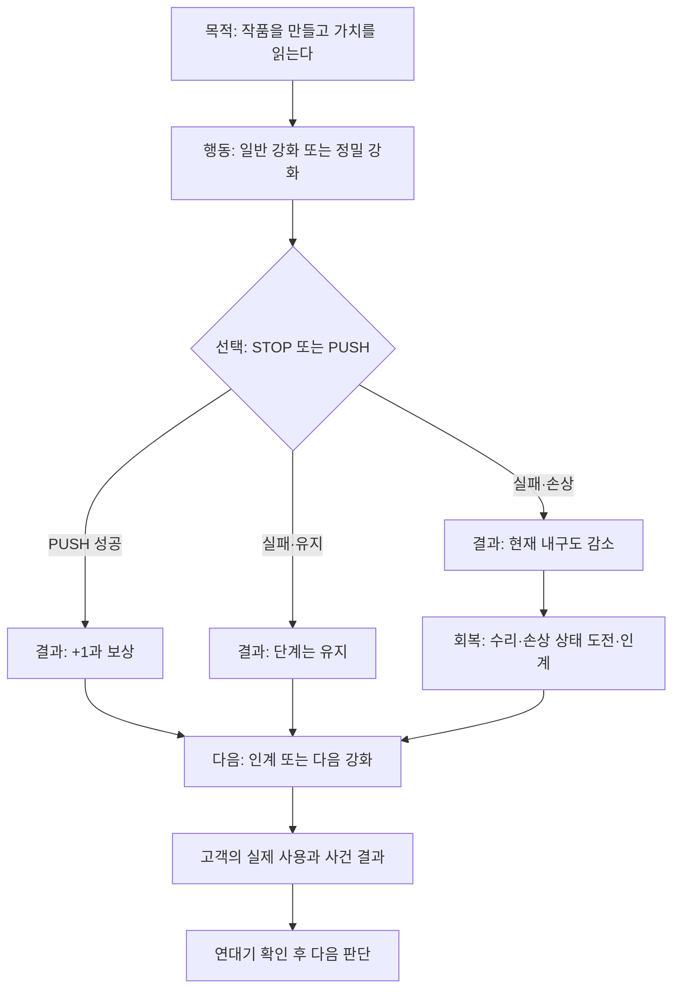

# 모루의 서약 — 사람용 게임 기획서

- 문서 상태: `CURRENT_HUMAN_FACING_GDD / KOREAN_PRIMARY / 2026-08-31 KST`
- 제품명: `모루의 서약 / ANVIL OATH`
- 문서 기준일: 2026-08-31 KST
- 기준 커밋: `main / 5744865a1b9805c89da230aea0b067f382def85c` (반복 정밀강화·다섯 장비 이미지 구현 뒤, 이번 파생 GDD 정합성 복구 전)
- 독자: 프로젝트 오너, 기획·아트·UI·사운드 협업자, 플레이테스터; 공방의 한 판이 어떤 선택과 결과를 만드는지 알고 싶은 플레이어와 협업자.
- 읽는 경계: `사람용 본문 = 플레이 경험의 이해와 의사결정`, `개발 참고 = 구현·데이터·테스트 추적`. 이 문서는 내부 구현 이름이나 검사 절차를 사람용 본문에서 직접 설명하지 않는다.

## 한눈에 보는 게임

| 항목 | 사람용 정의 |
|---|---|
| 장르 | **강화 중심 제작·경영 내러티브**. 세로 화면에서 한 작품의 가치를 판단하는 공방 게임. |
| 플레이어 시점 | 고객의 무기를 만들고 돌보는 **대장장이 공방 주인**. 전장을 직접 조작하지 않는다. |
| 핵심 재미 | 다음 +1을 얻기 위해 지금의 성과를 지킬지 더 밀어 볼지 고르는 **STOP OR PUSH**. |
| 차별점 | 한 무기의 강화, 태그, 실제 사용, 손상, 수리, 사건, 연대기가 같은 생애로 이어진다. |

강화는 메인 콘텐츠다. 고객의 이야기는 강화의 위험과 성과가 누구의 삶에 닿았는지를 보여 주며, 별도의 복잡한 경영 게임으로 커지지 않는다.

## 한 작품의 여정



| 목적 | 행동 | 선택 | 결과 | 다음 |
|---|---|---|---|---|
| 작품의 가치를 만든다 | 일반 강화 또는 정밀 강화 | STOP 또는 PUSH | 성공, 실패·유지, 실패·손상 | 인계·다음 강화·수리 |
| 작품의 생애를 잇는다 | 고객에게 인계한다 | 실제 사용의 결과를 읽는다 | 사건, 내구도, 수리 가능 여부 | 연대기 확인 뒤 다음 판단 |

이 흐름은 목적 → 행동 → 선택 → 결과 → 다음 행동을 한 화면씩 분명히 보여 준다. 정상 강화에서는 태그를 고르지 않는다. 정밀 강화에서만 작품의 완성 경로를 정한다.

**강화 → 태그 → 생애**는 이 게임의 짧은 약속이다. 태그를 정하지 않으면 강화 시도 자체가 시작되지 않는다.

## 강화의 언어

- 성공은 언제나 정확히 `+1`이다.
- 결과는 성공, 실패·유지, 실패·손상 셋 중 하나다. 단계 하락이나 별도 치명 결과는 없다.
- 실패·유지는 강화 단계와 태그를 바꾸지 않는다. 실패·손상은 단계와 태그를 바꾸지 않고 현재 내구도만 줄일 수 있다.
- 목표가 +10 이하일 때 강화 실패로 인한 손상은 없다. 그 이후의 손상 가능성은 성공과 별개가 아니라 **실패 뒤에만** 판단된다.

## 열 번의 정밀 강화

정밀 강화는 매 10단계의 경계에서 열린다. `+9 → +10`부터 `+99 → +100`까지 정확히 열 번이다. 성공할 때만 `+1`과 함께 태그 행동 하나가 남는다.

| 관문 | 플레이어가 하는 일 | 성공 뒤 남는 것 |
|---|---|---|
| +9 → +10 | 첫 방향을 고른다 | **태그 추가**만 가능 |
| +19 → +20 | 새 방향 또는 기존 방향을 고른다 | 태그 추가 또는 **태그 강화** |
| +29 → +30 | 다음 정밀 판단 | 태그 추가 또는 태그 강화 |
| +39 → +40 | 다음 정밀 판단 | 태그 추가 또는 태그 강화 |
| +49 → +50 | 다음 정밀 판단 | 태그 추가 또는 태그 강화 |
| +59 → +60 | 다음 정밀 판단 | 태그 추가 또는 태그 강화 |
| +69 → +70 | 다음 정밀 판단 | 태그 추가 또는 태그 강화 |
| +79 → +80 | 다음 정밀 판단 | 태그 추가 또는 태그 강화 |
| +89 → +90 | 다음 정밀 판단 | 태그 추가 또는 태그 강화 |
| +99 → +100 | 마지막 정밀 판단 | 태그 추가 또는 태그 강화 |

정밀 강화에서 성공 한 번에는 태그 행동도 정확히 하나만 적용된다. 실패·유지, 실패·손상, 또는 막힌 시도는 태그, 단계, 효과를 전혀 바꾸지 않는다.

## 태그 시스템: 무기에 남는 완성 경로의 정체성

태그는 플레이어의 칭호가 아니라 **무기에 남는 기록**이다. 작품은 등급, 태그, 사건이라는 세 종류의 흔적을 가질 수 있으며, 태그는 그중 “어떻게 완성했는가”를 말한다.

### 최대 세 개의 태그 보드

한 무기에는 최대 세 개의 태그만 남는다. 각 태그는 아래 네 단계 중 하나로 자란다.

**단계 읽기: 씨앗 / 성장 / 진화 / 완성.**

| 단계 | 이름 | 의미 |
|---:|---|---|
| I | 씨앗 | 처음 정한 완성 방향 |
| II | 성장 | 같은 방향을 한 번 더 다듬음 |
| III | 진화 | 작품의 성격이 또렷해짐 |
| IV | 완성 | 그 태그를 더 강화할 수 없음 |

`+9 → +10`은 **태그 추가**만 가능하다. 이후 관문에서는 빈 자리가 있으면 새 태그를 추가하고, 이미 가진 태그가 I~III이면 그 태그를 강화할 수 있다. 세 개가 찼거나 같은 태그를 다시 고르거나 IV 태그를 더 강화하려 하면, 비용과 굴림 전에 막힌다. 무게가 이미 0인 작품에서 경량 담금을 고르는 경우도 비용과 굴림 전에 막힌다. 기본 선택, 무작위 선택, 다시 뽑기는 없다.

### 첫 네 가지 완성 방향

현재 승인된 시각 방향은 `ILLUSTRATED_WORKSHOP_BOOK`이다. 따뜻한 손그림 공방 노트의 종이·가죽·철·목재 물성과, 게임 조작에 필요한 현대적이고 선명한 정보 계층을 함께 쓴다.

- **Keep:** 따뜻한 공방의 손맛, 작품을 기록하는 책 같은 정서, 한눈에 읽히는 강화 결과.
- **Avoid:** 검정·금색 위주의 과거 `STYLIZED_DARK_FORGE` 보드를 최종 그림체로 되살리는 일, 장식 때문에 확률·내구도·다음 행동을 가리는 UI.
- **Do Not Drift:** 고객·환경·UI·VFX가 서로 다른 게임처럼 보이거나, AI 이미지 안의 가짜 텍스트를 실제 규칙처럼 취급하는 일.

새 이미지는 실제 게임 consumer와 해상도·상태 요구·권리 기록이 있을 때만 만든다. 생성 후보는 곧바로 제품 에셋이나 구현 완료가 아니며, 최종 방향 잠금 또는 런타임 승격만 사용자 확인을 받는다.

| 계보 | 방식 | 무기 태그 | 무기에 남는 변화 |
|---|---|---|---|
| 불씨 계보 | 날 세우기 | 불씨의 예리함 | 역할 능력치 +3 |
| 불씨 계보 | 경량 담금 | 불씨의 가벼움 | 무게 -3, 0 아래로는 내려가지 않음 |
| 모루 계보 | 날 세우기 | 모루의 예리함 | 역할 능력치 +3 |
| 모루 계보 | 경량 담금 | 모루의 가벼움 | 무게 -3, 0 아래로는 내려가지 않음 |

촉매 계보 → 정밀강화 방식 → 태그 키워드의 순서로 작품의 방향을 읽는다. 이 선택은 내구도를 바꾸지 않으며, 등급이나 사건 태그를 바꾸지도 않는다.

## 손상과 회복

무기의 상태는 `현재 내구도 / 최대 내구도 / 기본 최대 내구도`로 읽는다. 화면의 정상·경미·중대·파괴는 이 세 숫자에서 계산된 하나의 유효 상태다. 현재 손상과 구조 흉터를 이중 벌점으로 겹치지 않는다.

손상이 발생했을 때 현재 내구도가 줄어든 작품만 한 번의 수리 기회를 얻는다. 파괴된 작품은 수리할 수 없고, 현재 내구도가 이미 가득 찬 작품도 수리할 수 없다. 수리는 현재 내구도를 회복시킬 수 있지만 최대 내구도의 회복은 아직 정해지지 않았다. 중대 상태에서도 강화는 가능하므로, 플레이어는 수리·도전·인계 중 무엇을 할지 다시 판단한다.

## 고객과 작품의 생애

### 생애 주기: 고객의 실제 사용으로 닫히는 흐름

고객에게 인계하는 순간에는 손상되지 않는다. 고객이 **실제로 사용**한 사건에서만 결과가 열리고, 하나의 사건은 한 무기에 최대 한 번만 손상을 판정한다. 임무의 성패와 무기 손상은 별개의 결과다. 세계 사건은 최대 내구도를 직접 줄이지 않는다.

```text
제작·등급 기록 → 강화와 태그 → 인계 → 실제 사용 → 사건 결과
→ 내구도·수리 가능 여부·연대기 확인 → 다음 강화 / 수리 / 다음 인계
```

**인계 → 실제 사용 → 사건 결과 → 다음 판단**의 순서가 바뀌지 않는다.

### 고객 이벤트: 결과의 원인을 보여 주는 규칙

연대기에는 제작, 태그, 의미 있는 손상·수리·인계·세계 결과가 남는다. 일반 강화 버튼을 누른 모든 기록은 쌓이지 않는다. 플레이어가 기억해야 할 것은 “내가 완성한 그 무기가 실제로 쓰였고, 돌아온 뒤에도 내가 다음 판단을 내린다”는 감각이다.

## 공방 책 삽화, 다섯 작품 정체성, 네이티브 정밀 강화 UX

아래 삽화는 게임 규칙이나 완성된 화면의 증거가 아니다. 각 장면은 텍스트와 버튼을 이미지 안에 굽지 않고, 게임의 읽기 쉬운 조작층 뒤에서 공방의 맥락을 만든다. 다섯 작품 삽화도 역할을 결정하거나 상태를 꾸미는 카드가 아니라, 제작 전에 고른 작품과 작업대에서 다시 보는 작품을 같은 모습으로 알아보게 하는 정체성 표지다.

| 장면 | 쓰임 | 현재 확인된 상태 |
|---|---|---|
| 메인 메뉴 | 공방에 들어가 새 작업 또는 이어 하기를 고르는 배경 | 사용자 잠금·정본 등록·구현 기계 검증 |
| 고객 결과 | 실제 사용 뒤 돌아온 작품의 결과 맥락 | 사용자 잠금·정본 등록·구현 기계 검증 |
| 첫 제작 | 철검·철방패·철활·철갑옷·철투구 중 하나를 고르는 다섯 장비 식별 카드 | 사용자 잠금·정본 등록·구현 기계 검증 |
| 작업대 | 첫 제작에서 고른 같은 장비를 내구도 상태와 **별개로** 다시 알아보는 정체성 히어로 | 사용자 잠금·정본 등록·구현 기계 검증 |

정밀 강화는 별도 배경 그림을 쓰지 않는다. 태그 선택, 성공·실패 확률, 비용, 결과는 네이티브 Godot UI로만 보여 주며, 검·방패·활만 각 +10 단위에서 태그를 추가하거나 강화한다. 갑옷과 투구는 `+9 → +10`에서 비용·굴림·변경 전에 차단된다.

장비 이미지는 버튼을 대체하지 않는다. 큰 네이티브 선택 영역이 조작을 맡고, 이미지는 입력을 가로채지 않는다. 또한 장비 정체성 그림은 정상·경미·심각·파괴를 보여 주는 내구도 상태 그림과 합쳐지지 않는다.

이 삽화들은 런타임 스크린샷이 아니다. 실제 클라이언트, Android, 접근성, 사람의 시각 검수는 모두 아직 실행하지 않음 상태다.

## 현재 증거 한계

| 항목 | 현재 상태 | 말할 수 없는 것 |
|---|---|---|
| 규칙과 태그 보드 | 사용자 승인된 현재 규칙 | 재미와 균형이 확정되었다는 주장 |
| 공방 삽화와 다섯 장비 정체성의 등록·연결 | 사용자 잠금·정본 등록·구현 기계 검증 | 실제 화면에서 잘 읽힌다는 주장 |
| 자동 검증 | 기계적 계약과 연결 상태의 증거 | Godot 클라이언트, Android, 접근성, 성능 PASS |
| 사람 경험 | 아직 실행하지 않음 | 사람이 STOP OR PUSH와 작품의 생애를 즐긴다는 주장 |
| 출시 | 아직 실행하지 않음 | 출시 준비 또는 권리·플랫폼 PASS |

내구도·수리·고객 사건의 일부 수치는 현재 테스트 예산이다. 사람 플레이 검수는 이번 계약의 완료 조건이 아니다. 실제로 수행될 때까지 아직 실행하지 않음 상태다. 5강 단위의 성장감은 관찰할 수 있지만, 열 번의 정밀 관문과 별개의 태그 선택을 대신하지 않는다.

## 기획 검토

| 관점 | 선택 | 이유 |
|---|---|---|
| 명시적 작품 성장 | ADOPT | 매 10단계의 태그 보드는 플레이어가 작품의 방향을 읽게 한다. |
| 넓은 무작위 수식어 게임 | REJECT | 기본 선택·무작위·재굴림은 STOP OR PUSH를 흐린다. |
| 공방과 고객의 연결 | ADAPT | 같은 UID가 실제 사용 결과로 돌아오게 하되, 시장·길드·던전 관리층은 만들지 않는다. |
| 차별점 | 차별점 | 강화 선택이 숫자에서 끝나지 않고 작품의 생애가 된다. |
| 남은 불확실성 | TEST | 짧은 세션에서 사람이 태그 성장과 고객 결과를 자신의 선택으로 느끼는지 아직 확인하지 않았다. |

## 13. 개발 참고: 정본·구현 연결

### 확정된 기계 정본

- 통합 의미: `docs/planning/BLACKSMITH_CORE_SIMPLIFICATION_CANON_20260825.md`
- +10 무기 키워드 소유: `docs/decisions/BS-ENHANCE-20260828-34_WEAPON_KEYWORD_OWNERSHIP.md`
- 실패 손상 곡선·표시: `docs/planning/BLACKSMITH_DAMAGE_PROBABILITY_CURVE_20260826.json`
- 내구도·수리·흉터: `docs/planning/BLACKSMITH_DURABILITY_REPAIR_MODEL_20260826.json`
- 수리 경제 테스트 예산: `docs/planning/BLACKSMITH_REPAIR_ECONOMY_REBASE_20260826.json`
- 고객 실제 사용·세계 사건: `docs/planning/BLACKSMITH_CUSTOMER_WORLD_EVENT_DAMAGE_POLICY_20260826.json`
- 이미지 실제 consumer gate: `docs/planning/BLACKSMITH_ACTUAL_GAME_IMAGE_CONSUMER_GATE_20260826.json`
- 반복 정밀강화·태그 성장: `docs/decisions/BS-ENHANCE-20260830-38_RECURRING_PRECISION_TAG_EVOLUTION.md`

### 현재 구현과의 정직한 연결

- 화면: `scenes/vertical_slice/vertical_slice_app.tscn`, `scenes/vertical_slice/screens/vs_workshop_screen.tscn`, `scenes/vertical_slice/screens/vs_customer_result_screen.tscn`
- 강화/정밀강화: `scripts/vertical_slice/resolvers/vs_enhancement_resolver.gd`, `scripts/vertical_slice/resolvers/vs_precision_resolver.gd`, `scripts/vertical_slice/services/vs_enhancement_action_service.gd`, `scripts/vertical_slice/ui/vs_workshop_screen.gd`
- 내구도/수리: `scripts/vertical_slice/domain/vs_item.gd`, `scripts/vertical_slice/resolvers/vs_repair_resolver.gd`
- 고객 실제 사용: `scripts/vertical_slice/resolvers/vs_customer_world_event_resolver.gd`, `scripts/vertical_slice/services/vs_customer_actual_use_action_service.gd`
- 검증: `tests/check_*contract.py`, `tests/gut/unit/vertical_slice/**`

PR #328은 현재 대체된 Decision37의 첫 2×2 선택을 vertical-slice에 구현한 역사 증거다. 현재 field owner인 `BS-ENHANCE-20260830-38`은 이를 무기 3종의 **all ten Precision gates**로 확장한다. 기존 `CATALYST_AFFIX` 안의 **V4 versioned Tag collection**은 최대 세 태그와 I~IV 성장을 보존하며, 첫 관문은 추가만, 그 뒤 관문은 추가 또는 강화만 허용한다. Workshop은 선택·미리보기·결과를 네이티브 한국어 Control로 제시하고, 빈/잘못된 선택을 비용·재료·굴림 전에 차단한다. 성공 시 한 번의 `+1`과 태그 행동 하나만 남고, hold·damage·blocked는 태그를 바꾸지 않는다. `PRECISION_KEYWORD_PENDING_CONTENT`는 플레이어 표기가 아닌 V3 이관 origin에 한정된 1회 무상·무굴림 정정 대상이다. PR #328 exact-head의 Godot 4.7.1 headless GUT은 29 scripts / 180 tests / 1033 assertions를 통과한 역사 자동 증거이며, 현재 recurring slice의 실제 client 화면·Android·사람 플레이를 검증한 결과는 아니다. 이 GDD는 그 차이를 숨기지 않는다.

### 후속 순서

1. 반복 정밀 태그의 live Workshop 경로를 Godot 클라이언트에서 확인하고, `+9→+10`부터 `+99→+100`까지의 선택·성공/hold·정정 상태가 자동 계약과 일치하는지 검수한다.
2. 실제 consumer를 가진 +5 단위 피드백·고객 결과 화면의 구현을 같은 current-canon 범위에서 검수하되, 새 제품 범위는 Issue/Goal 선택 없이 열지 않는다.
3. Godot 클라이언트와 Android 세로형에서 정보 위계·터치·글자 크기를 확인한다.
4. 사람 플레이테스트는 사용자 지시로 이번 계약의 완료 조건에서 제외한다. 실제 수행 전까지 `NOT_RUN`이며, 나중에 강화가 충분히 즐겁고 고객 생애가 그 재미를 강화하는지 검증할 때만 다시 연다.

이 순서는 새 기능을 자동 승인하지 않는다. 각 구현은 승인된 Issue/Goal, RED→GREEN→REFACTOR, exact-head 검증을 따른다.
