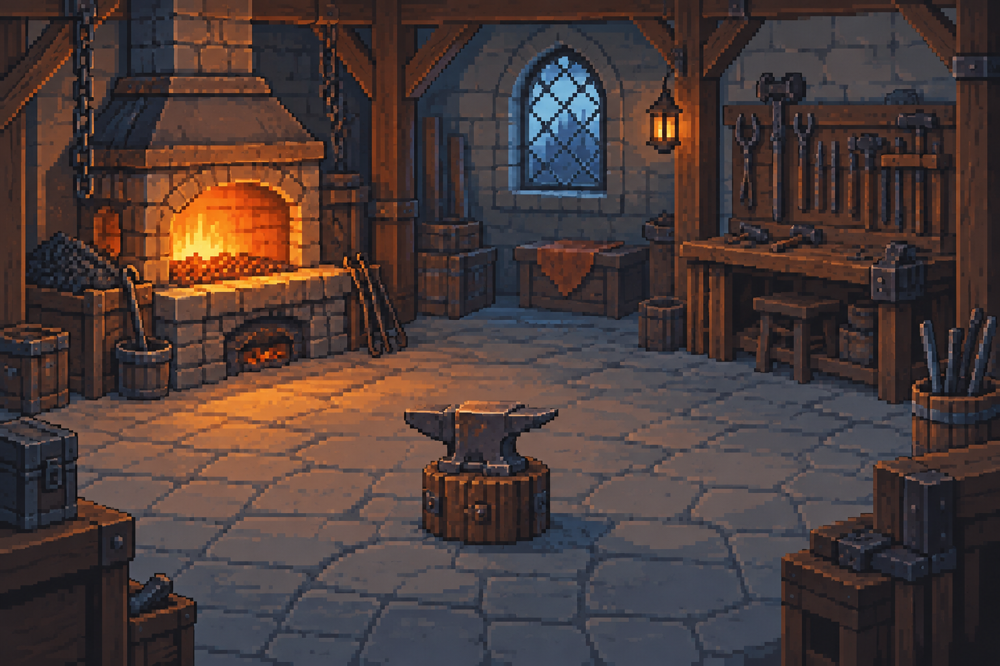
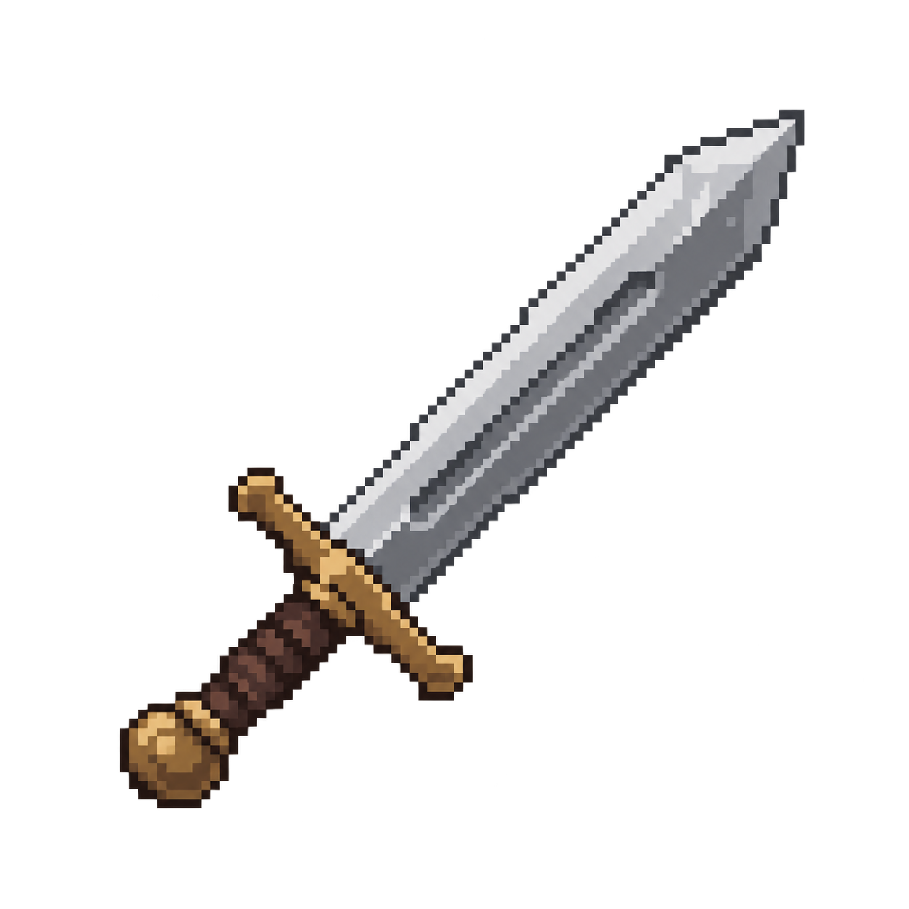
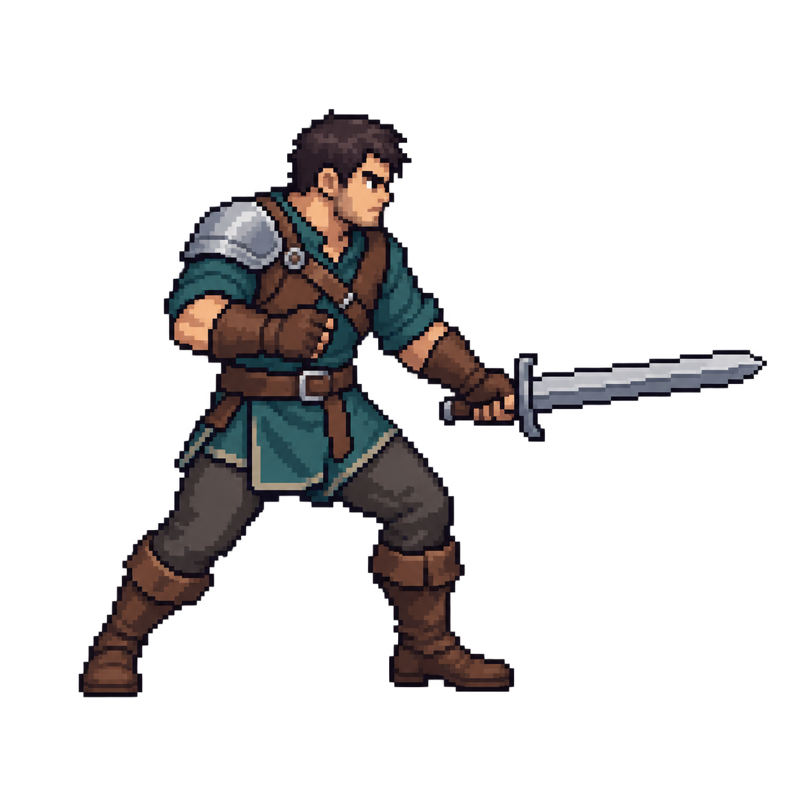
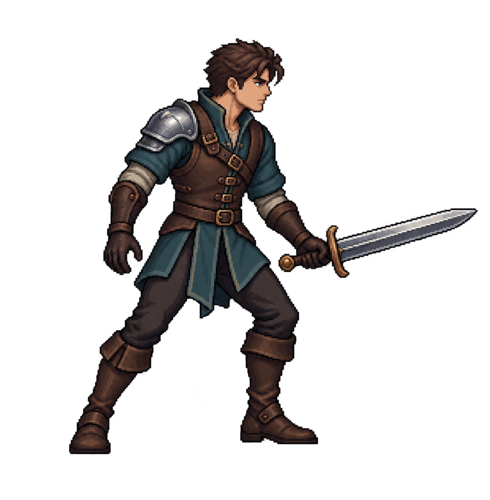
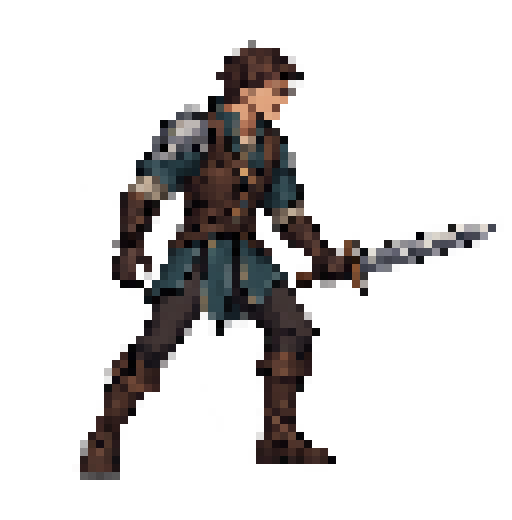
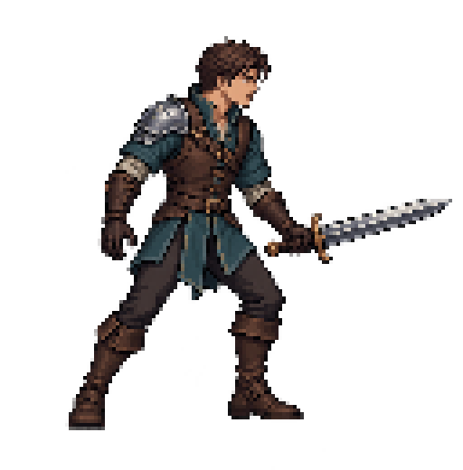

# 모루의 서약 | 픽셀 공방과 세계창

2026-09-10 재기획 블루프린트 보충편 · BS-REPLAN-20260910-41

승인된 방향: 전체 픽셀 아트, 기존 이미지 참고자료화, 기존 코어의 조사 기반 개선, 다섯 장비 정밀 태그 확장, 원할 때 보는 분할 세계 이벤트. 상세 배치·연출·데이터 설계는 아래의 검토안이며 구현 사실이 아니다. 기존 블루프린트 PDF는 역사 자료로 보존하고 이 보충편을 최신 변경 방향으로 함께 읽는다.

플레이어 경험: 공방에서 만든 장비가 세상에서 쓰이는 모습을 잠깐 보고, 그 기록을 다음 강화 판단에 연결한다. 제작·일반 강화 +1·10단위 정밀 태그·촉매 소모·손상·수리·연대기를 유지한다. 검·방패·활·갑옷·투구는 같은 종류의 기본 외형을 공유하고 강화·태그·손상으로 달라진다.

이번 산출물은 설계 문서와 파생 PDF이며 10절부터 첫 픽셀 후보를 포함한다. 실제 게임 캡처와 엔진 적용은 미실행이다. 기존 원화와 세이브를 지우거나 자동 변환하지 않는다. 프로젝트 Base v9.4.4 잠금은 유지한다.

## 1. 선택한 구조와 대안

- 채택: 상단 공방 + 하단 접이식 세계창. 세계창을 열어도 현재 장비·다음 강화 비용·위험·주 행동이 남는다. 세계 이벤트는 한 번에 하나만 재생한다.
- 비교: 항상 절반씩 분할하면 관람은 편하지만 작은 세로 화면의 강화·태그 선택 영역이 부족해진다. 기본값으로 채택하지 않는다.
- 비교: 별도 전면 세계 화면은 장면 감상에는 유리하지만 공방과의 연결이 약해진다. 세계창의 확대 보기로만 제공한다.
- 독창성 가설: 장비 UID, 당시 태그, 실제 사용 사건을 같은 화면에서 연결하면 '내 작품이 활약했다'는 감정을 만든다. 시장에서 유일하다는 주장이 아니며 플레이테스트로 확인한다.

첨부 이미지는 상하 분할과 동시에 다른 활동을 보여 주는 정보구조 참고다. 작품명은 이미지 하나로 단정하지 않으며 캐릭터·맵·UI 그림을 가져오지 않는다.

---

## 2. 세로 화면 와이어프레임

아래 수치는 360×640 논리 화면의 설계 예산이다. 720×1280 표시, 긴 한국어, 실제 터치 크기, 기기별 안전 영역을 별도 검증한다. 논리 px를 Android dp와 동일하다고 간주하지 않는다.

```wireframe
공방 집중 | 기본 상태
상단 상태줄                 40
공방 / 대장장이 / 장비      248
강화 · 태그 · 내구도        176
강화 / 멈추기               64
세계 소식 · 열기            56
하단 탐색 / 안전 영역       56
```

```wireframe
함께 보기 | 사용자가 세계창을 연 상태
상단 상태줄                 40
공방 / 장비 핵심 화면       136
비용 · 위험 · 태그 요약      96
강화 / 멈추기               56
결투 / 모험 / 군대          48
선택한 세계 사건 재현       136
사건 요약 / 확대 / 접기      72
하단 탐색 / 안전 영역       56
```

정밀 태그 선택·수리 확인처럼 중요한 결정창이 열리면 세계창 재생을 잠시 멈추고 핵심 결정 영역을 확보한다. 결정창 종료 뒤 이전 세계창 상태로 복귀한다. 전체 보기에서는 뒤로가기가 공방으로 돌아오며, 배속·일시정지·다시 보기는 관람 시간만 바꾼다.

사건이 없으면 '아직 도착한 소식이 없습니다'와 장비 인계 경로를 표시한다. 시청 가능한 사건이 생겨도 자동으로 화면을 펼치거나 강화를 중단시키지 않는다. 축소 상태에서는 장면 렌더와 반복 효과음을 멈춘다.

---

## 3. 세계 이벤트 세 종류

| 종류 | 짧게 보여 줄 장면 | 장비와 연결하는 정보 |
| --- | --- | --- |
| 콜로세움 결투 | 두 결투자의 준비, 접근, 공방 장비가 보이는 주요 교환, 판정 | 소유자, 당시 장비·태그, 기록된 승패, 실제 손상 여부 |
| 모험 | 출발, 지형 통과, 위험 조우, 귀환 또는 중단 | 임무 목적, 실제 장비 사용 장면, 기록에 있는 태그 관련성 |
| 군대 전투 | 소규모 대표 병력의 진형, 충돌, 전선 변화, 결과 | 해당 장비를 쓴 병사, 사건 목표, 성과와 손상을 별도 표시 |

대표 동작 수와 재생 길이는 시험 예산: 3~5개 비트, 전체 8~15초, 기본 자동 반복 없음. 군대 전투는 대표 스프라이트 6~8개부터 시험한다. 이 수는 실제 병력 수·사상자 수를 의미하지 않는다. 기록이 없으면 임의 피해 숫자·HP·처치 수·태그 발동을 만들지 않는다.

초기 구현 권장: 저장된 사건의 '사건 재현'. 현재 실제 실행 코드에는 세 종류의 실시간 전투 시뮬레이터가 없다. 실시간 관람은 사건 진행 정보를 제공하는 생산자가 생긴 뒤 별도 확장한다. 요약 재현을 LIVE 또는 실제 전투 리플레이라고 표시하지 않는다.

사용 예: 철검을 인계한 뒤 모험 결과가 저장된다. 세계 소식에서 모험을 누르면 그 사건 당시의 철검을 든 고객이 위험 지형을 통과하는 요약을 본다. 다시 보거나 창을 닫아도 보상·손상은 변하지 않는다. 관련성이 기록된 경우에만 '이 태그가 도움이 됨'을 표시한다.

## 4. 관람과 저장 흐름

```flow
장비 인계와 실제 사용 사건
→ 기존 판정 서비스가 결과 저장
→ 저장된 event_id + item_uid 확인
→ 사건 당시 장비 스냅샷 + 표현 가능한 비트 구성
→ 세계 소식에 표시
→ 열기 / 접기 / 확대 / 다시 보기
→ 같은 저장 결과에서 장면과 Chronicle 읽기
```

보는 행위에는 추가 보상·추가 손상·재굴림이 없다. 저장 실패 사건은 재현 목록에 들어가지 않는다. 결과가 확정되지 않았으면 결과 대기만 표시한다. 같은 UID의 과거 모습을 보면서 현재 공방에서 강화하더라도 과거 장비의 태그와 외형은 변하지 않는다. 인계된 장비의 편집 가능 여부는 기존 소유권 규칙을 따른다.

---

## 5. 기존 요소 재평가와 SWOT

| 현재 상태 | 조치 | 이유와 기대효과 |
| --- | --- | --- |
| 같은 UID의 제작·사용·연대기 | 유지·세계창 연결 | 시스템의 원인과 결과를 한 장비의 이야기로 묶음 |
| 10단위 태그·촉매 소모 | 유지 | 반복 강화 중 선택 지점이 명확하며 기존 저장 로직을 재사용 |
| 갑옷·투구는 +10에서 차단 | 승인된 확장 방향으로 재설계 | 5종 선택의 완결성 확보. 방어용 명칭·효과·카탈로그는 구현 전 확정 |
| 정적 공방·결과 이미지 | 새 픽셀 자산으로 단계 교체 | 제작 동작과 세계 사용 장면을 일관된 스타일로 연결 |
| 두 촉매가 같은 방식 효과를 공유 | 비교·개선 후보 | 색만 다른 선택이 되지 않도록 효과 차별성을 검증. 신규 원소 피해는 아직 미정 |
| 내구도 CURRENT/MAX/BASE_MAX | 수치 유지·표시 개선 | 숨은 패널티 없이 균열·흉터와 실제 상태를 함께 이해 |
| 결과 텍스트 중심 | 짧은 장면 + 핵심 문장 | 결과 읽기 부담을 낮추고 장비의 활약을 보여 줌 |
| 역사 정밀 미니게임·옛 정본 | 참조 관계 감사 뒤 활성 경로 정리 | 반복 설계 충돌 감소. 소비처 불명 파일은 보존 |
| 장비 등급별 그림 교체 없음 | 유지 | 같은 장비의 정체성을 유지하고 태그·강화 변화를 강조 |
| 직원·던전 운영 전체 도입 | 현재 범위에서 제외 | 공방 선택과 세계 관람을 완성하는 데 제작량 집중 |

강점(S): UID·저장·사용 결과와 태그라는 연결 기반이 있다. 약점(W): 시각 동작이 빈약하고 방어구 성장 및 세계 사건 공급이 미완성이다. 기회(O): 제작자 시점으로 장비의 활약을 관람하는 경험, 선택적으로 펼치는 세로 화면을 발전시킬 수 있다. 위협(T): 화면 과밀, 자동전투 게임과의 유사성, 프레임·장비 조합 폭증, Android 발열이다.

대응: 한 번에 한 사건만 보여 주고 기록에 있는 인과만 강조한다. 승률·피로·수리 경제는 아트 전환과 별도 실험한다. 독창성은 새 시스템 개수보다 장비 변화와 사건 연결의 이해도로 평가한다.

---

## 6. 픽셀 Visual Bible와 모션 계약

세 방향 비교: 낮은 해상도의 복고 픽셀은 빠르게 읽히나 태그·흉터를 표현하기 어렵다. 중간 밀도의 판타지 픽셀은 장비 실루엣과 각인, 작은 인물 동작을 함께 읽히게 할 수 있어 권장한다. 고밀도 픽셀과 깊이 조명은 장면성이 좋으나 생산·모바일 검증 비용이 커서 보류한다.

권장 5축: 선명한 픽셀 덩어리 / 약간 과장된 인물 비율 / 공방 사선 고정 시점과 전투 측면 시점 / 따뜻한 금속·목재와 차가운 세계 배경 / 제한된 디테일과 선명한 준비-동작-복귀. 제목은 모루의 서약을 유지한다. UI·장비·배경·로고 모두 픽셀 방향이며 한글 가독성은 별도 검수한다.

생산 후보 규격: 장비 64×64, 인물 48×64, 접점 중심 VFX 64×64. 실제 1배·2배 화면에서 검토 후 잠근다. 장비 5종은 각자 기본 실루엣을 유지한다. 태그 각인·강화 마감·손상 흔적은 정해진 부착점에 표현하고 모든 조합의 가독성을 검사한다.

| 소비처 / 후보 ID | 필요한 새 자산 | 필수 상태와 실패 폴백 |
| --- | --- | --- |
| 공방 / PX-FORGE-01 | 공방 배경, 대장장이, 망치 | idle, prepare, strike, recover; 승인 자산 전에는 문서 시안 |
| 장비 표시 / PX-EQUIP-05 | 검·방패·활·갑옷·투구 각 1종 | 투명 배경, 태그 부착점, 손상 레이어; 텍스트 상태 유지 |
| 결투 / PX-WORLD-DUEL | 경기장, 결투자 상태군 | ready, move, attack, guard, hit, recover, outcome |
| 모험 / PX-WORLD-ADVENTURE | 길·위험 배경, 탐험자 | idle, walk, encounter, use, return |
| 군대 / PX-WORLD-ARMY | 전선 배경, 병사·깃발 | ready, advance, clash, hold, retreat |
| 세계창 조작 / PX-WORLD-UI | 픽셀 탭·프레임·선택 표시 | normal, pressed, selected, disabled, focus |

공방 배경·철검·결투자 준비 자세는 첫 후보가 생성되었다(10~12절). 나머지 항목은 NEEDED/BRIEF_DRAFT다. 생성 계약은 PIXEL_CANDIDATE_BRIEF_20260910.md에 있으며 팔레트·외형·실제 픽셀 규격은 아직 최종 확정 전이다.

Aseprite: 연결된 aseprite-candidates MCP와 실행 파일1.3.18.5-dev를 사용했다. 철검 단일 프레임의 복사·검사·PNG+JSON 내보내기·RGBA 동일성은 TASK_VERIFIED다. 모션 제작은 미실행이다. 새 창작은 이미지 모델, 후보의 프레임·레이어·시트 정리는 Aseprite, 게임 재생은 Godot이 담당한다. 서로 다른 상태 그림을 프레임으로 묶는 것만으로 연결 동작이 완성되지는 않는다.

작업 원본은 별도 후보 폴더에서 보존하고 .aseprite + PNG + JSON으로 내보낸다. 프레임마다 동일 캔버스·발 위치·손잡이 위치를 맞춘다. idle 4~6fps, 행동 8~12fps는 시험값이며 UI 렌더 FPS와 별개다. 투명도·시트 프레임 순서·태그·소스/출력 해시·프레임 타이밍을 확인한다.

---

## 7. 구현 가능성·반대 검토

기존 소비처: scripts/vertical_slice/ui/vs_app.gd, vs_workshop_screen.gd, vs_customer_result_screen.gd, vs_item_chronicle_screen.gd. 기존 저장 책임: services/vs_customer_actual_use_action_service.gd와 resolvers/vs_customer_world_event_resolver.gd. 세계창은 새 표시 컴포넌트이며 세 종류의 이벤트 제작자·재현 비트·역사 장비 스냅샷은 아직 없다.

계획된 구조: App의 화면 분할 컨테이너 → 공방 화면 + WorldEventPanel. Panel은 읽기 전용 adapter로 event_id, event_kind, source_item_uid, item_snapshot, outcome, presentation_beats를 받는다. 필드명은 제안이며 저장 스키마 변경은 별도 migration 명세로 확정한다. UI 캐시는 정본이 아니다.

과거 기록에 프레임별 전투 정보가 없으면 '요약 재현'으로 표시한다. 장비 스냅샷까지 없으면 정확한 장비 장면을 만들지 않고 텍스트 요약을 보여 준다. 새 기록은 사건 당시 장비와 자산 revision을 함께 고정하는 계약을 구현한다. 예전 세이브를 열 수 있어야 하고, unknown event_kind는 텍스트 폴백한다.

Godot은 Control 영역으로 공방·조작부를 구성하고 관람 장면에 필요할 때만 SubViewportContainer + SubViewport를 사용한다. 두 관람 장면을 동시에 돌리지 않는다. 접힌 창은 처리를 멈춘다. 실제 .tscn/Resource 저작은 프로젝트의 승인된 Godot 저작 경로를 따른다.

반대 검토 1: 세계창이 강화 입력을 가리거나 보상을 중복할 수 있는가? 강화 버튼의 고정 영역, 정밀 선택 시 관람 일시정지, 읽기 전용 재생, 20회 재열기/다시 보기 후 저장 결과 불변으로 검증한다.

반대 검토 2: 예쁜 전투가 사실을 왜곡하거나 제작량을 폭증시키는가? 사건 당시 스냅샷, 기록에 없는 피해 숫자 금지, 인물 상태 재사용, 대표 병력 상한, 단일 관람 렌더로 제한한다. 5종×태그×손상 대표 조합과 모션 감소 상태를 비교한다. 이 검토는 설계 수준이며 실제 성능·플레이 테스트를 대체하지 않는다.

## 8. 블루프린트 작업 체크리스트

- [x] 사용자 승인 방향과 새 세계창 요구 통합
- [x] 현재 main·열린 PR·실제 저장/표시 소비처 확인
- [x] Base 잠금 유지, 최신 Aseprite 자동 선택 지침 확인
- [x] 집중/분할 와이어프레임, 3종 사건, 폴백·저장 경계 명세
- [x] SWOT·유지/개선/보류·두 차례 반대 검토
- [ ] 방어구 태그 명칭·효과·카탈로그와 세이브 이행 확정
- [x] 대표 공방·철검·결투자 브리프 작성과 첫 후보 3종 생성 (나머지 4종 장비는 미제작)
- [ ] Aseprite 상태군·연결 프레임·투명도·피벗 내보내기 검증
- [ ] 사건 공급·스냅샷·재현 데이터 및 세이브 회귀 구현
- [ ] 세계창 펼침·접힘·확대·재생 및 세 종류 장면 구현
- [ ] Godot 인게임 캡처와 동작 영상, Android 성능·터치 검증
- [ ] 사람 검토: 어떤 장비가 왜 도움 됐는지 이해, 공방 복귀·판단 부담

순서: 상세 명세 → 대표 공방/결투 후보 → 프레임 검증 → 한 사건 관람 완성 → 모험·군대 확장 → 실제 화면/영상과 PDF 갱신. 기존 그림 폐기는 대체 소비처·회귀·복구 경로 확인 뒤 정확한 파일별로 진행한다.

---

## 9. 조사 출처와 작업 증거

공식 제품 소개와 도구 문서 확인일: 2026-09-10. 직접 플레이·현업 인터뷰·Android 기기 실험은 미실행이다. 아래 해석은 설계 가설이며 시장 성공이나 UX 통과를 증명하지 않는다.

- Weapon Shop Fantasy: 제작과 모험 자동전투의 연결을 ADAPT. 직원 성장·광범위한 전투 운영은 현재 범위에서 REJECT. https://store.steampowered.com/app/599460/Weapon_Shop_Fantasy/
- Gladiator Guild Manager: 장비를 갖춘 인물의 경기 관찰을 ADAPT. 전술 지휘·길드 운영은 REJECT. https://store.steampowered.com/app/1043260/Gladiator_Guild_Manager/
- Anvil Saga: 공방 행동과 세계 결과의 연결을 ADAPT. 방 확장·직원 경제는 보류. https://store.steampowered.com/app/1587540/Anvil_Saga/
- Godot Viewports: 서로 다른 표시 영역·렌더 책임을 ADAPT. 추가 viewport는 필요할 때 한 개부터 측정. https://docs.godotengine.org/en/stable/tutorials/rendering/viewports.html
- Aseprite Animation: 프레임·태그 기반 제작을 ADAPT. 생성 성공과 동작 연속성 검증은 별개. https://www.aseprite.org/docs/animation/

기준 main: ff1c935d9ada60607bace782f1f21f1adac59ba9. 열린 PR #359와 #196은 다른 작업으로 읽기 전용 확인. Base remote main: 2f93e872d9ed4fa18018ac759b01acd7d34e9b58. 채택 잠금 v9.4.4 유지. 운영 계약 검사 PASS. 새 픽셀 runtime / Android / Human / release: NOT_RUN.

학습: PATH에 없는 Aseprite를 미설치로 단정한 이전 안내를 정정한다. 현재 MCP 도구 목록, 로컬 사용 문서, 실행 파일 버전을 함께 확인해야 한다. Base 최신 자동 선택 규칙은 origin/main의 ART_DIRECTION_AND_ASSET_PLANNING_GUIDE.md §11에 존재한다. 기존 Base 공용 규칙으로 이미 해결되므로 중복 스킬이나 bridge는 만들지 않는다.

---

## 10. 첫 픽셀 후보 - 공방

GENERATED_CANDIDATE / 그림체·공간 검토용 / 인게임 캡처 아님. 최신 생성 계약: PIXEL_CANDIDATE_BRIEF_20260910.md. 원본·해시·검수 기록: candidates/pixel-first-20260910/record.json.



채택할 표현: 읽히는 작업 공간, 금속·목재·석재 구분, 따뜻한 불빛과 차가운 그림자의 대비. 보완할 표현: 모루와 불꽃이 배경에 포함되어 있으므로 대장장이의 망치 접점과 화염 동작은 레이어 분리 및 실제 화면 크롭 검증이 필요하다. 이것만으로 공방 모션 자산 완성이 아니다.

---

## 11. 철검 후보와 실제 투명도 검증



실제 파일: 1254×1254 RGBA. 모서리 알파0, 투명 배경 확인. Aseprite native MCP로 .aseprite 복사 → PNG+JSON 내보내기 → 원본 픽셀 보존 확인을 수행했다. 1프레임100ms이며 애니메이션이 아니다.

제작 전 보완: 부분 알파219,698픽셀, RGBA색29,927개로 아직 엄격한64×64 픽셀 스프라이트가 아니다. 모델의 픽셀풍 외형과 실제 정수 그리드 자산을 구분한다. 그리드·팔레트·투명 경계 정리 및 소형 표시 검증 전에는 runtime 승격하지 않는다.

---

## 12. 결투자 후보와 다음 동작



읽히는 요소: 청록 옷과 갈색 가죽, 강철 어깨 보호구, 준비 자세. 보완할 요소: 요청한 완전 측면보다 사선에 가깝고 들고 있는 검이 단독 철검과 다르다. 장비 모듈과 인물 원본의 동일성을 먼저 맞춘다.

다음 상태: 준비 → 예비동작 → 공격 → 회복 → 준비. 현재 준비 자세1장만 존재한다. 프레임 복제만으로 동작 완료를 만들지 않는다. 5종 장비·태그·손상과 결투/모험/군대 상태군, Godot 인게임 캡처·영상은 계속 미완료다. 후보 외형 검토와 실제 게임 승인은 분리한다.

---

## 13. 그림체 보완 후보 - 세련된 판타지 결투자

사용자 요청: 기존보다 멋진 그림체. 유지: 청록·가죽·강철, 짧은 철검, 청동 가드, 전신 준비 자세. 보완: 성인형 비례, 날렵한 얼굴과 자세, 정돈된 금속 면과 가죽 구조. 아래는 새 시안이며 이전 후보의 최종 교체 승인이 아니다.



실측1242×1266 RGBA, 완전 투명1,209,354픽셀. 앞선 RGB 바둑판 실패와 달리 실제 알파가 있다. 다만 부분 알파362,413픽셀이 남았고, 엄격한 측면보다 사선 자세에 가깝다. 멋과 재질은 개선됐지만 소형 픽셀 자산으로 완성된 것은 아니다.

---

## 14. 작은 화면 검수 - 64픽셀 폭



Aseprite로 원본 비율을 유지해64×65로 축소하고8배 정수 확대했다. 64×64 완성 규격으로 표기하지 않는다. 얼굴·버클·가죽 경계가 합쳐지며 어두운 영역이 뭉친다. 일부 외곽의 색 점과 부분 알파도 남는다. 단순 축소를 픽셀 정리 완료로 취급하지 않는다.

---

## 15. 작은 화면 검수 - 128픽셀 폭과 체크리스트



128×130은 얼굴·갑옷 판독이 낫지만 여전히 축소 파생 후보다. 확대 세계창용 검토안으로만 남기며 기본 캐릭터 해상도를 자동 변경하지 않는다. 기본64급에서 쓰려면 외곽 정리, 명암 단계 축약, 장식 생략과 손·검의 분리가 필요하다.

| 항목 | 현재 상태 | 다음 조건 |
| --- | --- | --- |
| 후보 전용 Aseprite 기능 | 구현·기계검증 | opt-in 세션12도구, 기본10도구 유지 |
| 실제 투명 배경 | 확인 | 알파 경계·색 점 정리는 별도 미완료 |
| 새 그림체 | 사용자 검토 대기 | 최종 선택 전 정본 자산 승격 금지 |
| 기본 게임 규격 | 미완료 |64급 가독성과 캔버스·발 접점 고정 |
| 연결 동작 | 미제작 | 같은 기준 이미지의 준비·공격·복귀 |
| 인게임 캡처 | 미실행 | 승인 자산 적용 후 실제 화면으로 검증 |

---

## 16. 상세 규칙 - 기획 우선과 5종 장비

사용자 최신 위임: 인터넷 조사·벤치마킹을 바탕으로 상세 규칙을 권장안대로 정리한다. IMAGE_PRODUCTION_PAUSED. 이번 16~19절은 상세 기획 책임 원본이며 1~15절의 상충하는 제작 순서·효과 제안보다 우선한다. 기존 후보는 참고로 보존한다. 상세 설계는 SPECIFIED / 수치는 RECOMMENDED_TEST_VALUES / 제품 구현은 NOT_RUN이다. 문서 위임을 실제 플레이 승인이나 세이브 변환 승인으로 해석하지 않는다.

유지: 모루의 서약, 강화의 STOP OR PUSH, 일반 성공 +1, +10~+100의 10단위 정밀강화, 최대3태그와 I~IV, 시도별 촉매1개, 같은 UID의 소유·손상·수리·연대기. 등급으로 동일 종류의 기본 외형을 바꾸지 않는다. 내구도 CURRENT/MAX/BASE_MAX와 파괴·수리·실패 비용은 현행 규칙을 유지한다.

| 장비 | 담당 역할 | 성능 가공 표기 | 취급 가공 표기 | 사건에서 보여 줄 사용 |
| --- | --- | --- | --- | --- |
| 검 | 근접 공격 | 날 벼림 | 무게중심 조율 | 베기·받아치기에 실제 사용 |
| 방패 | 능동 방어 | 방패면 보강 | 손잡이 조율 | 막기·엄호에 실제 사용 |
| 활 | 원거리 공격 | 활대 조율 | 당김 균형 | 원거리 지원에 실제 사용 |
| 갑옷 | 몸통 보호 | 판금 보강 | 착용 균형 | 몸통 보호가 필요한 사건 |
| 투구 | 머리 보호 | 두정부 보강 | 착용 균형 | 머리 보호가 필요한 사건 |

위 표는 다섯 별도 전투 엔진이 아니라 공통 태그 시스템의 역할·표시 매핑이다. 초기 사건은 대표 장비1개를 소유권·역할에 맞게 평가한다. 장비5개 동시 착용, 부위별 HP, 명중·회피·기절·원소 저항을 새로 만들지 않는다. 갑옷·투구의 기존 정밀강화 차단은 새 규칙 구현 때 해제하며 현재 런타임은 그대로다.

고객은 인계 전에 필요한 장비 종류, 사건 목적, 주 요구(성능/취급), 수행 성격(순간/지속)을 보여 준다. 종류 불일치는 인계 전에 차단한다. 보유하지 않은 장비를 자동 지급하지 않는다. 기본 수치가 달라도 동일한 강화 체계와 결과 설명을 사용한다.

현재 문제: 원본 무게15와 경량 -3에서 두 경량 태그의 유효 성장은 합계5회다. 역할 태그1개 IV의4회를 더해도9회뿐이라10번째 정밀강화가 막힌다. 현재 카탈로그4종 중3종을 고르는4조합 중2조합이 해당한다. 이는 규칙 계산·코드 대조 증거이며 실제 엔진 재현은 미실행이다.

선택: 기존 경량 효과를 새 기획에서 취급 성능으로 대체한다. 무게를0으로 만드는 반복 차감과 무효 강화는 폐기 대상으로 분리한다. 현재 무게 값은 고객 허용 하중 검사에 계속 쓰며 새 취급 태그가 무게·이동속도·회피율을 바꾼다고 설명하지 않는다.

---

## 17. 촉매 - 순간 발휘와 지속 수행

설계 선택: 불의 심장=순간 발휘, 대지의 결정=지속 수행. 가공 방식은 성능/취급이다. 촉매가 공격/방어를 독점하지 않으므로 방패·갑옷·투구에도 두 재료의 용도가 있다. 화염 피해나 흙 저항은 추가하지 않는다. 아래4개 태그는5종 공통이며 장비별 가공 표시만16절 표를 따른다.

| 촉매 | 가공 | 권장 태그명 / 새 ID | 적용 상황 |
| --- | --- | --- | --- |
| 불의 심장 | 성능 | 격발 / BURST_OUTPUT | 짧은 결정적 성능 발휘 |
| 불의 심장 | 취급 | 기민 / BURST_HANDLING | 순간적인 조작·대응 |
| 대지의 결정 | 성능 | 견실 / SUSTAIN_OUTPUT | 지속적인 성능 수행 |
| 대지의 결정 | 취급 | 균형 / SUSTAIN_HANDLING | 반복·장시간 안정적 취급 |

새 태그 ID는 설계 전용이며 기존 TAG_EMBER_* / TAG_ANVIL_* ID를 같은 뜻으로 재사용하지 않는다. 네 번째 affix 슬롯을 만들지 않고 CATALYST_AFFIX 안의 태그로 유지한다. 같은 ID 중복 추가 금지, 서로 다른4종 중최대3개를 선택한다. 같은 축의 두 촉매는 함께 보유할 수 있다.

정밀강화 성공마다 ADD_TAG로 I를 추가하거나 UPGRADE_TAG로 한 단계 올린다. +10은 추가만, 이후는 가능한 행동 중 명시 선택한다. 최대 IV, 태그 교체·삭제·랜덤 재굴림 없음. 실패는 비용만 현행대로 소비하고 태그·단계는 유지한다. 빈 선택·자원 부족·불가능한 선택은 비용·굴림·저장 전에 차단한다. 저장 실패는 장비·골드·보강재·촉매 모두 원상 유지한다.

시험 계산: 사건의 주 요구 축과 같은 태그만 적합도에 기여한다. 태그 단계 s에 대해 수행 성격도 일치하면3s, 성격이 다르면 s점을 부여한다. 축이 다르면0점이다. 같은 축의 두 촉매 점수는 합산한다. 성격은 BURST 또는 SUSTAINED 중하나, 축은 OUTPUT 또는 HANDLING 중하나만 사건 정의가 소유한다. 표시 이름으로 추론하지 않는다.

예: 성능·순간 사건에서 격발II는6점, 견실II는2점이다. 성능·지속 사건에서는 반대다. 기민·균형은 이 성능 사건에0점이며 취급 사건에서 가치를 갖는다. 사건 종류 자체가 특정 촉매를 강제하지 않도록 모험·결투·군대 모두 순간/지속 변형을 준비한다.

적합도는 신규 사건 지원도이며 raw_role_stat 누적, 무게 차감, 강화 성공률, 내구도 수리 보정으로 중복 적용하지 않는다. 최대3슬롯×4단계=12성장 공간이라10회 선택 중 공간 고갈이 없다. 슬롯이3개 미만이면 추가, 가득 찼어도10회 미만이면 최소 하나는IV 미만이다. 단, 재료 부족·파괴 같은 기존 차단은 별개다.

반대 검토: 차이가 항상 같은 답이면 선택이 아니다. 4개 요구 조합을 동등 노출하는 시험군과 편중 시험군을 비교한다. 숫자3/1은 최종 밸런스가 아니다. 한 촉매가 양쪽 성격에서 항상 우월하거나 사용자가 차이를 설명하지 못하면 조정한다.

---

## 18. 사건 - 인과를 보여 주는 최소 규칙

초기 범위는 모험의 짧은 사건1개와 요구 변형4개다. 결투·군대는 같은 계약을 확인한 뒤 확장한다. 결과를 그럴듯하게 만드는 가짜 HP·피해량·처치 수는 만들지 않는다. 초기 출력은 요약 재현이며 실시간 전투가 아니다.

제안 사건 입력: event_id, ruleset_version, event_kind, required_equipment_group, challenge_axis, pressure_profile, primary_item_uid, item_snapshot, base_success_percent, damage_profile, actual_item_use, reward_spec. 사건 ID는 실행 전에 고정하며 재시도·다시 보기로 새 ID나 결과를 만들지 않는다. item_snapshot은 당시 종류·레벨·태그·내구도·표시 자산 revision을 포함한다.

결과 시험 규칙: 기존 요구조건을 통과한 신규 사건에서 최종 성공률=clamp(태그 보정 전 기본 성공률+17절 적합도,5,95). 기본 성공률은 사건 producer가 확정해 저장한다. 현재 고객 estimate를 실제 판정으로 자동 전용하지 않는다. 첫 비교 시험은 기본60%, 같은 장비 레벨·고객·내구도,4요구 조합으로 고정한다. s=II의 일치/불일치는66%/62%로 비교한다. 이것은 신규 사건 시험이며 기존 고정 귀환 결과를 몰래 대체하지 않는다.

성공/실패 판정과 장비 손상은 독립적으로 기존 Decision30 경계를 따른다. 이번4태그는 손상 완화 기능을 부여하지 않는다. 실제 사용이 없으면 손상 없음, 같은 사건·UID당 최대1회 손상, MAX 직접 손상 없음. 결과·비용·보상·손상을 한 저장 후보에서 해결하고 저장 성공 후에만 노출한다. 관람은 읽기 전용이다.

초기 비교 사건의 reward_spec은 NONE이다. 확정되지 않은 촉매 드롭·상점 가격·무한 자원 루프를 만들지 않는다. 테스트 시작 자원은 현행 임시 예산을 사용하고 정식 획득처·가격·수리비 경제는 별도 검증한다. 성공해도 손상될 수 있고 실패해도 장비가 무사할 수 있음을 따로 표시한다.

사용 흐름: 고객이 철방패와 순간 취급을 요구 → 기민 태그의 관련성을 비용 지불 전에 확인 → 강화 또는 현재 상태로 인계 → 저장된 성공/실패와 손상 확인 → 선택한 경우만 세계창에서 짧게 재현 → 같은 UID의 연대기로 이동. 결과에는 사용 장비, 요구조건, 태그의 수치 기여, 실제 손상을 표시한다. 확률 기여가 있었다는 이유로 태그가 승리를 단독으로 결정했다고 쓰지 않는다.

펼침·접힘·배속·다시 보기20회에도 저장 결과와 자원이 불변이어야 한다. 기록·snapshot·버전이 부족한 과거 사건은 텍스트 요약으로 표시한다. 압박 상황의 인과를 알 수 없으면 추정 태그 발동을 보여 주지 않는다. 현재 장비를 변경해도 과거 snapshot은 변하지 않는다.

---

## 19. 이행 - 조사 근거와 검증 체크리스트

LEGACY_V3_UNCHANGED. 현행 catalog V3·실행 코드·세이브를 이번 문서로 변경하지 않는다. 신규 규칙은 새 ruleset/catalog version으로 분리한다. 기존 태그 효과는 raw_role_stat·weight_point에 누적되어 있어 ID만 교체하면 이중 보상 또는 가치 손실이 발생한다. 기존 효과 역산·원래 무게 복구를 보장할 자료가 없는 세이브는 자동 변환하지 않는다. 초기 검증은 별도 신규 테스트 세이브로만 수행하고 사용자 세이브는 보존한다.

새 기획이 대체하려는 범위: Decision38/40의 동일 방식 효과, 경량 -3, weapon-only 상세 제한과 catalog의 기능 재설계 금지 경계. 유지 범위: cadence,3태그,I~IV,촉매 소비 원자성,내구도·수리·소유권. 새 기획의 runtime 활성화는 저장 호환성·실패 경로·시각 자료 검증 이후 별도 구현 작업으로 진행한다.

| 현재 상태 | 권장 조치 | 이유·기대효과 |
| --- | --- | --- |
| 같은 방식의 두 촉매 효과 동일 | 순간/지속 적합도로 구분 | 모든 장비에서 재료 선택 이유 제공 |
| 두 경량 태그에서 성장 공간9회 | 취급 성능으로 재설계 | 허용 조합의10회 성장 확보 |
| 방어구 정밀강화 차단 | 5종 공통계약·가공 표기 | 역할별 표현과 성장 완결성 |
| 결과와 모션 자산 연결 미완성 | 사건 입력·snapshot 선행 | 재제작·허위 인과 표현 감소 |
| 이미지와 도구 보완이 앞서 진행 | 기획 검토→시험→아트 순서 | 최신 사용자 선호 반영 |

조사 확인: 2026-09-10. 공식 소개 기반 desk research이며 직접 플레이·인터뷰 아님. Weapon Shop Fantasy의 장비-모험 연결은 ADAPT, 대량 장비/직원 운영 복제는 REJECT. Anvil Saga의 목적 있는 주문·결과는 ADAPT, 직원 생활관리는 REJECT. Gladiator Guild Manager의 사전 선택-관전 연결은 ADAPT, 전술 지휘 이식은 REJECT. 독창성 가설은 같은 UID의 제작·성장·사용·흉터를 다음 선택에 연결하는 데 있으며 시장 유일성을 주장하지 않는다.

- https://store.steampowered.com/app/599460/Weapon_Shop_Fantasy/
- https://store.steampowered.com/app/1587540/Anvil_Saga/
- https://store.steampowered.com/app/1043260/Gladiator_Guild_Manager/
- https://docs.godotengine.org/en/stable/tutorials/io/saving_games.html

- [x] 실제 catalog·resolver·고객 하중 consumer 대조
- [x] 기존9회 성장 한계 계산, 대안의 슬롯/단계 공간 검사
- [x] 5종 역할·4태그·사건 연결과 기존 세이브 보호 명세
- [ ] 신규 사건 판정·태그 규칙의 Godot 회귀 검증
- [ ] 재고 부족·저장 실패·중복 사건·옛 세이브 테스트
- [ ] 요구4조합×태그4종×I~IV의 기여·선택 분포 검증
- [ ] 고객 요구 이해·태그 차이 설명·관전 후 다음 판단의 사람 검증
- [ ] 정식 획득/가격 경제, 기존 세이브 이행, Android 입력·성능 검증

작업 순서: 위 명세의 모순 검토 → 신규 테스트 세이브에서 계산·저장 계약 검증 → 화면 정보 확정 → 필요한 아트·모션 재개 판단 → 실제 캡처. Base 공용 승격은 아직 하지 않는다. 현재 학습은 프로젝트 고유의 경량 포화 문제이며 공용 규칙으로 검증된 결과가 아니다.

---

## 20. 재미 - 누를 이유와 멈출 이유

현재 작업: 상세 기획 지속 위임에 따른 재미·독창성 검토. 20~23절은16~19절을 보완하며 확률·수리 경제를 덮어쓰지 않는다. IMAGE_PRODUCTION_PAUSED / DESK_RESEARCH_NOT_PLAYTEST. 자동 계산으로 선택 공간은 확인하지만 손맛·애착·재미를 통과 처리하지 않는다.

플레이어 약속: 더 높은 숫자를 만드는 것뿐 아니라, 어떤 상황에 강한 작품으로 키울지 판단하고 그 작품의 사용 기록을 확인한다. 핵심은 강화이고 세계창은 결과를 이해하는 선택형 보조 수단이다. 세 종류의 전투 게임을 동시에 만들지 않는다.

| 재미 층위 | 실제 선택·확인 | 피드백 | 금지·검증 조건 |
| --- | --- | --- | --- |
| 한 번의 강화 | 현재 상태로 멈추기 / 비용을 내고 도전 | +1·비용·성공/유지/손상 즉시 확인 | 가짜 아슬아슬 실패·확률 왜곡 금지 |
| 정밀강화 | 새 용도 추가 / 기존 강점 성장 | 이번·다음 예정 요구의 기여 변화 비교 | 자동 최적 태그 선택 금지 |
| 작품 인계 | 요구를 읽고 현 상태로 인계 / 더 준비 | 성공률과 손상 가능성을 분리 표시 | 좋은 결과를 보장한다고 쓰지 않음 |
| 세계 소식 | 텍스트만 / 짧은 재현 / 다시 보기 | 내 장비·당시 태그·실제 결과 확인 | 시청 보상·강제 대기 없음 |
| 다음 작품 | 이전 결과를 참고해 다른 목적 준비 | UID에 묶인 의미 사건과 비교 | 손상 강제 연출·숨은 실패 보상 없음 |

한 바퀴 시험은 기존6~8분 가설을 유지하되 목표가 아니라 측정 기준으로 쓴다. 도입에서 고객 요구를 보고 제작·반복 강화·첫 정밀 선택을 경험한 뒤 인계·결과·공방 복귀까지 평가한다. +100은 이 짧은 세션 목표가 아니다. +20 이후 조합 판단은 별도 진행도 고정 테스트에서 확인한다.

처음부터 모든 탭을 설명하지 않는다. 첫 요구는 장비 종류·목적·요구 축·수행 성격만 보여 주고, 태그 선택 때 비용과 기여 변화, 결과에서 손상·기록을 설명한다. 연출 지연은 입력을 보호하는 최소 구간만 허용하고 반복 결과는 짧게 한다. 구체적 모션·사운드 제작은 지금 하지 않는다.

정밀 선택은 장비 전체의4요구 적합도를 작은 비교표로 제공한다. 현재 목표와 다음 예정 작업의 요구를 강조하되 없는 미래 정보를 확정처럼 표시하지 않는다. 다음 목표가 미정이면 미정으로 표시하고 숨은 최적 조합을 유도하지 않는다. 요구 공개 없이 이름·색만 고르게 하는 방식은 제외한다.

일반 +1이 신규 사건에서 어떤 이득을 주는지는 별도 검증 위험이다.18절의 기본60%는 태그 비교를 위한 통제값일 뿐 완성 경제/성장식이 아니다. 기존 고객 estimate의 레벨 기여를 실제 사건 판정에 자동 이식하지 않는다. 통합 성공률·비용·손상 노출을 검증하기 전에는 STOP OR PUSH의 재미가 완성됐다고 말하지 않는다.

---

## 21. 대표 모험 - 무너진 수로의 측량대

새 고객·사건 텍스트는 콘텐츠 초안이며 실제 세계의 확정 역사나 구현 사실이 아니다. 목적: 측량대의 작업자가 무너진 수로의 측량 표식을 회수하거나 통로를 확보하도록 필요한 장비를 인계한다. 신규 전투 수치 대신 작업 목적과 장비의 사용 이유가 읽히는지 검증한다.

첫 시험 장비는 철방패다. 아래4변형은 같은 장비·레벨·정상 내구도·태그 성장 예산·기본60%·보상NONE·손상LOW로 맞춘 비교 조건이다. 손상LOW는 현행 시험 프로필이며 최종 경제가 아니다. 위험 수준과 장비를 동시에 바꿔 태그 효과로 오인하지 않는다.

| 사건 ID / 요구 | 고객 요청 초안 | 성공 / 실패 결과 초안 | 주요 사용 장면 |
| --- | --- | --- | --- |
| AQ01 / 성능·순간 | 짧게 쏟아지는 파편을 막고 통로를 확보해 주세요 | 표식 회수 / 통로 확보 실패로 철수 | 방패면으로 파편 차단 |
| AQ02 / 취급·순간 | 좁은 통로에서 바뀌는 파편 방향에 대응해야 합니다 | 표식 회수 / 접근을 중단하고 철수 | 방패 방향 전환 |
| AQ03 / 성능·지속 | 측량이 끝날 때까지 작업자를 계속 엄호해야 합니다 | 측량 완료 / 엄호 지속 실패로 철수 | 고정 위치에서 엄호 |
| AQ04 / 취급·지속 | 좁은 길을 이동하며 여러 측량 지점을 보호해야 합니다 | 경로 기록 완료 / 일부 접근 중단 후 철수 | 이동하며 반복 엄호 |

판정은 실제 사용 시1회의 임무 성공 굴림과 별도의1회 손상 굴림이다. LOW·정상 상태는 손상10% 시험값이며 성공 여부로 손상을 결정하지 않는다. 인계만으로는 굴리지 않는다. 작업자 사망·부상·사상자 수·시간 지연 패널티는 이 결과 텍스트에서 새로 생성하지 않는다.

관람 비트: 출발 → 요구가 드러나는 작업 → 대표 장비 사용 → 저장된 결과 확인. 각 비트는 표현일 뿐 추가 전투 판정이 아니다. 실패 장면도 인물의 무능을 조롱하지 않는다. 피해 없는 실패와 임무 성공 후 장비 손상을 서로 다른 문장으로 표시한다. 지원도는 '성공 가능성 +6%p'처럼 기여로 설명하고, 판정 근거 없는 결정타 연출은 하지 않는다.

사건 배정: 테스트는 AQ01~04를 사전에 정한 순서로 순환하고 순서 효과는 참가자별로 교차한다. 현재 고객 요구는 강화 전에 고정한다. 태그를 본 뒤 사건을 바꾸지 않는다(NO_ADAPTIVE_COUNTER_PICK). 메뉴 재열기·관람·재접속은 사건 ID·요구를 바꾸지 않는다. 같은 사건을 다시 보는 것은 재시도가 아니다.

새 실제 사용 임무는 별도 event_id와 명시적인 새 인계를 요구한다. 이미 인계된 장비를 공방에서 임의 강화하거나 자동 회수하지 않는다. 다음 작품은 현재 허용된 소유권·제작 경로로 준비한다. 기존 UID를 다시 쓰는 경우에는 소유권 반환이 실제로 확인된 상태만 허용한다.

확장 조건: AQ02/AQ04의 취급 차이와 AQ01/AQ03의 성능 차이를 사용자가 구분하면 같은 계약으로 검·활·갑옷·투구 사례를 검토한다. 결투·군대는 이후 콘텐츠 변형으로 연결하며 실시간 전투·다중 장비 착용은 별도 범위로 남긴다.

---

## 22. 태그 조합 - 평균이 같아도 재미는 미검증

계산 입력:17절의4태그,최대3슬롯,I~IV,총10성장. 순서는 격발a·기민b·견실c·균형d다.4요구 점수는 성능순간=3a+c, 취급순간=3b+d, 성능지속=a+3c, 취급지속=b+3d. 신규 문서 규칙의 완전열거이며 Godot 실행·경제 시뮬레이션이 아니다.0..IV를 나열하고 총10·활성3이하만 남긴다.

| 비교 조합 | 성능순간 | 취급순간 | 성능지속 | 취급지속 |
| --- | --- | --- | --- | --- |
| 격발IV·견실IV·기민II | 16 | 6 | 16 | 2 |
| 격발IV·기민IV·견실II | 14 | 12 | 10 | 4 |
| 격발III·기민IV·견실III | 12 | 12 | 12 | 4 |

결과: 가능한24개 최종 조합 모두4요구 합계40점, 균등 노출 평균10점이다. 다른 조합보다 모든 요구에서 같거나 높으면서 하나 이상 높은 엄격 우월 조합 쌍은0이다. 특정 요구 최대16점, 각 조합의 최저점을 가장 높게 만드는 값은4점이다. 모두 평균이 같다는 사실은 선택이 재미있다는 증거가 아니다.

편중 시험: 성능순간70%, 나머지 각10%면 최선 평균13.6점이다. 실제 콘텐츠가 한 요구로 편중되면 특정 조합이 유리해진다. 이것을 숨은 자동 균형 보정으로 해결하지 않는다. 요구의 노출·예고·선호 고객·재료 비용을 함께 검토하고 플레이어의 전문화를 정당한 선택으로 남긴다.

반대 검토1: 목표가 하나이고 계속 같으면 답이 뻔하다. 대응은 태그를 늘리는 것이 아니라 다른 목적의 다음 예정 작업을 보여 주는 것이다. 현재 목표의 기여 증가와 다른 요구에서 포기하는 성장 기회를 함께 비교한다. 다음 작업까지 모르는 첫 시도에서 장기 최적화를 강요하지 않는다.

반대 검토2: +100 평균만 같고 초반·재료 비용은 다를 수 있다. 이번 계산은 태그 성장 비용·획득 빈도·정밀 실패·95%cap 효과를 포함하지 않는다. 기본60%에서는 최대76%라 cap이 작동하지 않지만 높은 기본 성공률에서는 기여가 잘릴 수 있다. 화면은 raw지원도와 실제 적용%p를 구분하고 이미95%인 사건에 추가 성공률이 생긴다고 표시하지 않는다.

검증 전 조치: +10/+20/+30의 모든 가능한 상태, 촉매 편중 재고, 기본 성공률50/60/85/95, 사건 균등/편중 조건을 다음 검사 범위로 둔다. 유효 성장 경로가 있다는 것과 지금 고객에게 유익한 선택이 있다는 것은 다르다. 성장해도 모든 이용 가능한 사건에서 실제 기여가0인 상태는 별도 설계 경고로 기록한다.

---

## 23. 독창성 - 내 작품의 사용 기록

차별화 가설: 영웅 육성·자동전투 자체보다 장비를 만든 사람의 관점으로 선택과 사용 이력을 연결한다. 기존 UID·촉매·흉터·Chronicle을 활용하며 새로운 명성 화폐·세력 운영·장비 환생·추가 능력 슬롯을 만들지 않는다. 시장 유일성이나 흥행을 주장하지 않는다.

| 요소 | 조치와 이유 | 기대효과·실패 기준 |
| --- | --- | --- |
| 고객의 목적 | 강화 전 요구·사용 이유 공개 | 선택 설명이 가능해야 함; 숫자 색맞추기만 남으면 재검토 |
| 작품 기억 | 제작·태그·실제 사용·흉터 기록을 UID로 연결 | 자신의 장비를 기억; 모든 일상 강화 로그는 제외 |
| 손상과 성공 | 독립 결과를 함께 설명 | 납득과 애착; 고의 손상·파괴 연출 금지 |
| 관전 | 원할 때만 짧게 보기 | 결과 이해; 시청 강제·보상 차등은 제외 |
| 다음 작품 | 이전 결과와 다른 예정 요구 비교 | 새로운 제작 이유; 자동 장비 지급·강제 폐기 없음 |
| 그림체·모션 | 정보·판정 계약 뒤 제작 | 장비 식별·인과 전달; 고밀도만으로 품질 판정 금지 |

신규 조사(공식 소개·발표자 소개문 확인, 발표 영상 전체 시청·실플레이·인터뷰 아님): Into the Breach의 적 공격 예고는 ADAPT해 고객 요구와 위험 사전 공개에 사용한다. 전투의 완전 결정성은 REJECT하고 강화 확률을 유지한다. Wildermyth의 선택·결과·인물 이력은 ADAPT해 장비 UID 이력에 적용하며 환생·인물 관계 시스템은 REJECT한다. Battle Brothers의 장비 적합성·계약 위험·영구 부상은 ADAPT해 역할/흉터 설명을 점검하지만 피로·사기·영구 사망 체계를 복제하지 않는다.

Matthias Worch의 의미 있는 선택 발표 소개는 선택의 우선순위·시스템 결합을 검토하는 현업 참고다. 숫자3/1·노출70/10·테스트 인원은 외부 자료의 확정 수치를 가져온 것이 아니라 프로젝트 시험 설계다.

- https://subsetgames.com/itb.html
- https://wildermyth.com/
- https://store.steampowered.com/app/365360/Battle_Brothers/
- https://www.worch.com/2014/03/23/decisions-that-matter/

SWOT 후속: 강점은 같은 작품의 인과 추적, 약점은 신규 사건·경제·체감 미검증, 기회는 제작자 시점의 목적 있는 성장, 위협은 균등 평균을 재미로 오해하거나 반복 사건이 색맞추기로 축소되는 것이다. 새 기능 수가 아닌 사용자의 선택 설명과 다음 시도 의향으로 판단한다.

사람 검증 계획: 첫5명은 방향성 오류를 찾는 소규모 탐색이며 통계적 입증이 아니다.4/5명이 도움 없이 요구와 태그 기여를 설명하고,4/5명이 시청 유무와 보상이 무관함을 이해하는 것을 초기 기준으로 둔다. 제어 오류·뜻하지 않은 자원 소모는1건이라도 교정한다. 재시도 의향과 지루했던 구간을 묻고 실제 선택·소요시간과 함께 기록한다. 이를 시장 유지율로 해석하지 않는다.

체크리스트: [완료] 신규3작품+현업1차 소개 비교, 24조합·편중 조건 계산, 모험4변형·관전/소유권 경계 명세. [미실행] 초반 단계·재료 비용·cap 통합 검사, 사건 구현, 실제6~8분 루프, 사람/Android 검증. 다음 안전 작업은 계산 범위를 초반 성장·재료 제약까지 넓히고 사건 입력/저장 명세를 검사하는 것이다. 이미지 제작 재개는 이번 작업에 포함하지 않는다.

학습: 기존 docs/BALANCE_SIMULATION_SCOPE.md는 POC v0.6.4·하락·피버 등 역사 입력을 가리키므로 이번 새 태그 계산의 입력으로 재사용하지 않았다. 기존 스킬·문서의 방법과 현재 수치 owner를 분리한다. 이번 완전열거 검사는 이 블루프린트의 검증에만 추가하며 Base 공용 승격·기존 스킬 변경은 하지 않는다.
