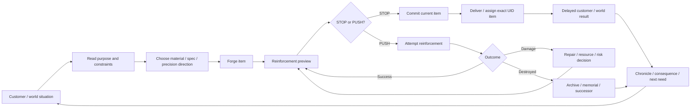

# Blacksmith — Human Game Flow Map 2026

> Documentation routing decision: `BS-OPS-20260825-02`
>
> This document is a structured repository companion to the human-facing Notion Project Home. It does not create new product mechanics. Current product rules remain owned by `CURRENT_CONFIRMED_DECISIONS_20260820_OVERLAY.md` and the 2026-08-20/24 domain canons.

## 1. 30-second game understanding

**Player fantasy**

You are a blacksmith who makes a piece of equipment for a real purpose, decides how far to push reinforcement, and later learns what happened when that exact item entered the world.

**Pointed fun / current hypothesis**

> “This is already good. Do I protect it now, or risk one more push for something exceptional?”

The primary core is **reinforcement tension + decision-driven design (DDD)**. Precision crafting, customer/world context, item biography, durability/repair and economy support that decision rather than replacing it.

**Evidence ceiling**

- Product direction: `CURRENT_CANON`
- Player-fun claim: `HYPOTHESIS`
- Human usability / player experience: `NOT_RUN`
- human usability / player experience: `NOT_RUN`

## 2. Whole-game flow



The player does **not** directly fight to prove the item. The item’s use is returned as readable consequence and history.

## 3. What the player is deciding

| Moment | Player question | Information that must be readable | Result that must be visible |
| --- | --- | --- | --- |
| Request | “What does this person actually need?” | purpose, constraints, known situation | a reason to care about the specification |
| Craft | “What trade-off am I building toward?” | material/spec differences, precision option | concrete item identity |
| Reinforce | “Is one more step worth the risk?” | current value, next-step risk, durability/economic exposure | STOP/PUSH is a real choice |
| Consequence | “Was my decision actually useful?” | exact UID, relevant causal factors | success/damage/failure/world effect |
| Lifecycle | “Do I repair, overhaul, retire, remember or replace it?” | CURRENT/MAX, history, cost, eligibility | biography continues or closes |

## 4. One-item lifecycle

```text
NEW ITEM
→ crafted with a purpose
→ reinforced through repeated STOP/PUSH decisions
→ delivered as an exact UID
→ used outside the forge
→ delayed result returns
→ repaired / partially overhauled / kept in service
→ or permanently DESTROYED
→ archived / optionally memorialized
→ successor may be linked as a NEW UID
```

Protected rules already approved in current canons:

- destruction does not erase the historical record;
- successor items do not inherit reinforcement, stats, material, Chronicle or price;
- max-lifetime overhaul is bounded and does not resurrect a destroyed item;
- +100 is a true reinforcement completion point, not an automatic prestige loop;
- direct combat/exploration is not introduced as the default proof surface.

## 5. First-session learning path

Current onboarding owner: `BS-ONBOARD-20260824-23`.

```text
New Game
→ short first craft
→ safe +1/+2 reinforcement
→ +3~+9 build-up
→ +10 first precision reinforcement / checkpoint / economic reference
→ +11 structural-risk preview
→ first meaningful STOP/PUSH
→ real outcome
→ short UID/request payoff
```

The approximate “first reinforcement by ~3 minutes / first STOP-PUSH by ~10 minutes” targets are pacing hypotheses, not hard timers. No tutorial-only hidden success bonus, forced failure or forced +11 is implied by this map.

## 6. System hierarchy

### Primary core

1. **Reinforcement tension** — readable risk, escalating commitment, real STOP/PUSH choice.
2. **DDD consequence** — the choice changes an item’s future and becomes something the player can remember.

### Supporting systems

- **Precision crafting** — gives reinforcement and customer-fit decisions texture.
- **Customer/world context** — gives the item a purpose before crafting and causal feedback after use.
- **UID + Chronicle** — preserves identity and biography across ownership, repair and consequence.
- **CURRENT/MAX durability** — turns damage into lifecycle pressure rather than a disposable hit-point bar.
- **Repair / overhaul / destruction / successor** — creates bounded recovery and permanent stakes.
- **Resource/economy/day work** — makes choices costly enough to matter without becoming a broad logistics simulator.

## 7. Nadia representative causal slice

Current starter-order/customer owner: `NADIA_VENN / ADVENTURER_01` under `BS-LINK-20260824-24`.

The intended teaching pattern is:

```text
Nadia reveals purpose + constraints
→ player makes a precision/reinforcement trade-off
→ item leaves the forge as an exact UID
→ result is NOT instantly fabricated during the first 10-minute tutorial
→ delayed exploration result returns later
→ result cites 2–4 actual causes rather than one opaque aggregate score
→ item/customer history changes
```

This is the representative pattern because it connects “what I did at the forge” to “what happened in the world” without adding direct adventure controls.

## 8. Market differentiation guard

The game should not drift into “the widest blacksmith shop simulator.” Current benchmark evidence supports keeping a narrower decision surface:

- `Potion Craft` demonstrates the value of readable customer problems, tactile craft decisions and consequences; adapt the principle, not the potion system.
- `Blacksmith Master` demonstrates a viable broad management market but also exposes late-game micromanagement/repetition risk in player feedback; do not copy its staffing/logistics breadth as Blacksmith’s core.
- `While the Iron's Hot` demonstrates crafting as a world-facing problem-solving verb; adapt the consequence principle without importing exploration chores.
- `Anvil Saga` demonstrates management + story decisions; use only as a consequence reference, not a scope target.

Detailed evidence and source classification are recorded in `docs/operations/BS-OPS-20260825-02_PLANNING_REACTIVATION_AND_HUMAN_AI_WORKSPACE_SPLIT.md` and the Notion Reference/Benchmark surface.

## 9. Human Project Home contract

The Project Home should answer, in order:

1. What is this game?
2. What do I repeatedly do?
3. What is the meaningful choice?
4. Why does one item matter?
5. How does the world answer my craft?
6. What happens when an item is damaged or destroyed?
7. What should the first 10 minutes teach?
8. Where do I open the detailed direction / enhancement / visual / production / benchmark pages?

The Home should **not** answer:

- current PR/SHA/CI state;
- pause/handoff state;
- branch or tool routing;
- prompt/hash/asset-debug metadata;
- AI task queue;
- local Godot ports or session details.

Those belong to the existing Project Registry/System Record and repository operational owners.

## 10. Revisit criteria

Revisit this map when current canon changes the primary core, when human playtests contradict the first-session thesis, or when a new system changes the one-item lifecycle. Do not rewrite it merely because implementation SHA or current task status changes.
