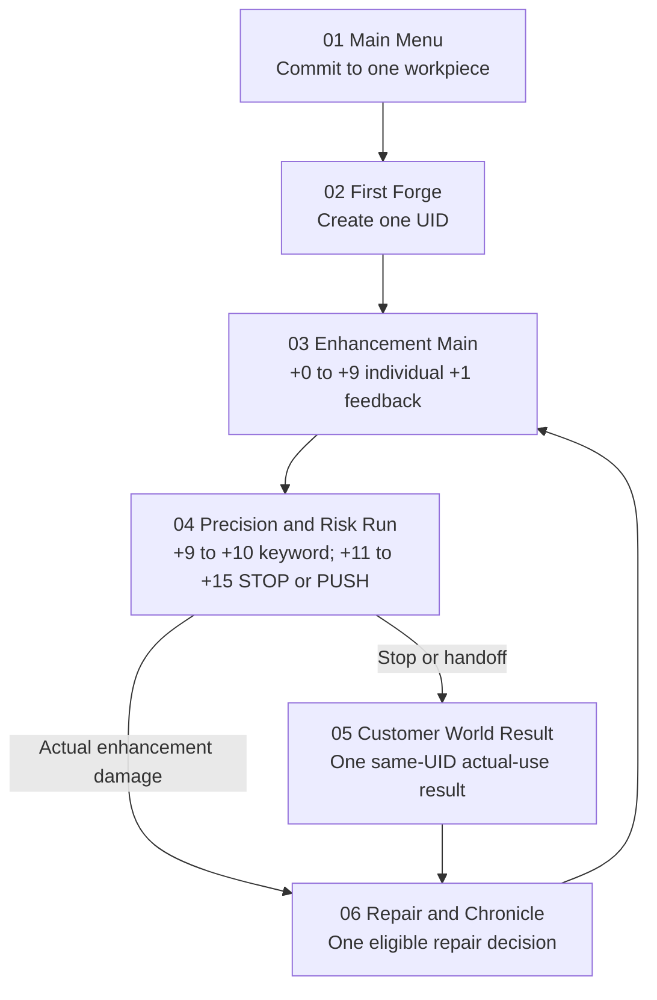

# PROJECT_CORE_SCENE_VISUAL_BOARD · Enhancement-first Slice B · 2026-08-28

## 1. Artifact identity

```text
ARTIFACT_CLASS = PLANNING_VISUALIZATION_ONLY
PURPOSE = AI_UNDERSTANDING_CHECK + USER_FLOW_REVIEW + VISUAL_DIRECTION_CONFIRMATION
RUNTIME_ASSET_STATUS = NOT_A_RUNTIME_ASSET
GODOT_SCENE_STATUS = NOT_A_GODOT_SCENE
HUMAN_USABILITY_STATUS = NOT_RUN
NEW_GENERATED_RASTER = NONE
TARGET_PLAYER_TIME = 6_TO_8_MINUTES / PHASE_1_HYPOTHESIS
```

This is a structured planning board, not a group of implemented screens,
runtime images, generated fake screenshots, or a Human/Player Experience
pass. Exact descriptions belong to this structured text and the current
machine owners, never to pseudo-text inside an image.

The target measures a first player’s active path from committing to the item
through one same-UID customer actual-use result. It is a playtest hypothesis,
not a timer, a speedrun target, or a reason to batch/skip approved individual
enhancement feedback.

## 2. Slice B at a glance



`+11` through `+15` are available decision beats, not a forced outcome.
Customer actual use and damage remain independent axes. A demonstration must
not script damage simply to make the repair panel appear.

## 3. Panel contracts

### PANEL_01 = MAIN_MENU

| Field | Contract |
|---|---|
| Actual consumer | `res://scenes/vertical_slice/main_menu.tscn`; dynamic background source binding in `vs_main_menu.gd`. |
| Player goal / action | Begin a first item journey; choose to enter First Forge. |
| Meaningful choice | None yet; this is commitment and expectation-setting, not a fake early game decision. |
| Required information | One workpiece can gain a history through enhancement, use, damage, and repair. |
| Feedback / emotion | Warm workshop invitation and anticipation. |
| Next | First Forge. |
| Current canon evidence | `PRIMARY_PLAYABLE_CONTENT = REPEATED_ENHANCEMENT_JUDGMENT_AND_FEEDBACK`. |
| Undecided | Final title copy, onboarding language, actual mobile layout/readability. |

### PANEL_02 = FIRST_FORGE

| Field | Contract |
|---|---|
| Actual consumer | First Forge dynamic background in `res://scripts/ui/forging_screen.gd`; downstream item handoff evidence exists. |
| Player goal / action | Create the single item UID that will carry the Slice. |
| Meaningful choice | The approved Slice does not invent a new craft-selection system here. Its purpose is ownership of the future enhancement subject. |
| Required information | The freshly forged item, starting level, and why it can become personally meaningful. |
| Feedback / emotion | A small ownership beat: “this is my workpiece,” not a reward substitute for enhancement. |
| Next | Enhancement Main. |
| Current canon evidence | UID persists through crafting, ownership, durability, repair, destruction archive, and world consequence. |
| Undecided | Starter item presentation and final forge interaction details. |

### PANEL_03 = ENHANCEMENT_MAIN

| Field | Contract |
|---|---|
| Actual consumer | `res://scenes/vertical_slice/screens/vs_workshop_screen.tscn`; existing workshop background and durability-atlas bindings. |
| Player goal / action | Enjoy individual ordinary enhancement feedback from `+0` through `+9`; reach the Precision threshold. |
| Meaningful choice | Continue a satisfying growth rhythm or preserve resources/stop. This is lower tension than the later risk run and must not falsely imply damage eligibility before `+11`. |
| Required information | Same item UID, current target, resource/cost state where implemented, visible `CURRENT / MAX / BASE_MAX`, and legible normal enhancement outcome. |
| Feedback / emotion | Crisp +1 confirmation, workpiece progression, growing anticipation for +10. |
| Next | Precision and Risk Run at `+9 -> +10`. |
| Current canon evidence | Every ordinary success is exactly `+1`; enhancement damage is zero through target `+10`. |
| Undecided | Final attempt timing, resource pacing, audio/VFX, target-resolution UI composition. |

### PANEL_04 = PRECISION_AND_RISK_RUN

| Field | Contract |
|---|---|
| Actual consumer | Planned state within Workshop; no new image or separate visual asset is authorized by this board. |
| Player goal / action | Convert `+9 -> +10` into exactly one keyword, then make several voluntary STOP/PUSH judgments over targets `+11` to `+15`. |
| Meaningful choice | Secure the +10 state, or expose the same UID to further success, `FAILED_HOLD`, or conditional `FAILED_DAMAGE`. Player may stop after every target. |
| Required information | Exact success / hold / damage final-outcome probabilities; target level; one keyword at +10; visible durability state; repair consequence only when actually eligible. |
| Feedback / emotion | +10 is a memorable secure milestone; later targets create readable, self-authored tension rather than opaque punishment. |
| Next | Handoff to Customer World Result, or conditional Repair and Chronicle after actual damage. |
| Current canon evidence | Precision occurs once at +9→+10; no fourth affix; failure is exclusively HOLD or DAMAGE; Decision28/29 own risk. |
| Undecided | Final probability copy, animation and audio language, costs, exact one-hand UI arrangement. |

### PANEL_05 = CUSTOMER_WORLD_RESULT

| Field | Contract |
|---|---|
| Actual consumer | `res://scenes/vertical_slice/screens/vs_customer_result_screen.tscn` and stored-result service evidence. Player-facing scheduler/entry remains `NOT_RUN`. |
| Player goal / action | See how the previously enhanced same UID performed in actual use; relate result to the item’s history. |
| Meaningful choice | The meaningful choice happened during enhancement and handoff. This panel explains consequence; it must not add a new unapproved customer-management system. |
| Required information | Customer/event cause, same UID, mission outcome and damage as separate axes, `CURRENT/MAX` before/after when damage occurred, repair-job availability. |
| Feedback / emotion | Pride, concern, or reflective ownership—“my enhancement choice travelled with this item.” |
| Next | Conditional repair, Chronicle, or return to Workshop for the next enhancement decision. |
| Current canon evidence | Purchase/handoff itself never causes damage; actual use is required; one damage roll maximum per event/UID; no forced damage. |
| Undecided | Scheduler and player entry, customer identity surface, actual client composition. |

### PANEL_06 = REPAIR_AND_CHRONICLE

| Field | Contract |
|---|---|
| Actual consumer | Workshop repair binding is historical implementation evidence; Chronicle is current product meaning. |
| Player goal / action | If actual damage creates an eligible job, decide whether to repair the same item and understand its enduring scar. |
| Meaningful choice | Spend the one available repair job and accept quality/scar consequences, push while damaged, or stop. |
| Required information | `CURRENT / MAX / BASE_MAX`, derived effective state, repair eligibility, cost/band marked temporary, and no repair for destroyed/full-durability items. |
| Feedback / emotion | Recovery is consequential but does not replace enhancement as the source of fun. Chronicle turns a meaningful event into a memory, not a routine-click log. |
| Next | Return to Enhancement Main or close the item’s meaningful history. |
| Current canon evidence | Repair job opens only after resolved actual damage; routine enhancement clicks are not player Chronicle. |
| Undecided | Final repair price table, repair visual treatment, full player-visible Chronicle layout. |

## 4. Style anchors across panels

| Need | Locked treatment | Evidence ceiling |
|---|---|---|
| Workpiece identity | Central, large, ink-contoured steel silhouette; condition variation must remain readable without color alone. | Atlas source and byte binding exist; client render `NOT_RUN`. |
| Enhancement information | Parchment-like light decision field over restrained workshop material; numeric odds outrank ornament. | Direction locked; exact UI layout `NOT_RUN`. |
| Customer consequence | Same visual grammar with a bounded customer/event accent; item UID remains the visual anchor. | No approved customer visual asset or runtime composition. |
| Repair / Chronicle | Structural scar is a material/state difference, not an extra decorative penalty meter. | Current numeric rule approved; presentation `NOT_RUN`. |

## 5. Consistency and adversarial check

| Check | Result |
|---|---|
| Enhancement remains the main content | PASS — panels 03–04 own the session’s repeated action and decisions. |
| Player Promise chain is complete | PARTIAL — planned flow is complete; customer player entry and human evidence are `NOT_RUN`. |
| Support systems do not replace core | PASS — lifecycle explains enhancement consequence; repair is conditional. |
| New system or button invented by the board | PASS — all unconfirmed fields are explicitly marked undecided. |
| Visual comparison mistaken for runtime assets | PASS — no generated comparison or raster board exists. |
| Camera / density comparison fair | PASS — every planned panel uses the same portrait, workpiece-first, high-legibility grammar. |
| Damage forced to prove the repair screen | PASS — `DO_NOT_FAKE_DAMAGE_FOR_DEMONSTRATION = TRUE`. |
| Direction drift or cross-project contamination | PASS by document audit; actual runtime composition remains `NOT_RUN`. |
| Target resolution / UI composition approved | NOT_RUN. |
| Rights / provenance shipping clear | NOT_RUN / `RELEASE_BLOCKED_UNVERIFIED`. |

## 6. Required next validation

1. Decide final session timing and resource pacing without changing the +1 or risk authorities.
2. Phase-2 review: test the board against portrait target composition and existing source assets; do not generate new imagery unless a specific runtime consumer passes the separate gate.
3. Phase-3/4 only after approval: implement the player-facing customer entry and the chosen screen states.
4. Phase-5: observe whether a player enjoys the enhancement run before they can explain why the same UID’s later result matters.
