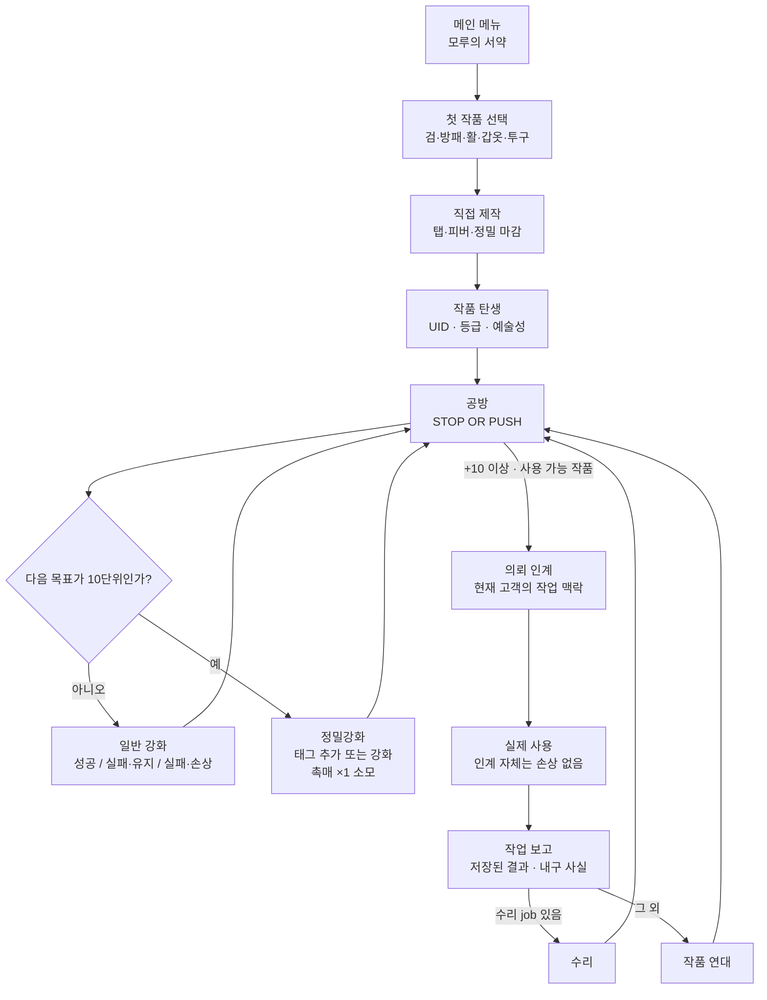

# 모루의 서약 — 독립 제작·의뢰·귀환 생애주기 설계

```
STATUS = IMPLEMENTED_PENDING_EXACT_HEAD_DELIVERY
DESIGN_DATE = 2026-09-03
ARTIFACT_CLASS = CURRENT_CANON_IMPLEMENTATION_PROVENANCE / NON_RUNTIME
BASELINE_COMMIT = 296ad86c2315357998ed86c594b8b006a1bde420
PRODUCT_SCOPE = CURRENT_CANON_MVP_IMPLEMENTATION_GAP_REVIEW
NO_FOREIGN_ASSET_CODE_TEXT_OR_SCREEN_COMPOSITION_REUSE = TRUE
IMPLEMENTED_PRODUCT_PATH_MUTATIONS = SCRIPTS_ONLY / EXACT_PATHS_IN_PROTECTED_APPROVAL_MANIFEST
NO_NEW_RASTER_OR_THIRD_PARTY_ASSET = TRUE
```

## 1. 작업 전 문제와 이번 목표

사용자가 참고 대상으로 지정한 공식 앱은 짧은 망치 입력으로 검을 만들고, 작품을
의뢰 흐름에 보내며, 사용 결과와 기록을 다시 받는 구조를 전면에 둔다. 이 구조는
`모루의 서약`이 이미 채택한 **한 작품의 UID 생애주기**와 맞닿아 있다. 다만 그대로
따르는 것은 작품·캐릭터·세계관·보상·화면 구성을 복제하는 일이므로 허용되지 않는다.

이번 설계의 목표는 현재 정본을 다음처럼 더 명확히 잇는 것이다.

```text
원본 제작 감각
→ 같은 UID 작품 확정
→ 강화의 STOP OR PUSH
→ +10 이상 고객 인계
→ 실제 사용 결과 귀환
→ 수리 또는 작품 연대기
→ 다시 공방
```

이는 "왕실에 검을 바치고 영웅을 파견한다"는 외부 게임의 이야기가 아니다. 플레이어가
직접 만든 검·방패·활·갑옷·투구가 `모루의 서약`의 고객과 실제 사용 맥락을 거쳐
되돌아오는, 기존 DDD 코어의 독립적 표현이다.

## 2. 조사 범위와 지식재산 경계

### 2.1 읽은 1차 자료

| 자료 | 확인한 사실 | 사용 방식 |
| --- | --- | --- |
| [전설의 대장간 후예: 도트 키우기 RPG — Google Play 공식 페이지](https://play.google.com/store/apps/details?id=com.patrick.legendsmith) | 제작 입력, 작품 제출, 사용 결과 귀환, 기록집, 공방 성장이라는 공개 설명과 스크린샷 흐름 | 상위 수준 루프만 비교 대상으로 삼음 |
| [Anvil Saga — Steam 공식 제품 페이지](https://store.steampowered.com/app/1587540/Anvil_Saga/) | 주문·관계·직원·시설·경제가 얽힌 공방 경영 구조 | 고객 맥락의 가치는 참고하되, 경영/세력/직원 운영 범위는 거절 |
| [Godot Containers 공식 문서](https://docs.godotengine.org/en/stable/tutorials/ui/gui_containers.html) | Container가 자식 Control의 배치·크기와 반응형 재배치를 소유 | 새 보고 UI도 기존 Container/NodePath를 보존하고 수동 좌표 레이아웃으로 분기하지 않음 |
| [Godot Theme 공식 문서](https://docs.godotengine.org/en/stable/classes/class_theme.html) | Theme는 같은 Control 계열의 스타일을 공통 적용할 수 있음 | 상태 표현이 추가될 때만 현재 project Theme와 local override를 먼저 대조하고 중복 스타일을 최소화 |
| `scripts/ui/forging_screen.gd` | 5종 선택, 탭·피버·정밀 마감 기반의 현재 첫 제작 화면 | 기존 실제 구현을 재사용·보완 대상으로 확인 |
| `scripts/vertical_slice/ui/vs_app.gd` | `WORKSHOP → CUSTOMER → RETURN → RESULT → REPAIR/ITEM_DETAIL` 전이와 +10 인계 경계 | 같은 UID 귀환 흐름의 현재 구현 사실 확인 |
| `scripts/vertical_slice/domain/vs_item.gd` 및 `VSContentResultRecord` | UID, 제작등급, 예술성, 태그, 내구도, 의미 사건 기록과 고객 실제 사용 결과의 저장 경계 | 새 저장 필드를 만들지 않는 우선 경계로 채택 |

### 2.2 절대 재사용하지 않는 것

다음은 벤치마크의 아이디어가 아니라 그 작품 고유 표현이므로 이 프로젝트에 가져오지
않는다.

- 외부 게임의 제목, 상표, 캐릭터·왕실·영웅·던전 설정, 대사, 편지 문구, 고유 명칭
- 스크린샷의 배치·아이콘·픽셀 아트·색 구성·애니메이션·사운드·프로그램 코드·수치
- 영웅 등급 조합, 주간 랭킹, 광고 보상, 영구 칭호, 방치형 수익·뽑기·과금 구조
- "왕실 평가 → 영웅 파견"이라는 외부 서사와 그것을 연상시키는 화면/문장

`모루의 서약`은 이미 확정한 **ILLUSTRATED_WORKSHOP_BOOK** 아트 방향, 장비 5종,
정밀 태그, 손상/수리/흉터, 고객 실제 사용과 작품 연대기를 유지한다. 외부 참고는
플레이어가 한 번의 짧은 행동 뒤 다음 목적지를 이해하는 방식만 검토한다.

## 3. fresh-read 결과: 현재 구현과 빈 연결부

### 3.1 이미 구현되어 다시 만들지 않을 요소

| 현재 사실 | 실제 소유 경로 | 이번 설계의 판단 |
| --- | --- | --- |
| 검·방패·활·갑옷·투구 선택 및 투명 장비 그림 | `scripts/ui/forging_screen.gd` + `VSEquipmentCatalog` | **REUSE**. 새 장비 종류·등급별 장비 이미지 없음 |
| 탭, 피버, 정밀 마감이 있는 첫 제작 리듬 | `scripts/ui/forging_screen.gd`, `scripts/forging/forging_session.gd` | **REUSE**. 새로운 외부식 미니게임을 추가하지 않음 |
| 제작 결과의 UID·등급·예술성·출생 ledger | `VSItemBirthService` | **REUSE**. 첫 구현 묶음에서 save schema 변경 없음 |
| 일반 강화·10단위 정밀 태그·불의 심장/대지의 결정 | `VSEnhancementActionService`, `VSPrecisionResolver` | **PRESERVE**. 촉매를 계보 선택으로 바꾸지 않음 |
| +10 이상 인계, 실제 사용, 내구도 결과, 수리, 연대기 | `VSApp`, customer resolver, result/chronicle screens | **REUSE_AND_CLARIFY**. 인계 자체의 손상은 계속 금지 |
| 같은 종류는 등급과 무관하게 한 장비 그림 | five-equipment catalog + V2 asset family | **PRESERVE**. 외형 변화는 강화/태그의 UI 상태만 사용 |

### 3.2 사실로 확인된 빈 연결부

| 현재 상태 | 개선 후보 | 요청 이유 | 기대 효과 | 경계 |
| --- | --- | --- | --- | --- |
| 실제 인계/귀환 UI 문구가 `나디아 벤`과 Phase 1 fixture에 직접 결합됨 | 현재 프로필 데이터에서 이름·역할·의뢰 목적을 읽는 **작업 보고** 표현 | 작품이 왜 떠나고 무엇을 확인하는지 이해하기 어렵고, 특정 fixture가 시스템처럼 보임 | 고객 실제 사용은 유지하면서도 공방의 다음 목적지가 명확해짐 | 현재 `NADIA_VENN`만 지원. 다중 고객 운영은 만들지 않음 |
| 연대기가 제작·태그·나디아의 결과를 표시하지만 결과 축과 고객 사실을 좁게 표현함 | 저장된 `VSContentResultRecord`만 읽어 고객명·의뢰 결과·내구 결과를 차례로 표시 | 같은 UID의 이야기가 수치 화면과 분리되어 보임 | "내 작품이 사용되고 돌아왔다"는 감각 강화 | routine 강화 로그, 새 보상, 새 서사 필드 금지 |
| 현재 첫 제작 quality는 `STANDARD/GOOD/PERFECT` 세 결과만 현재 제작등급의 보통/우수/명품으로 변환됨 | **결정 보류:** 걸작/전설 도달 규칙을 새로 만들지 않음 | canon에는 5등급이 있지만 현재 첫 제작에서 상위 2등급은 도달하지 않음 | 성급한 등급·경제 인플레이션 방지 | 별도 밸런스/의미 Decision 없이는 수정 금지 |
| 첫 제작의 탭·피버 결과는 존재하나, 완성 직후 UID 생애와의 연결 설명이 약함 | 새 데이터 없이 "작품 확정 → 공방에서 벼리기" 귀결 문구와 다음 CTA 정리 | 제작 미니게임이 한 번의 화면 효과처럼 읽힐 수 있음 | 첫 터치가 이후 STOP OR PUSH에 연결됨 | 점수·확률·재화·예술성 계산을 변경하지 않음 |
| content contract에는 여럿의 역사/계약 ID가 있으나, 런타임 profile은 나디아 한 명만 존재 | **DEFER:** 고객 게시판·다중 의뢰·대기/일정 시스템 미도입 | 소스 데이터가 있다는 이유로 제품 의미가 확정된 것은 아님 | 미완성 고객 관리 루프와 임의 데이터 생성을 예방 | 새 고객/보상/난이도/시간 대기에는 별도 승인 필요 |

## 4. 벤치마크 판단: ADOPT / ADAPT / REJECT

| 관찰한 디자인 원리 | 판단 | 모루의 서약에서의 독립적 적용 |
| --- | --- | --- |
| 짧은 직접 제작 행동이 작품 탄생을 체감시킴 | **ADOPT** | 이미 있는 탭·피버·정밀 마감을 유지하고, 완성 직후 작품 UID와 공방 CTA를 명확히 연결 |
| 제작품이 플레이어 밖의 사용 맥락으로 이어짐 | **ADAPT** | 왕실/영웅/던전이 아니라, 현재 고객의 의뢰 목적·실제 사용·작업 보고로 표현 |
| 사용 후 결과가 돌아와 다음 행동을 제시함 | **ADAPT** | 저장된 내구도 결과를 우선 표시하고, 수리 가능 시 수리, 그렇지 않으면 작품 연대로 연결 |
| 제작품의 누적 기록집 | **ADOPT** | UID별 birth, 정밀 태그, 인계, 실제 사용, 손상/수리 같은 의미 사건만 기록 |
| 영웅 등급, 던전 전투, 수집형 인물 roster | **REJECT** | 고객 관리/파티 RPG/전투 시스템으로 확장하지 않음 |
| 순위 경쟁, 광고 보상, 방치형 과금 반복 | **REJECT** | 재화, 랭킹, 광고, 영구 타이틀을 도입하지 않음 |
| 도트 픽셀 외형과 해당 화면 구성 | **REJECT** | 기존 삽화 공방책 방향·승인 장비 투명 PNG·native Godot Control 유지 |

## 5. 채택할 독립 플레이 흐름

현재 `VSApp`의 전이와 도메인 보존을 기준으로 한 화면/데이터 흐름이다. 이는 새
save state를 뜻하지 않으며, 확인된 현재 상태를 플레이어에게 이해 가능하게 배열한
것이다.



### 화면 상태별 계약

| 상태 | 플레이어가 읽는 사실 | 허용 행동 | 금지 행동 |
| --- | --- | --- | --- |
| 첫 제작 | 선택 장비, 현재 제작 리듬, 완성 예상 | 탭/터치, 장비 선택(제작 전), 기존 정밀 마감 | 새 장비/등급 보상/재화 생성 |
| 작품 탄생 | UID, 기존 제작등급, 예술성, 다음 공방 목적지 | 작품 확정 후 공방 진입 | 결과 reroll, 출생 ledger 재작성 |
| 공방 | 다음 강화의 정확한 성공/실패 결과와 비용 | 일반/정밀 강화, 조건부 수리/인계/연대기 | 확률 재계산, 촉매를 계보로 선택 |
| 의뢰 인계 | 고객 이름·역할·목적, UID, 실제 사용 후 보고 예정 | 인계 확인 | 인계 시 손상·보상·대기 시간 생성 |
| 작업 보고 | 실제 사용 여부, 내구도 전/후, 결과와 다음 행동 | 수리 또는 연대 보기 | 결과를 다시 굴리거나 문구로 사실 변경 |
| 작품 연대 | birth·정밀 태그·인계·실사용·손상/수리의 순서 | 공방 귀환 | routine 강화 로그/외부식 편지·캐릭터 수집 표시 |

## 6. 구현 묶음과 소유 경계

이 문서는 현재 구현의 범위·의도·소유 경계를 기록한 설계 provenance다. 세분화한
실행 순서는 `docs/superpowers/plans/2026-09-03-independent-forge-lifecycle.md`에
기록하며, 모든 변경은 기존 scene/service/resolver의 소유 경계를 넘지 않아야 한다.

### 묶음 A — 첫 작품에서 공방으로의 귀결 명확화

- **소비처:** `scripts/ui/forging_screen.gd`, `scripts/vertical_slice/ui/vs_main_menu.gd`
- **입력:** 현재 `ForgingSession` completion, 기존 선택 장비, 현재 adapter의
  `quality_id`, `tap_count`, `fever_activation_count`
- **출력:** 현재 `VSFirstForgeCompletionService`를 통해 확정된 동일 item UID와
  "공방에서 벼리기"라는 다음 행동 안내
- **보존:** quality mapping, 공격력/가치 계수, crafting grade, artistry, 저장 스키마
- **명시적 제외:** 새 망치 메커니즘, 외부 게임식 score, 등급 reroll, 걸작/전설
  도달 규칙, 새 래스터 이미지

### 묶음 B — 현재 고객의 의뢰·귀환 정보를 data-first로 정리

- **소비처:** `VSApp`, `VSCustomerHandoffScreen`, `VSCustomerResultScreen`
- **입력:** 현재 `data/vertical_slice/customers/nadia_venn.json`, 선택 item UID,
  이미 저장된 `VSContentResultRecord`
- **출력:** 고정 문장 대신 customer profile의 이름·역할·content goal을 읽는
  독립적 **작업 보고** UI. 결과 화면은 내구도 사실과 `primary_next_action`을
  계속 소유자로 사용한다.
- **보존:** `PHASE1_HANDOFF_MINIMUM_LEVEL = 10`, 실제 사용 1회, 인계 무손상,
  customer/world damage resolver, 수리 eligibility
- **명시적 제외:** 새 고객 생성, 고객 선택 게시판, 일정/대기, 전투·던전, 보상표,
  관계도, 외부 게임의 영웅/편지 표현

### 묶음 C — 작품 연대의 결과 사실성 강화

- **소비처:** `VSItemChronicleScreen`
- **입력:** item ledger와 `active_run.resolved_events`의 저장된 사실
- **출력:** 현재 고객의 이름과 실제 사용 결과를 같은 UID의 의미 사건으로 표시
- **보존:** routine enhancement history는 chronicle이 아니며, 새 ledger event나
  새 save field를 만들지 않는다.
- **명시적 제외:** 수집 도감, 영웅 roster, 편지 수집, 자동 보상, 외부 텍스트

### 별도 의사결정으로 남기는 범위

다음은 현재 정본의 표현 개선이 아니라 제품 의미/경제를 바꾸므로, 이 문서에 대한
승인이 있어도 자동 구현하지 않는다.

1. 걸작/전설 제작등급을 획득시키는 새 quality score, 확률, 보상 또는 재화.
2. 다중 고객·다중 의뢰·대기 시간·일정·새 고객 프로필과 결과 콘텐츠.
3. 고객의 전투력, 던전/전투 결과, 파티/영웅 시스템.
4. 순위, 광고, 소셜, 경쟁, 과금, 뽑기, 영구 타이틀.
5. 새 장비 타입, 새 외형 변형, 새 생성 이미지·사운드.

## 7. 적대적 검토와 실패 처리

| 반대 질문 또는 실패 | 설계 대응 | 검증 기준 |
| --- | --- | --- |
| 직접 제작이 반복 피로를 만들지 않는가? | 현재 자동 진행과 짧은 피버 구조를 유지하고, 새 입력을 추가하지 않음 | 기존 `ForgingSession` 완료·취소/재시작 테스트 회귀 없음 |
| 탭 성과가 강화 확률이나 경제를 망치지 않는가? | 결과 설명만 보강하며 quality mapping·강화 resolver·재화 수치를 건드리지 않음 | 기존 forging/enhancement 테스트와 diff audit |
| 고정된 나디아 문구를 data-first로 바꾸다 저장된 결과를 바꾸지 않는가? | profile은 표시용, `VSContentResultRecord`와 resolver 출력은 authority | UI test가 결과 dict의 내구도/next action을 그대로 표시 |
| 결과 화면이 "인계가 손상을 만들었다"고 오해시키지 않는가? | 인계 화면과 작업 보고를 분리하고, 손상은 actual-use 결과에서만 표시 | handoff/actual-use resolver contract 유지 |
| 연대기가 모든 강화 로그로 넘치지 않는가? | 의미 사건 whitelist를 유지 | routine enhancement event가 chronicle text에 없음을 GUT으로 검증 |
| 외부 게임을 닮은 화면이 되는가? | 독립 문구, 기존 삽화 공방책 방향, native Control, 외부 art/text 미사용 | asset/provenance review와 human visual review |
| 실제 Android에서 정보가 읽히는가? | 설계만으로 PASS 선언 금지 | portrait Godot runtime capture 후 Android/accessibility/human은 별도 NOT_RUN 유지 |

## 8. TDD·검증·증거 한계

사용자 승인 뒤 실제 구현은 각 묶음마다 다음의 순서를 따랐다.

1. **RED:** customer profile이 없는 경우 안전하게 blocker/fallback을 보여 주고,
   같은 item UID·기존 result facts·chronicle whitelist를 요구하는 실패 테스트를
   먼저 만든다.
2. **GREEN:** 새 저장 구조 없이 가장 작은 presenter/adapter 연결을 만든다.
3. **REFACTOR:** hard-coded display text만 data-first formatter로 정리하고,
   resolver·economy·정밀 태그 소유자에는 손대지 않는다.
4. **MACHINE:** focused GUT, Python contract, Godot headless parse/import,
   protected-path/authority checks, exact-head diff를 실행한다.
5. **RUNTIME:** 실제 Blacksmith project path와 current scene을 확인한 Godot
   portrait capture로 첫 제작·+10 인계·귀환·연대를 관찰한다.
6. **DELIVERY:** branch push, draft/ready PR의 exact head CI readback, 승인된
   merge 뒤 `main` readback을 한다.

현재 문서의 증거 ceiling은 다음과 같다.

```text
fresh_current_repository_read = CONFIRMED_AT_296ad86c
benchmark_official_listing_review = CONFIRMED
implementation = IMPLEMENTED_PENDING_EXACT_HEAD_MACHINE_DELIVERY
machine_verification_of_new_change = PENDING_FINAL_EXACT_HEAD_RUN
godot_runtime_of_new_change = VERIFIED_IN_ISOLATED_BLACKSMITH_WORKTREE_RUNTIME
android_device = NOT_RUN
accessibility = NOT_RUN
human_player_experience = NOT_RUN
release_rights_compliance = NOT_RUN
```

## 9. 사용자 검토 요청

이 설계는 외부 게임의 장점을 **짧은 제작 감각 → 한 작품의 사용 맥락 → 사실 기반
귀환 → 의미 사건 연대**로만 흡수했다. A/B/C 구현은 저장·resolver·경제·외부 자산을
추가하지 않고 완료했으며, 새 제품 의미가 필요한 항목은 계속 별도 Decision으로
남긴다. 정확 헤드 기계 검증과 GitHub 보호 병합은 별도 delivery 단계로 남아 있다.
